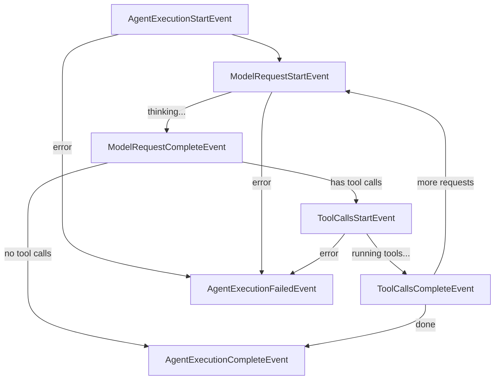

# Events

Custom events for sideband streaming and lifecycle tracking.

## Overview

The event system provides two categories of events:

1. **Lifecycle Events**: Automatic execution tracking emitted by `stream_agent`
2. **Sideband Events**: Tool/feature-specific events (compact, handoff, subagent, etc.)

All events inherit from `AgentEvent` and are delivered via `StreamEvent` wrapper:

```python
from pai_agent_sdk.context import StreamEvent
from pai_agent_sdk.events import AgentEvent

@dataclass
class StreamEvent:
    agent_id: str      # Unique agent identifier
    agent_name: str    # Human-readable agent name
    event: AgentEvent  # The actual event
```

## Lifecycle Events

Lifecycle events are automatically emitted by `stream_agent` when `emit_lifecycle_events=True` (default).

### Event Flow



### Event Types

| Event                         | When Emitted                    | Key Fields                              |
| ----------------------------- | ------------------------------- | --------------------------------------- |
| `AgentExecutionStartEvent`    | Agent execution begins          | `user_prompt`, `message_history_count`  |
| `ModelRequestStartEvent`      | Model request starts (thinking) | `loop_index`, `message_count`           |
| `ModelRequestCompleteEvent`   | Model response received         | `loop_index`, `duration_seconds`        |
| `ToolCallsStartEvent`         | Tool execution starts           | `loop_index`                            |
| `ToolCallsCompleteEvent`      | Tool execution completes        | `loop_index`, `duration_seconds`        |
| `AgentExecutionCompleteEvent` | Agent execution completes       | `total_loops`, `total_duration_seconds` |
| `AgentExecutionFailedEvent`   | Agent execution fails           | `error`, `error_type`, `total_loops`    |

### Loop Index

The `loop_index` field (zero-based) tracks iteration count:

- Loop 0: First model request + optional tool calls
- Loop 1: Second model request + optional tool calls
- ...

All events within the same loop share the same `loop_index`.

### Usage Example

```python
from pai_agent_sdk.agents import create_agent, stream_agent
from pai_agent_sdk.events import (
    AgentExecutionStartEvent,
    AgentExecutionCompleteEvent,
    ModelRequestStartEvent,
    ModelRequestCompleteEvent,
    ToolCallsStartEvent,
    ToolCallsCompleteEvent,
)

runtime = create_agent("openai:gpt-4o")

async with stream_agent(runtime, "Hello") as streamer:
    async for stream_event in streamer:
        event = stream_event.event

        if isinstance(event, AgentExecutionStartEvent):
            print(f"Starting execution with {event.message_history_count} history messages")

        elif isinstance(event, ModelRequestStartEvent):
            print(f"Loop {event.loop_index}: Thinking...")

        elif isinstance(event, ModelRequestCompleteEvent):
            print(f"  Response received in {event.duration_seconds:.2f}s")

        elif isinstance(event, ToolCallsStartEvent):
            print(f"  Running tools...")

        elif isinstance(event, ToolCallsCompleteEvent):
            print(f"  Tools completed in {event.duration_seconds:.2f}s")

        elif isinstance(event, AgentExecutionCompleteEvent):
            print(f"Completed: {event.total_loops} loops in {event.total_duration_seconds:.2f}s")
```

### Disabling Lifecycle Events

Set `emit_lifecycle_events=False` for custom tracking or cleaner output:

```python
async with stream_agent(
    runtime,
    "Hello",
    emit_lifecycle_events=False,
) as streamer:
    async for event in streamer:
        pass  # Only model events, no lifecycle events
```

## Sideband Events

Sideband events are emitted by specific tools or features to communicate status.

### Compact Events

Emitted during context compaction (summarizing message history):

| Event                  | Description                       |
| ---------------------- | --------------------------------- |
| `CompactStartEvent`    | Compaction started                |
| `CompactCompleteEvent` | Compaction succeeded with summary |
| `CompactFailedEvent`   | Compaction failed with error      |

```python
from pai_agent_sdk.events import CompactStartEvent, CompactCompleteEvent, CompactFailedEvent

if isinstance(event, CompactCompleteEvent):
    print(f"Compacted {event.original_message_count} -> {event.compacted_message_count} messages")
```

### Handoff Events

Emitted during context handoff (clearing context with summary):

| Event                  | Description       |
| ---------------------- | ----------------- |
| `HandoffStartEvent`    | Handoff started   |
| `HandoffCompleteEvent` | Handoff succeeded |
| `HandoffFailedEvent`   | Handoff failed    |

```python
from pai_agent_sdk.events import HandoffCompleteEvent

if isinstance(event, HandoffCompleteEvent):
    print(f"Handoff complete: {event.new_message_count} messages preserved")
```

### Subagent Events

Emitted when delegating to subagents:

| Event                   | Description                  |
| ----------------------- | ---------------------------- |
| `SubagentStartEvent`    | Subagent execution started   |
| `SubagentCompleteEvent` | Subagent execution completed |

```python
from pai_agent_sdk.events import SubagentStartEvent, SubagentCompleteEvent

if isinstance(event, SubagentStartEvent):
    print(f"Delegating to {event.agent_name}: {event.prompt_preview}")
```

### Message Bus Events

Emitted when messages are received from the message bus:

| Event                  | Description                    |
| ---------------------- | ------------------------------ |
| `MessageReceivedEvent` | Messages injected into context |

```python
from pai_agent_sdk.events import MessageReceivedEvent

if isinstance(event, MessageReceivedEvent):
    for msg in event.messages:
        print(f"Received from {msg.source}: {msg.rendered_content}")
```

## Event Correlation

Events can be correlated using `event_id`:

```python
# All lifecycle events in a run share the same event_id (ctx.run_id)
start = AgentExecutionStartEvent(event_id="run-123", ...)
model_start = ModelRequestStartEvent(event_id="run-123", loop_index=0)
complete = AgentExecutionCompleteEvent(event_id="run-123", ...)

# Sideband event pairs also share event_id
compact_start = CompactStartEvent(event_id="compact-456", ...)
compact_complete = CompactCompleteEvent(event_id="compact-456", ...)
```

## Custom Events

Create custom events by subclassing `AgentEvent`:

```python
from dataclasses import dataclass
from pai_agent_sdk.events import AgentEvent

@dataclass
class MyCustomEvent(AgentEvent):
    """Custom event for my feature."""
    custom_field: str = ""

# Emit via context
await ctx.emit_event(MyCustomEvent(event_id="custom-001", custom_field="value"))
```

## Type Aliases

For convenience, a union type is provided for lifecycle events:

```python
from pai_agent_sdk.events import LifecycleEvent

# LifecycleEvent = (
#     AgentExecutionStartEvent
#     | AgentExecutionCompleteEvent
#     | AgentExecutionFailedEvent
#     | ModelRequestStartEvent
#     | ModelRequestCompleteEvent
#     | ToolCallsStartEvent
#     | ToolCallsCompleteEvent
# )

def handle_lifecycle(event: LifecycleEvent) -> None:
    match event:
        case AgentExecutionStartEvent():
            print("Started")
        case AgentExecutionCompleteEvent():
            print("Completed")
        # ...
```
