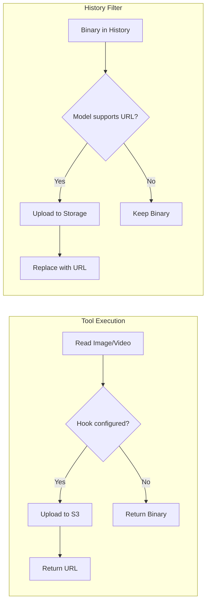

# Media Upload

This document covers the media upload system for converting binary media content to URLs.

## Overview

The SDK provides a media upload system for:

1. **ToolConfig hooks** - Convert media to URLs at tool execution time
2. **History filter** - Upload media in message history before sending to model



## MediaUploader Protocol

The `MediaUploader` protocol defines the interface for media upload services:

```python
from pai_agent_sdk.media import MediaUploader

class MediaUploader(Protocol):
    async def upload(self, data: bytes, media_type: str) -> str:
        """Upload media data and return public URL."""
        ...
```

Implement this protocol to support different storage backends:

- S3 (AWS, MinIO, Ceph, Cloudflare R2)
- Azure Blob Storage
- Google Cloud Storage
- Local file server with public URL
- imgbb, imgur, etc.

## S3MediaUploader

The SDK provides a built-in S3 implementation:

```python
from pai_agent_sdk.media import S3MediaConfig, S3MediaUploader

config = S3MediaConfig(
    bucket="my-bucket",
    region="us-east-1",
    # Optional: explicit credentials (default: AWS credential chain)
    access_key_id="AKID",
    secret_access_key="SECRET",
    # Optional: custom endpoint for S3-compatible services
    endpoint_url="https://minio.example.com",
    # Optional: path-style URLs for older S3-compatible services
    force_path_style=True,
    # Object key prefix
    prefix="uploads/",
    # URL generation mode
    url_mode="cdn",  # or "presign"
    cdn_base_url="https://cdn.example.com",
    presign_expires_seconds=3600,  # 1 hour
)

uploader = S3MediaUploader(config)
url = await uploader.upload(image_bytes, "image/png")
# -> https://cdn.example.com/uploads/2024-02-03/abc123def456.png
```

### Configuration Options

| Option                    | Type                   | Default     | Description                                         |
| ------------------------- | ---------------------- | ----------- | --------------------------------------------------- |
| `bucket`                  | str                    | (required)  | S3 bucket name                                      |
| `region`                  | str                    | `us-east-1` | AWS region                                          |
| `access_key_id`           | str                    | None        | AWS access key (None = credential chain)            |
| `secret_access_key`       | str                    | None        | AWS secret key (None = credential chain)            |
| `endpoint_url`            | str                    | None        | Custom S3 endpoint URL                              |
| `prefix`                  | str                    | `""`        | Object key prefix (auto-normalized to end with `/`) |
| `url_mode`                | `"cdn"` \| `"presign"` | `"presign"` | URL generation mode                                 |
| `cdn_base_url`            | str                    | None        | CDN base URL (required if url_mode="cdn")           |
| `presign_expires_seconds` | int                    | 3600        | Presigned URL expiration                            |
| `force_path_style`        | bool                   | False       | Use path-style URLs for older services              |

### Object Key Format

Objects are stored with the format:

```
{prefix}{YYYY-MM-DD}/{content_hash}.{ext}
```

Example: `uploads/2024-02-03/a1b2c3d4e5f6.png`

- Date prefix enables easy cleanup by date
- Content hash enables deduplication

### Dependencies

Requires optional dependency:

```bash
pip install pai-agent-sdk[s3]
```

## ToolConfig Hooks

Use hooks in `ToolConfig` to convert media at tool execution time:

```python
from pai_agent_sdk.media import S3MediaConfig, create_s3_media_hook
from pai_agent_sdk.context import ToolConfig

config = S3MediaConfig(bucket="my-bucket")
hook = create_s3_media_hook(config)

tool_config = ToolConfig(
    image_to_url_hook=hook,  # Convert images to URLs
    video_to_url_hook=hook,  # Convert videos to URLs
)
```

The hook returns `None` on failure, causing fallback to binary content.

### When to Use

- Model supports URL-based media (OpenAI, Anthropic direct API)
- Want to reduce request payload size
- Need permanent URLs for media

### When NOT to Use

- Model only supports base64 (AWS Bedrock)
- Using image processing filters (compression, resize)

## Media Upload Filter

The `create_media_upload_filter` creates a history processor that uploads binary media:

```python
from pai_agent_sdk.filters import create_media_upload_filter
from pai_agent_sdk.media import S3MediaUploader, S3MediaConfig

# Create uploader
config = S3MediaConfig(bucket="my-bucket", url_mode="cdn", cdn_base_url="https://cdn.example.com")
uploader = S3MediaUploader(config)

# Create filter
media_filter = create_media_upload_filter(
    uploader,
    upload_images=True,  # Upload images
    upload_videos=True,  # Upload videos
)

# Use in agent
agent = Agent(
    "openai:gpt-4o",
    deps_type=AgentContext,
    history_processors=[
        drop_extra_images,  # First: limit/compress images
        media_filter,       # Then: upload to S3
    ],
)
```

### Model Capabilities

The filter checks model capabilities before uploading:

- `ModelCapability.image_url` - Required to upload images
- `ModelCapability.video_url` - Required to upload videos

Configure capabilities in `ModelConfig`:

```python
from pai_agent_sdk.context import ModelConfig, ModelCapability

model_cfg = ModelConfig(
    capabilities={
        ModelCapability.vision,
        ModelCapability.image_url,  # Model accepts image URLs
        ModelCapability.video_url,  # Model accepts video URLs
    }
)
```

### Filter Placement

The media upload filter should run AFTER image processing filters:

```python
history_processors=[
    drop_extra_images,     # 1. Limit number of images
    drop_gif_images,       # 2. Remove unsupported formats
    # ... other image processing ...
    media_filter,          # 3. Upload processed images
]
```

This ensures you upload processed (compressed, resized) images rather than raw data.

## Custom Uploader Example

Implement your own uploader for other storage backends:

```python
from pathlib import Path
from uuid import uuid4

from pai_agent_sdk.media import MediaUploader

class LocalFileUploader:
    """Upload to local filesystem with public URL."""

    def __init__(self, base_dir: Path, base_url: str):
        self.base_dir = base_dir
        self.base_url = base_url.rstrip("/")
        self.base_dir.mkdir(parents=True, exist_ok=True)

    async def upload(self, data: bytes, media_type: str) -> str:
        ext = media_type.split("/")[-1]
        filename = f"{uuid4()}.{ext}"
        path = self.base_dir / filename
        path.write_bytes(data)
        return f"{self.base_url}/{filename}"

# Usage
uploader = LocalFileUploader(Path("/var/www/media"), "https://example.com/media")
assert isinstance(uploader, MediaUploader)  # Protocol check
```

## Provider Compatibility

| Provider           | Image URL | Video URL | Notes        |
| ------------------ | --------- | --------- | ------------ |
| OpenAI             | Yes       | Yes       | Full support |
| Anthropic (direct) | Yes       | Yes       | Full support |
| AWS Bedrock        | No        | No        | Base64 only  |
| Google Gemini      | Yes       | Yes       | Full support |
| Azure OpenAI       | Yes       | Yes       | Full support |

For providers that don't support URLs, the filter will skip upload and keep binary content.
