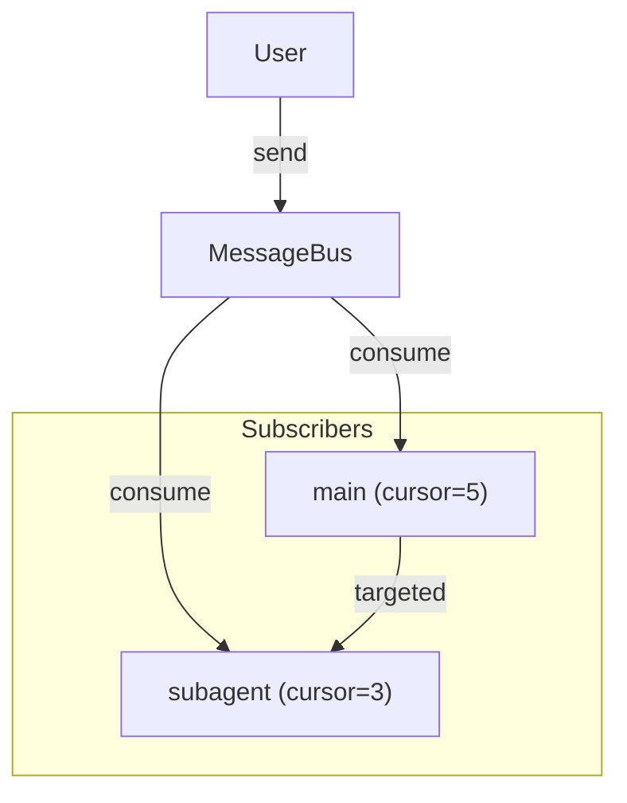

# Message Bus

Inter-agent communication with subscriber-based message delivery, inspired by Redis Streams.

## Overview

- **Subscriber Cursors**: Each subscriber tracks its read position independently
- **Broadcast Support**: `target=None` delivers to all subscribers
- **Bounded Queue**: `maxlen` limits memory usage, old messages auto-trimmed
- **No Message Loss**: Multiple subscribers can read the same broadcast message



## Basic Usage

### Sending Messages

```python
from pai_agent_sdk.context import AgentContext

async with AgentContext(env=env) as ctx:
    # Targeted message to main agent
    ctx.send_message("Focus on security issues", source="user", target="main")

    # Broadcast to all subscribers
    ctx.send_message("System alert", source="monitor")

    # With template formatting
    ctx.send_message(
        "Stop current task",
        source="user",
        target="main",
        template="[URGENT] {{ content }}"
    )
```

### Subscriber Lifecycle

Subscribers are managed automatically by AgentContext:

```python
# Main agent subscribes on context enter
async with AgentContext(env=env) as ctx:  # subscribes "main"
    # Subagent subscribes when created
    sub_ctx = ctx.create_subagent_context("debugger")
    async with sub_ctx:  # subscribes "debugger-xxxx"
        # ... subagent work ...
    # Subagent unsubscribes on exit

# Main agent clears bus on exit
```

### Manual Bus Operations

```python
from pai_agent_sdk.bus import MessageBus

bus = MessageBus(maxlen=100)

# Subscribe before sending to receive messages
bus.subscribe("main")
bus.send("Hello", source="user", target="main")

# Consume advances cursor (messages stay in queue)
messages = bus.consume("main")
for msg in messages:
    print(msg.render())

# Check without consuming
if bus.has_pending("main"):
    pending = bus.peek("main")  # Does not advance cursor

# Unsubscribe when done (for subagents)
bus.unsubscribe("subagent-123")
```

## Use Cases

### User Steering (CLI/TUI)

Send real-time guidance to agents during execution:

```python
from pai_agent_sdk.agents import create_agent, stream_agent

runtime = create_agent("openai:gpt-4o")

async def on_user_input(text: str):
    """Called when user types during agent execution."""
    # Always send to main agent
    runtime.ctx.send_message(text, source="user", target="main")

async with stream_agent(runtime, "Analyze this codebase") as streamer:
    async for event in streamer:
        handle_event(event)
```

### Multi-Agent Coordination

Coordinate between main agent and subagents:

```python
# Main agent sends task to subagent
ctx.send_message("Check for memory leaks", source="main", target="debugger-a7b9")

# Broadcast alert to all active agents
ctx.send_message("Low memory warning", source="monitor")
```

## Filter Integration

The `inject_bus_messages` filter automatically injects pending messages:

```python
# Filter is included by default in create_agent
# Messages appear as:
# <bus-message source="user">
# [URGENT] Stop current task
# </bus-message>
```

## Events

`MessageReceivedEvent` is emitted when messages are injected:

```python
from pai_agent_sdk.events import MessageReceivedEvent

async for event in streamer:
    if isinstance(event.event, MessageReceivedEvent):
        for msg in event.event.messages:
            print(f"[{msg.source}] {msg.render()}")
```

## API Reference

### MessageBus

| Method                                                 | Description                            |
| ------------------------------------------------------ | -------------------------------------- |
| `__init__(maxlen=500)`                                 | Create bus with max queue size         |
| `subscribe(agent_id)`                                  | Register subscriber (cursor at latest) |
| `unsubscribe(agent_id)`                                | Remove subscriber                      |
| `send(content, *, source, target=None, template=None)` | Send message                           |
| `consume(agent_id)`                                    | Get unread messages, advance cursor    |
| `has_pending(agent_id)`                                | Check if unread messages exist         |
| `peek(agent_id)`                                       | Get unread messages without advancing  |
| `clear()`                                              | Remove all messages and subscribers    |

### BusMessage

| Attribute   | Description                       |
| ----------- | --------------------------------- |
| `id`        | Unique message ID (auto-assigned) |
| `content`   | Message text                      |
| `source`    | Sender identifier                 |
| `target`    | Recipient (None = broadcast)      |
| `template`  | Jinja2 template string            |
| `timestamp` | Creation time                     |
| `render()`  | Apply template and return string  |

### AgentContext.send_message

Convenience method that delegates to `message_bus.send()`:

```python
ctx.send_message(content, *, source, target=None, template=None)
```
