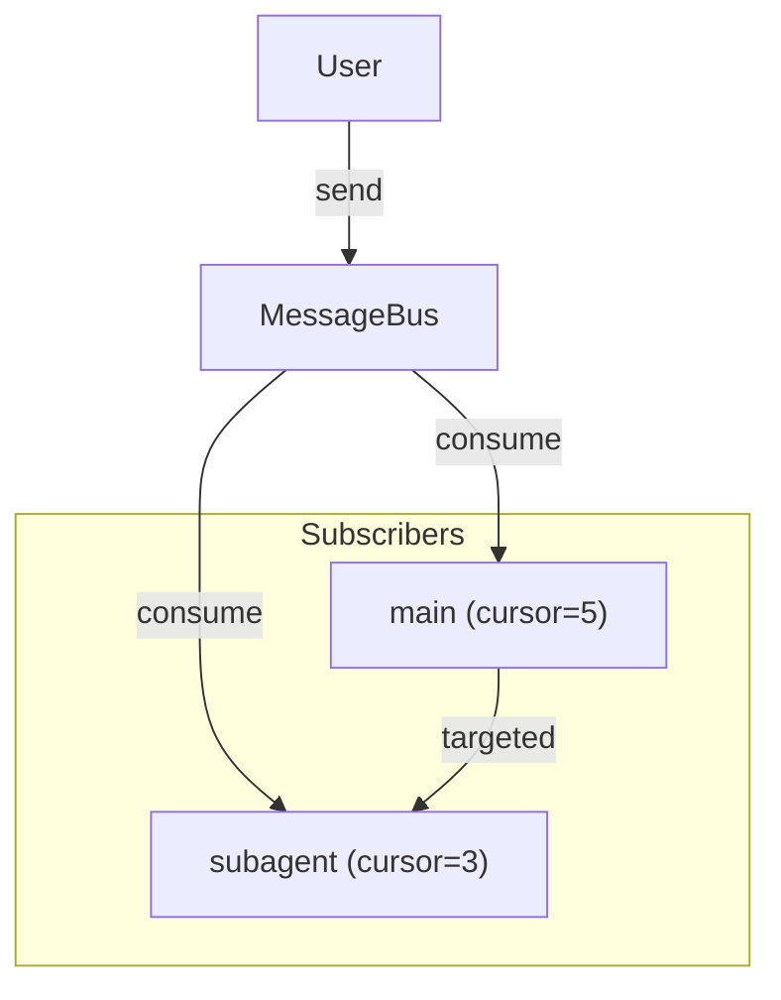

# Message Bus

Inter-agent communication with subscriber-based message delivery, inspired by Redis Streams.

## Overview

- **Subscriber Cursors**: Each subscriber tracks its read position independently
- **Broadcast Support**: `target=None` delivers to all subscribers
- **Bounded Queue**: `maxlen` limits memory usage, old messages auto-trimmed
- **Idempotent Send**: Duplicate message IDs are silently ignored
- **Idempotent Consume**: Each message is consumed only once per agent
- **No Message Loss**: Multiple subscribers can read the same broadcast message



## Basic Usage

### Sending Messages

```python
from pai_agent_sdk.context import AgentContext, BusMessage

async with AgentContext(env=env) as ctx:
    # Targeted message to main agent
    ctx.send_message(BusMessage(
        content="Focus on security issues",
        source="user",
        target="main",
    ))

    # Broadcast to all subscribers
    ctx.send_message(BusMessage(
        content="System alert",
        source="monitor",
    ))

    # With template formatting
    ctx.send_message(BusMessage(
        content="Stop current task",
        source="user",
        target="main",
        template="[URGENT] {{ content }}",
    ))

    # With explicit ID for idempotent send
    ctx.send_message(BusMessage(
        id="unique-id-123",
        content="Important message",
        source="user",
    ))
```

### Subscriber Lifecycle

Subscribers are managed automatically by AgentContext:

```python
# Main agent subscribes on context enter
async with AgentContext(env=env) as ctx:  # subscribes "main"
    # Subagent subscribes when created
    sub_ctx = ctx.create_subagent_context("debugger")
    async with sub_ctx:  # subscribes "debugger-xxxx"
        # ... subagent work ...
    # Subagent unsubscribes on exit

# Main agent clears bus on exit
```

### Manual Bus Operations

```python
from pai_agent_sdk.context import MessageBus, BusMessage

bus = MessageBus(maxlen=100)

# Subscribe before sending to receive messages
bus.subscribe("main")
bus.send(BusMessage(content="Hello", source="user", target="main"))

# Consume advances cursor (messages stay in queue)
messages = bus.consume("main")
for msg in messages:
    print(msg.render())

# Check without consuming
if bus.has_pending("main"):
    pending = bus.peek("main")  # Does not advance cursor

# Unsubscribe when done (for subagents)
bus.unsubscribe("subagent-123")
```

## Idempotency

Both send and consume operations are idempotent **within the `maxlen` window**.

### Send Idempotency

Messages with the same `id` are only stored once:

```python
# First send creates the message
bus.send(BusMessage(id="msg-001", content="Hello", source="user"))

# Second send with same ID is ignored (returns existing message)
bus.send(BusMessage(id="msg-001", content="Different", source="other"))

# Only one message in queue
assert len(bus) == 1
```

### Consume Idempotency

`AgentContext.consume_messages()` ensures each message is consumed only once:

```python
# First call returns pending messages
messages = ctx.consume_messages()
# [BusMessage(id="abc", content="Hello")]

# Second call returns empty (already consumed)
messages = ctx.consume_messages()
# []
```

This prevents duplicate injection on LLM retries.

### Idempotency Scope

Idempotent send is only guaranteed while the message remains in the queue.
Once a message is trimmed (due to `maxlen`), its ID is no longer tracked:

```python
bus = MessageBus(maxlen=2)
bus.send(BusMessage(id="id-001", content="First", source="user"))
bus.send(BusMessage(id="id-002", content="Second", source="user"))
bus.send(BusMessage(id="id-003", content="Third", source="user"))
# id-001 is trimmed and its ID is removed from tracking

# Resending id-001 is treated as a NEW message (not idempotent)
bus.send(BusMessage(id="id-001", content="First retry", source="user"))
# Queue now: ["id-003", "id-001"] (id-002 trimmed)
```

This trade-off bounds memory usage. For most use cases (LLM retries, duplicate
prevention within a session), the `maxlen` window (default: 500) is sufficient.

## Use Cases

### User Steering (CLI/TUI)

Send real-time guidance to agents during execution:

```python
from pai_agent_sdk.agents import create_agent, stream_agent
from pai_agent_sdk.context import BusMessage

runtime = create_agent("openai:gpt-4o")

async def on_user_input(text: str):
    """Called when user types during agent execution."""
    # Always send to main agent
    runtime.ctx.send_message(BusMessage(
        content=text,
        source="user",
        target="main",
    ))

async with stream_agent(runtime, "Analyze this codebase") as streamer:
    async for event in streamer:
        handle_event(event)
```

### Multi-Agent Coordination

Coordinate between main agent and subagents:

```python
# Main agent sends task to subagent
ctx.send_message(BusMessage(
    content="Check for memory leaks",
    source="main",
    target="debugger-a7b9",
))

# Broadcast alert to all active agents
ctx.send_message(BusMessage(
    content="Low memory warning",
    source="monitor",
))
```

## Filter Integration

The `inject_bus_messages` filter automatically injects pending messages:

```python
# Filter is included by default in create_agent
# Messages appear as:
# <bus-message source="user">
# [URGENT] Stop current task
# </bus-message>
```

## Events

`MessageReceivedEvent` is emitted when messages are injected:

```python
from pai_agent_sdk.events import MessageReceivedEvent

async for event in streamer:
    if isinstance(event.event, MessageReceivedEvent):
        for msg in event.event.messages:
            print(f"[{msg.source}] {msg.render()}")
```

## API Reference

### BusMessage

```python
class BusMessage(BaseModel):
    id: str           # Unique ID (auto-generated UUID if not provided)
    content: str      # Message content
    source: str       # Sender identifier
    target: str | None = None  # Recipient (None = broadcast)
    template: str | None = None  # Jinja2 template
    timestamp: datetime  # Creation time (auto-set)

    def render(self) -> str:
        """Apply template and return rendered content."""
```

### MessageBus

| Method                      | Description                            |
| --------------------------- | -------------------------------------- |
| `__init__(maxlen=500)`      | Create bus with max queue size         |
| `subscribe(agent_id)`       | Register subscriber (cursor at latest) |
| `unsubscribe(agent_id)`     | Remove subscriber                      |
| `send(message: BusMessage)` | Send message (idempotent by ID)        |
| `consume(agent_id)`         | Get unread messages, advance cursor    |
| `has_pending(agent_id)`     | Check if unread messages exist         |
| `peek(agent_id)`            | Get unread messages without advancing  |
| `clear()`                   | Remove all messages and subscribers    |

### AgentContext Methods

| Method                                   | Description                            |
| ---------------------------------------- | -------------------------------------- |
| `send_message(message: BusMessage)`      | Send message to bus (delegates to bus) |
| `consume_messages() -> list[BusMessage]` | Consume messages idempotently          |
