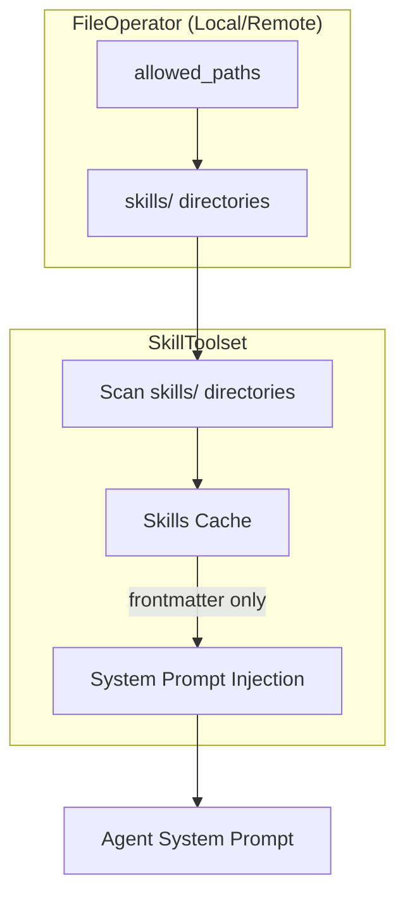
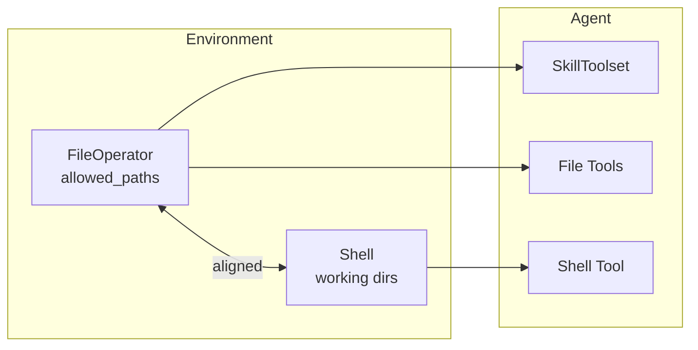
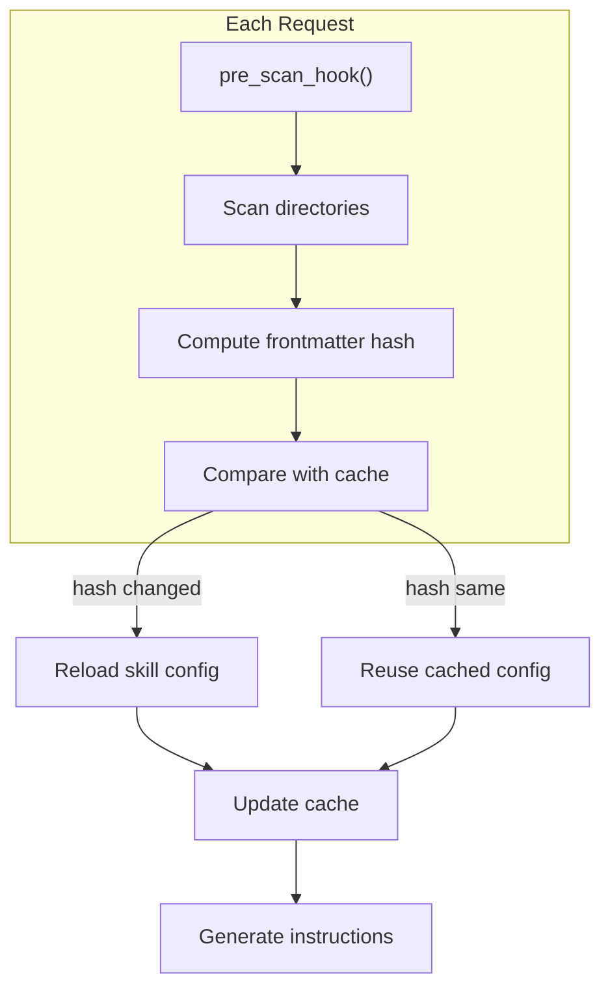

# Skills System

Skills are markdown-based instruction files that provide specialized guidance for specific tasks. Unlike subagents, skills don't create child agents - they inject context into the main agent's system prompt to guide task completion.

## Overview

- **Markdown Configuration**: Define skills using `SKILL.md` files with YAML frontmatter
- **Progressive Loading**: Only name and description are loaded initially; full content loaded on activation
- **Hot Reload**: Skill changes are detected at request boundaries without restart
- **Remote Filesystem Support**: Uses FileOperator's async methods for remote environments



## Quick Start

```python
from pai_agent_sdk.agents import create_agent
from pai_agent_sdk.toolsets.skills import SkillToolset
from pai_agent_sdk.toolsets.core.filesystem import tools as fs_tools
from pai_agent_sdk.toolsets.core.shell import tools as shell_tools

skill_toolset = SkillToolset()

async with create_agent(
    model="anthropic:claude-sonnet-4",
    tools=[skill_toolset, *fs_tools, *shell_tools],
) as runtime:
    # Skills from all allowed_paths/skills/ directories are available
    result = await runtime.agent.run("Help me build an AI agent", deps=runtime.ctx)
```

## Skill File Format

Skills are defined using `SKILL.md` files with YAML frontmatter:

```markdown
---
name: code-review
description: Review code for quality, security, and best practices. Use when asked to review code or before committing changes.
---

# Code Review Guidelines

When reviewing code, analyze the following aspects:

1. **Code Quality**
   - Readability and maintainability
   - Proper error handling
   - Consistent naming conventions

2. **Security**
   - Input validation
   - Authentication/authorization
   - SQL injection prevention

3. **Performance**
   - Algorithm efficiency
   - Memory usage
   - Database query optimization

## Review Process

1. Read the files to review using `view` tool
2. Identify issues and categorize by severity
3. Provide specific recommendations with code examples
```

### Configuration Fields

| Field         | Type   | Required | Description                                            |
| ------------- | ------ | -------- | ------------------------------------------------------ |
| `name`        | `str`  | Yes      | Unique identifier for the skill                        |
| `description` | `str`  | Yes      | Description shown to model; should explain when to use |
| `extra`       | `dict` | No       | Additional fields preserved for extensibility          |

## Directory Structure

Skills are discovered from `skills/` subdirectory in each of FileOperator's `allowed_paths`:

```
# Typical setup with local environment
allowed_paths:
  - /home/user/project          # Project directory
  - /home/user/.config/myapp    # Config directory

# Skills will be scanned from:
/home/user/project/skills/
  skill-one/
    SKILL.md
    reference.md
  skill-two/
    SKILL.md
/home/user/.config/myapp/skills/
  global-skill/
    SKILL.md
```

### Skill Priority

When multiple directories contain skills with the same name, later directories in `allowed_paths` take precedence. This allows project-level skills to override global skills.

## Architecture Assumption

**Important**: SkillToolset assumes that FileOperator's `allowed_paths` and Shell's working environment are aligned. This means:

- Skills can reference files using paths relative to allowed directories
- Shell commands executed by the agent can access the same files
- This assumption holds for `LocalEnvironment` and `DockerEnvironment`



## Pre-Scan Hook

The `pre_scan_hook` allows custom logic before skill scanning. Common use cases:

- Copy builtin skills from package to config directory
- Download skills from remote registry
- Validate or transform skills

### Hook Signature

```python
from pai_agent_sdk.toolsets.skills import SkillToolset, PreScanHook
from pai_agent_sdk.context import AgentContext
from pydantic_ai import RunContext

# Sync hook
def sync_hook(toolset: SkillToolset, ctx: RunContext[AgentContext]) -> None:
    ...

# Async hook
async def async_hook(toolset: SkillToolset, ctx: RunContext[AgentContext]) -> None:
    ...
```

### Hook Parameters

| Parameter | Type                       | Description                                        |
| --------- | -------------------------- | -------------------------------------------------- |
| `toolset` | `SkillToolset`             | Access to `skills_dir_name` and other config       |
| `ctx`     | `RunContext[AgentContext]` | Access to `file_operator`, `shell`, and other deps |

### Example: Sync Builtin Skills

```python
from pathlib import Path
import shutil
from importlib import resources

def sync_builtin_skills(toolset: SkillToolset, ctx: RunContext[AgentContext]) -> None:
    """Copy builtin skills to config directory before scanning."""
    file_operator = ctx.deps.file_operator
    if file_operator is None:
        return

    # Get config directory from allowed_paths
    config_dir = None
    for path in file_operator._allowed_paths:
        if ".config" in str(path):
            config_dir = path
            break

    if config_dir is None:
        return

    skills_dir = config_dir / toolset.skills_dir_name
    skills_dir.mkdir(parents=True, exist_ok=True)

    # Copy from package
    builtin_skills = resources.files("mypackage.skills")
    for item in builtin_skills.iterdir():
        if item.name.startswith("_"):
            continue
        target = skills_dir / item.name
        if not target.exists():
            with resources.as_file(item) as src:
                shutil.copytree(src, target)


skill_toolset = SkillToolset(pre_scan_hook=sync_builtin_skills)
```

### Example: Async Remote Sync

```python
import httpx

async def download_skills(toolset: SkillToolset, ctx: RunContext[AgentContext]) -> None:
    """Download skills from remote registry."""
    file_operator = ctx.deps.file_operator
    if file_operator is None:
        return

    async with httpx.AsyncClient() as client:
        response = await client.get("https://registry.example.com/skills/manifest.json")
        manifest = response.json()

        for skill in manifest["skills"]:
            skill_dir = f"{file_operator._allowed_paths[0]}/{toolset.skills_dir_name}/{skill['name']}"
            if not await file_operator.exists(skill_dir):
                # Download and write skill
                content = await client.get(skill["url"])
                await file_operator.mkdir(skill_dir, parents=True)
                await file_operator.write_file(f"{skill_dir}/SKILL.md", content.text)


skill_toolset = SkillToolset(pre_scan_hook=download_skills)
```

## Hot Reload Mechanism

SkillToolset detects skill changes using content hashing:

1. **Hash Computation**: SHA256 hash of YAML frontmatter (not body content)
2. **Cache Comparison**: Compare new hash with cached hash
3. **Selective Reload**: Only reload skills with changed frontmatter

This means:

- Changing `name` or `description` triggers reload (affects system prompt)
- Changing body content does NOT trigger reload (body loaded on-demand)
- System prompt cache remains valid if frontmatter unchanged



## System Prompt Injection

Skills metadata is injected into the system prompt in XML format:

```xml
<available-skills>
<skill name="code-review">
  <description>Review code for quality, security, and best practices.</description>
  <path>/home/user/.config/myapp/skills/code-review</path>
</skill>
<skill name="debugging">
  <description>Debug errors and test failures systematically.</description>
  <path>/home/user/project/skills/debugging</path>
</skill>
</available-skills>

<skill-usage-instructions>
When a user request matches a skill's description:
1. Read the skill's SKILL.md file to get detailed instructions
2. Follow the skill's guidelines to complete the task
3. Use available file and shell tools to execute the skill's instructions
</skill-usage-instructions>
```

## API Reference

### SkillToolset

```python
class SkillToolset(BaseToolset[AgentContext]):
    def __init__(
        self,
        skills_dir_name: str = "skills",
        *,
        toolset_id: str | None = None,
        pre_scan_hook: PreScanHook | None = None,
    ) -> None:
        """Initialize SkillToolset.

        Args:
            skills_dir_name: Subdirectory name to scan for skills.
            toolset_id: Optional unique ID for this toolset instance.
            pre_scan_hook: Hook called before scanning skills.
        """

    @property
    def skills_dir_name(self) -> str:
        """Return the skills directory name."""

    @property
    def id(self) -> str | None:
        """Return the toolset ID."""

    async def get_instructions(self, ctx: RunContext[AgentContext]) -> str | None:
        """Get skill instructions for system prompt injection."""
```

### SkillConfig

```python
class SkillConfig(BaseModel):
    name: str
    """Unique name for the skill."""

    description: str
    """Description shown to model for skill selection."""

    path: Path
    """Path to the skill directory containing SKILL.md."""

    content_hash: str
    """SHA256 hash of frontmatter for change detection."""

    extra: dict[str, Any]
    """Additional frontmatter fields for extensibility."""
```

### PreScanHook Type

```python
PreScanHook = (
    Callable[[SkillToolset, RunContext[AgentContext]], None]
    | Callable[[SkillToolset, RunContext[AgentContext]], Awaitable[None]]
)
```
