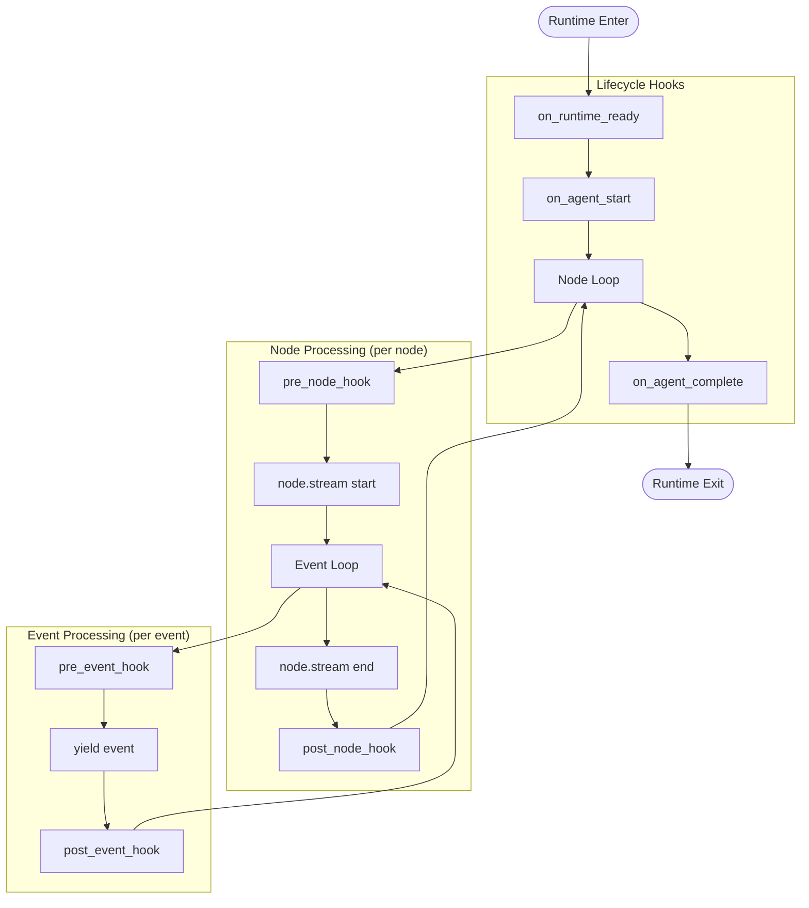
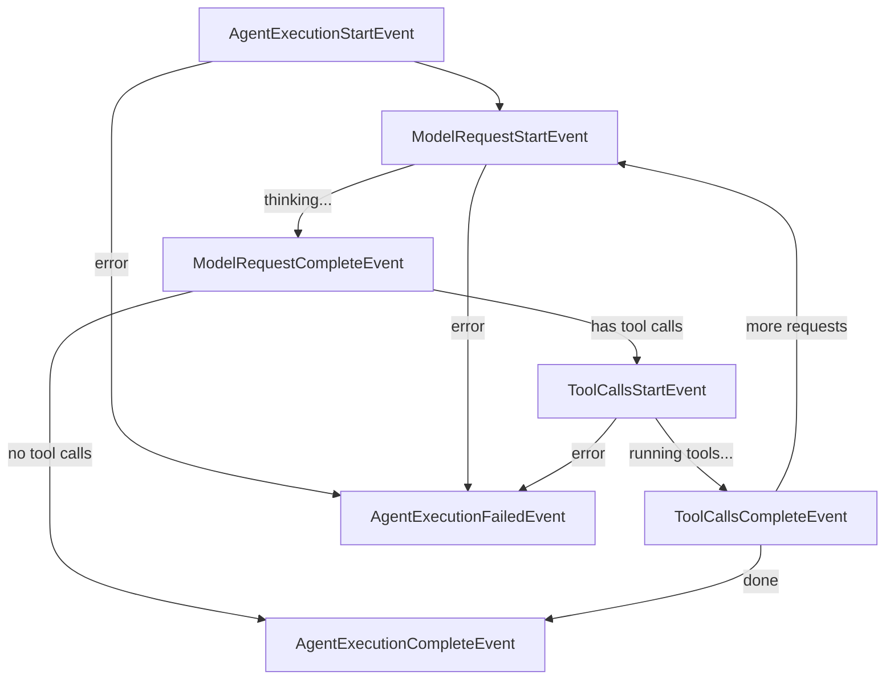

# Streaming and Hooks

Real-time streaming of agent execution with customizable hook points.

## Overview

`stream_agent` provides a streaming interface for agent execution with:

- **Event Streaming**: Real-time events from main agent and subagents
- **Lifecycle Hooks**: Inject custom logic at key execution points
- **Runtime Management**: Automatic lifecycle handling for env, ctx, and agent



## Basic Usage

```python
from pai_agent_sdk.agents import create_agent, stream_agent

runtime = create_agent("openai:gpt-4o")

async with stream_agent(runtime, "Hello") as streamer:
    async for event in streamer:
        print(f"[{event.agent_name}] {event.event}")
```

## Dynamic Prompt Generation

Use `user_prompt_factory` when the prompt requires runtime resources (e.g., reading files):

```python
async def build_prompt(runtime: AgentRuntime) -> str:
    # Access runtime resources to build prompt
    content = await runtime.ctx.file_operator.read_file("context.md")
    return f"Based on this context:\n{content}\n\nAnswer the question."

async with stream_agent(
    runtime,
    user_prompt_factory=build_prompt,
) as streamer:
    async for event in streamer:
        pass
```

**Note**: `user_prompt` and `user_prompt_factory` are mutually exclusive. Providing both raises `UserError`.

````

## Hook System

### Hook Types

| Hook                | Timing                                         | Use Cases                                           |
| ------------------- | ---------------------------------------------- | --------------------------------------------------- |
| `on_runtime_ready`  | After runtime enters, before `agent.iter()`    | Initialize resources, emit events, modify ctx state |
| `on_agent_start`    | After `agent.iter()` starts, before first node | Access run object, log agent start                  |
| `on_agent_complete` | After all nodes processed, before iter exits   | Access result/usage, log completion                 |
| `pre_node_hook`     | Before each node's `stream()` starts           | Logging, metrics, conditional logic                 |
| `post_node_hook`    | After each node's `stream()` completes         | Cleanup, aggregation, timing                        |
| `pre_event_hook`    | Before each event is yielded                   | Event filtering, transformation                     |
| `post_event_hook`   | After each event is yielded                    | Logging, side effects                               |

### Lifecycle Hooks

The three lifecycle hooks provide control at key points in agent execution:

```python
from pai_agent_sdk.agents.main import (
    stream_agent,
    RuntimeReadyContext,
    AgentStartContext,
    AgentCompleteContext,
)

async def on_ready(ctx: RuntimeReadyContext) -> None:
    """Called after runtime enters, before agent.iter() starts."""
    # Environment is ready, initialize resources
    await ctx.runtime.ctx.file_operator.write_file("init.log", "Starting...")

async def on_start(ctx: AgentStartContext) -> None:
    """Called after agent.iter() starts, run object available."""
    print(f"Agent started, run_id: {ctx.run.ctx.run_id}")

async def on_complete(ctx: AgentCompleteContext) -> None:
    """Called after all nodes processed, result available."""
    if ctx.run.result:
        print(f"Result: {ctx.run.result.output}")
        print(f"Usage: {ctx.run.usage()}")

async with stream_agent(
    runtime,
    "Hello",
    on_runtime_ready=on_ready,
    on_agent_start=on_start,
    on_agent_complete=on_complete,
) as streamer:
    async for event in streamer:
        pass
````

### Node and Event Hooks

```python
from pai_agent_sdk.agents.main import (
    stream_agent,
    NodeHookContext,
    EventHookContext,
)

async def pre_node(ctx: NodeHookContext) -> None:
    print(f"Starting node: {type(ctx.node).__name__}")

async def post_node(ctx: NodeHookContext) -> None:
    print(f"Completed node: {type(ctx.node).__name__}")

async def pre_event(ctx: EventHookContext) -> None:
    print(f"Event: {ctx.event}")

async with stream_agent(
    runtime,
    "Hello",
    pre_node_hook=pre_node,
    post_node_hook=post_node,
    pre_event_hook=pre_event,
) as streamer:
    async for event in streamer:
        pass
```

## Hook Context Classes

### RuntimeReadyContext

Available after runtime enters, before agent starts. Can be used to modify input.

| Field                   | Type                                   | Description                      |
| ----------------------- | -------------------------------------- | -------------------------------- |
| `runtime`               | `AgentRuntime[AgentDepsT, OutputT]`    | The runtime (env, ctx, agent)    |
| `agent_info`            | `AgentInfo`                            | Main agent metadata (id, name)   |
| `output_queue`          | `asyncio.Queue[StreamEvent]`           | Queue for emitting custom events |
| `user_prompt`           | `str \| Sequence[UserContent] \| None` | User prompt (modifiable)         |
| `deferred_tool_results` | `DeferredToolResults \| None`          | Deferred results (modifiable)    |

**Modifying Input:**

```python
async def on_ready(ctx: RuntimeReadyContext) -> None:
    # Modify user prompt before agent starts
    if isinstance(ctx.user_prompt, str):
        ctx.user_prompt = f"[System Note] {ctx.user_prompt}"

    # Or set deferred tool results
    ctx.deferred_tool_results = DeferredToolResults(...)
```

### AgentStartContext

Available after agent.iter() starts, before first node.

| Field          | Type                                | Description                      |
| -------------- | ----------------------------------- | -------------------------------- |
| `runtime`      | `AgentRuntime[AgentDepsT, OutputT]` | The runtime (env, ctx, agent)    |
| `agent_info`   | `AgentInfo`                         | Main agent metadata (id, name)   |
| `output_queue` | `asyncio.Queue[StreamEvent]`        | Queue for emitting custom events |
| `run`          | `AgentRun[AgentDepsT, OutputT]`     | The running agent iteration      |

### AgentCompleteContext

Available after all nodes processed.

| Field          | Type                                | Description                      |
| -------------- | ----------------------------------- | -------------------------------- |
| `runtime`      | `AgentRuntime[AgentDepsT, OutputT]` | The runtime (env, ctx, agent)    |
| `agent_info`   | `AgentInfo`                         | Main agent metadata (id, name)   |
| `output_queue` | `asyncio.Queue[StreamEvent]`        | Queue for emitting custom events |
| `run`          | `AgentRun[AgentDepsT, OutputT]`     | The run with result available    |

### NodeHookContext

Available during node processing.

| Field          | Type                                | Description                      |
| -------------- | ----------------------------------- | -------------------------------- |
| `agent_info`   | `AgentInfo`                         | Current agent metadata           |
| `node`         | `ModelRequestNode \| CallToolsNode` | Current graph node               |
| `run`          | `AgentRun[AgentDepsT, OutputT]`     | The running agent iteration      |
| `output_queue` | `asyncio.Queue[StreamEvent]`        | Queue for emitting custom events |

### EventHookContext

Available for each streamed event.

| Field          | Type                                | Description                      |
| -------------- | ----------------------------------- | -------------------------------- |
| `agent_info`   | `AgentInfo`                         | Current agent metadata           |
| `event`        | `AgentStreamEvent`                  | The event being streamed         |
| `node`         | `ModelRequestNode \| CallToolsNode` | Current graph node               |
| `run`          | `AgentRun[AgentDepsT, OutputT]`     | The running agent iteration      |
| `output_queue` | `asyncio.Queue[StreamEvent]`        | Queue for emitting custom events |

## Lifecycle Events

`stream_agent` emits built-in lifecycle events to track execution progress. These events are emitted to the stream alongside model events.

### Event Flow



### Event Types

| Event                         | When Emitted                    | Key Fields                              |
| ----------------------------- | ------------------------------- | --------------------------------------- |
| `AgentExecutionStartEvent`    | Agent execution begins          | `user_prompt`, `message_history_count`  |
| `ModelRequestStartEvent`      | Model request starts (thinking) | `loop_index`, `message_count`           |
| `ModelRequestCompleteEvent`   | Model response received         | `loop_index`, `duration_seconds`        |
| `ToolCallsStartEvent`         | Tool execution starts           | `loop_index`                            |
| `ToolCallsCompleteEvent`      | Tool execution completes        | `loop_index`, `duration_seconds`        |
| `AgentExecutionCompleteEvent` | Agent execution completes       | `total_loops`, `total_duration_seconds` |
| `AgentExecutionFailedEvent`   | Agent execution fails           | `error`, `error_type`, `total_loops`    |

### Usage Example

```python
from pai_agent_sdk.events import (
    ModelRequestStartEvent,
    ModelRequestCompleteEvent,
    ToolCallsStartEvent,
    ToolCallsCompleteEvent,
)

async with stream_agent(runtime, "Hello") as streamer:
    async for stream_event in streamer:
        event = stream_event.event
        if isinstance(event, ModelRequestStartEvent):
            print(f"Loop {event.loop_index}: Thinking...")
        elif isinstance(event, ModelRequestCompleteEvent):
            print(f"  Response received in {event.duration_seconds:.2f}s")
        elif isinstance(event, ToolCallsStartEvent):
            print(f"  Running tools...")
        elif isinstance(event, ToolCallsCompleteEvent):
            print(f"  Tools completed in {event.duration_seconds:.2f}s")
```

### Disabling Lifecycle Events

Set `emit_lifecycle_events=False` to disable built-in events (e.g., when implementing custom tracking via hooks):

```python
async with stream_agent(
    runtime,
    "Hello",
    emit_lifecycle_events=False,
) as streamer:
    async for event in streamer:
        pass  # Only model events, no lifecycle events
```

## Interruption

Interrupt streaming at any point:

```python
async with stream_agent(runtime, "Hello") as streamer:
    async for event in streamer:
        if should_stop:
            streamer.interrupt()
            break
    # AgentInterrupted is raised after context exits
```

## Error Handling

```python
# Default: exceptions are raised immediately
async with stream_agent(runtime, "Hello") as streamer:
    async for event in streamer:
        pass  # Exception raised here if error occurs

# Alternative: capture exception for later handling
async with stream_agent(runtime, "Hello", raise_on_error=False) as streamer:
    async for event in streamer:
        pass
    streamer.raise_if_exception()  # Check after iteration
```

Note: `on_runtime_exit` is always called, even when exceptions occur, making it
ideal for cleanup operations. The `exception` field in `RuntimeExitContext`
provides access to any error that occurred.

## See Also

- [context.md](context.md) - AgentContext and session management
- [toolset.md](toolset.md) - Tool-level hooks (pre/post hooks, global hooks)
- [subagent.md](subagent.md) - Subagent event streaming
