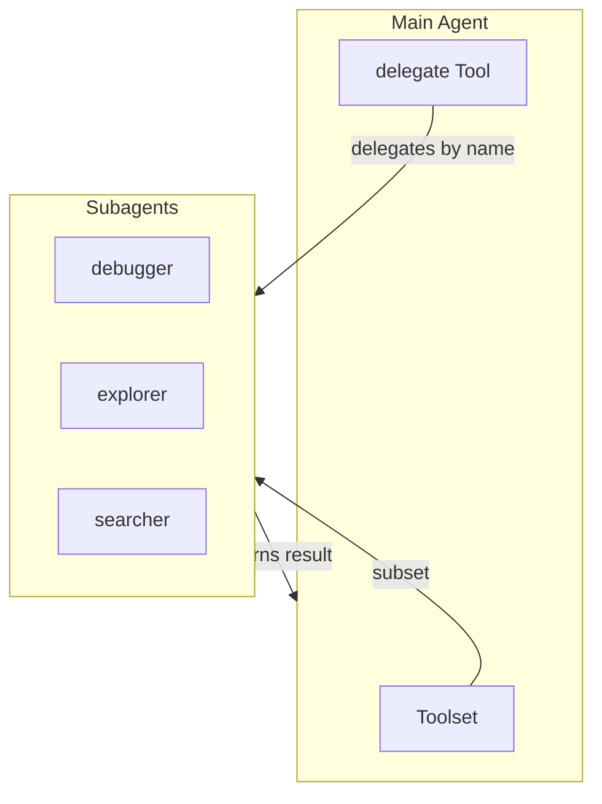

# Subagent System

Hierarchical agent architectures where a main agent delegates specialized tasks to child agents.

## Overview

- **Markdown-based Configuration**: Define subagents using markdown files with YAML frontmatter
- **Tool Inheritance**: Subagents inherit tools from parent toolset with optional filtering
- **Auto-Inherit Tools**: Management tools (task\_\*, handoff) are automatically inherited by all subagents
- **Model Flexibility**: Subagents can use different models or inherit from parent
- **Dynamic Availability**: Subagent tools are automatically disabled when required tools are unavailable
- **Unified Delegation** (Recommended): Single `delegate` tool to call any subagent by name



## Quick Start (Recommended: create_agent with unified_subagents)

The simplest way to use subagents is via `create_agent` with `unified_subagents=True`:

```python
from pai_agent_sdk.agents import create_agent
from pai_agent_sdk.subagents import SubagentConfig

# Define custom subagents
configs = [
    SubagentConfig(
        name="researcher",
        description="Research specialist",
        system_prompt="You are a research specialist...",
        tools=["search", "scrape"],
    ),
    SubagentConfig(
        name="analyst",
        description="Data analyst",
        system_prompt="You are a data analyst...",
        tools=["view", "grep"],
    ),
]

# Create agent with unified subagents (single 'delegate' tool)
runtime = create_agent(
    "anthropic:claude-sonnet-4",
    tools=[...],
    subagent_configs=configs,
    unified_subagents=True,  # Creates single 'delegate' tool
)

# Or with builtin subagents
runtime = create_agent(
    "anthropic:claude-sonnet-4",
    tools=[...],
    include_builtin_subagents=True,
    unified_subagents=True,
)
```

### Unified Tool Signature

```python
async def delegate(
    subagent_name: str,  # Name of subagent to call (e.g., "debugger", "explorer")
    prompt: str,         # Task to delegate
    agent_id: str | None = None,  # Optional ID to resume conversation
) -> str:
    ...
```

### Key Benefits

| Aspect      | Unified (Recommended)             | Individual Tools        |
| ----------- | --------------------------------- | ----------------------- |
| Tool Count  | 1 tool                            | N tools                 |
| Instruction | Single combined instruction       | N separate instructions |
| Selection   | `subagent_name` parameter         | Tool name selection     |
| Flexibility | Dynamic availability per subagent | Per-tool availability   |

## Alternative: Manual Unified Tool Creation

For more control, you can create the unified tool manually:

```python
from pai_agent_sdk.agents import create_agent
from pai_agent_sdk.subagents import (
    SubagentConfig,
    create_unified_subagent_tool,
    load_builtin_unified_subagent_tool,
)
from pai_agent_sdk.toolsets.core.base import Toolset

# Option 1: Load builtin subagents as unified tool
parent_toolset = Toolset(tools=[GrepTool, ViewTool, SearchTool, ...])
DelegateTool = load_builtin_unified_subagent_tool(
    parent_toolset,
    model="anthropic:claude-sonnet-4",
)

# Option 2: Custom subagents as unified tool
DelegateTool = create_unified_subagent_tool(
    configs,
    parent_toolset,
    model="anthropic:claude-sonnet-4",
)

# Use with create_agent
runtime = create_agent(
    "anthropic:claude-sonnet-4",
    tools=[..., DelegateTool],
)
```

## Alternative: Individual Subagent Tools

For cases where you need each subagent as a separate tool:

```python
from pai_agent_sdk.agents import create_agent
from pai_agent_sdk.subagents import SubagentConfig

config = SubagentConfig(
    name="researcher",
    description="Research specialist for web searches",
    system_prompt="You are a research specialist...",
    tools=["search", "scrape"],
)

runtime = create_agent(
    "anthropic:claude-sonnet-4",
    tools=[SearchTool, ScrapeTool, ViewTool],
    subagent_configs=[config],
    include_builtin_subagents=True,
)
```

## Configuration Format

Subagents are defined using markdown files with YAML frontmatter:

```markdown
---
name: debugger
description: Debugging specialist for errors and test failures
instruction: |
  Use the debugger subagent when encountering error messages or stack traces.
tools:
  - grep
  - view
optional_tools:
  - shell
  - edit
model: inherit
model_settings: inherit
model_cfg: inherit
---

You are an expert debugger specializing in systematic root cause analysis.
```

### Configuration Fields

| Field            | Type          | Required | Description                                                      |
| ---------------- | ------------- | -------- | ---------------------------------------------------------------- |
| `name`           | `str`         | Yes      | Unique identifier, used as tool name or subagent_name parameter  |
| `description`    | `str`         | Yes      | Shown to model when selecting tools/subagents                    |
| `instruction`    | `str`         | No       | Injected into parent's system prompt                             |
| `system_prompt`  | `str`         | Yes      | Markdown body content (after frontmatter)                        |
| `tools`          | `list[str]`   | No       | Required tools from parent (ALL must be available)               |
| `optional_tools` | `list[str]`   | No       | Optional tools (included if available)                           |
| `model`          | `str`         | No       | `"inherit"` or model name (e.g., `"anthropic:claude-sonnet-4"`)  |
| `model_settings` | `str \| dict` | No       | `"inherit"`, preset name, or dict config                         |
| `model_cfg`      | `str \| dict` | No       | `"inherit"`, preset name (e.g., `"claude_200k"`), or dict config |

### Tool Availability Rules

- **Required tools** (`tools`): ALL must be available in parent toolset for subagent to be enabled
- **Optional tools** (`optional_tools`): Included if available, not required for availability
- **Auto-inherit tools**: Tools with `auto_inherit=True` are automatically included in all subagents (e.g., `task_*`, `handoff`)
- **No tools specified**: Subagent inherits all tools from parent and is always available

### Auto-Inherit Tools

Some management tools are automatically inherited by all subagents without explicit configuration:

| Tool          | Purpose                                |
| ------------- | -------------------------------------- |
| `task_create` | Create tasks for tracking work         |
| `task_update` | Update task status and dependencies    |
| `task_list`   | List all tasks                         |
| `task_get`    | Get task details                       |
| `handoff`     | Context handoff for session management |

To create a custom auto-inherit tool:

```python
class MyManagementTool(BaseTool):
    name = "my_tool"
    description = "A management tool"
    auto_inherit = True  # Automatically inherited by all subagents

    async def call(self, ctx: RunContext[AgentContext]) -> str:
        return "result"
```

## Builtin Presets

Located in `pai_agent_sdk/subagents/presets/`:

| Preset          | Purpose                                         | Required Tools               |
| --------------- | ----------------------------------------------- | ---------------------------- |
| `debugger`      | Systematic debugging and root cause analysis    | `glob`, `grep`, `view`, `ls` |
| `explorer`      | Codebase navigation and structure understanding | `glob`, `grep`, `view`, `ls` |
| `code-reviewer` | Code quality, security, and maintainability     | `glob`, `grep`, `view`, `ls` |
| `searcher`      | Web research for documentation and solutions    | `search`                     |

```python
from pai_agent_sdk.subagents import (
    get_builtin_subagent_configs,
    load_builtin_unified_subagent_tool,  # Recommended
    load_builtin_subagent_tools,         # Individual tools
)

# Inspect configurations
configs = get_builtin_subagent_configs()

# Load as unified tool (recommended)
DelegateTool = load_builtin_unified_subagent_tool(parent_toolset, model="anthropic:claude-sonnet-4")

# Or load as individual tools
subagent_tools = load_builtin_subagent_tools(parent_toolset, model="anthropic:claude-sonnet-4")
```

## API Reference

> Full docstrings and examples: `pai_agent_sdk/subagents/__init__.py`

### Core

| Function/Class            | Description                                      |
| ------------------------- | ------------------------------------------------ |
| `SubagentConfig`          | Pydantic model for subagent configuration        |
| `INHERIT`                 | Special value indicating inheritance from parent |
| `parse_subagent_markdown` | Parse markdown string to SubagentConfig          |
| `load_subagent_from_file` | Load SubagentConfig from a markdown file         |
| `load_subagents_from_dir` | Load all SubagentConfigs from a directory        |

### Unified Subagent Factory (Recommended)

| Function                              | Description                                       |
| ------------------------------------- | ------------------------------------------------- |
| `create_unified_subagent_tool`        | Create single delegate tool from multiple configs |
| `load_unified_subagent_tool_from_dir` | Load from directory as unified tool               |
| `load_builtin_unified_subagent_tool`  | Load builtin presets as unified tool              |
| `get_available_subagent_names`        | Get subagent names from unified tool class        |

### Individual Subagent Factory

| Function                             | Description                              |
| ------------------------------------ | ---------------------------------------- |
| `create_subagent_tool_from_config`   | Create tool from SubagentConfig          |
| `create_subagent_tool_from_markdown` | Create tool from markdown file or string |
| `load_subagent_tools_from_dir`       | Load all subagent tools from a directory |
| `get_builtin_subagent_configs`       | Get builtin preset configurations        |
| `load_builtin_subagent_tools`        | Load builtin presets as individual tools |

### Low-Level (Advanced)

| Function                    | Description                                 |
| --------------------------- | ------------------------------------------- |
| `create_subagent_tool`      | Create tool from custom call function       |
| `create_subagent_call_func` | Create call function from pydantic-ai Agent |

## Best Practices

1. **Use Unified Subagent**: Prefer `create_unified_subagent_tool` over individual tools for cleaner interface
2. **Focused Responsibility**: Each subagent should have a clear, specific purpose
3. **Minimal Required Tools**: Only require essential tools; use `optional_tools` for nice-to-haves
4. **Clear Instructions**: Write `instruction` to help parent agent decide when to delegate
5. **Handle Missing Tools**: Subagents auto-disable when required tools are unavailable
6. **Parallel Execution**: Use with task manager to delegate independent tasks to subagents in parallel

## Integration with Task Manager

Subagents work well with the task manager for parallel execution of independent tasks:

```python
# In your workflow:
# 1. Create tasks with task_create
# 2. Delegate independent tasks to subagents via delegate tool
# 3. Each subagent works on its task concurrently
# 4. Update task status when subagent returns
```

The task manager can assign tasks to subagents using the `owner` field:

```python
task_update(task_id="TASK-1", owner="debugger", status="in_progress")
# Then delegate to debugger subagent
delegate(subagent_name="debugger", prompt="Fix the error in TASK-1...")
```

## See Also

- [context.md](context.md) - AgentContext and subagent history management
- [toolset.md](toolset.md) - Toolset architecture and tool creation
- [model.md](model.md) - Model configuration and presets
