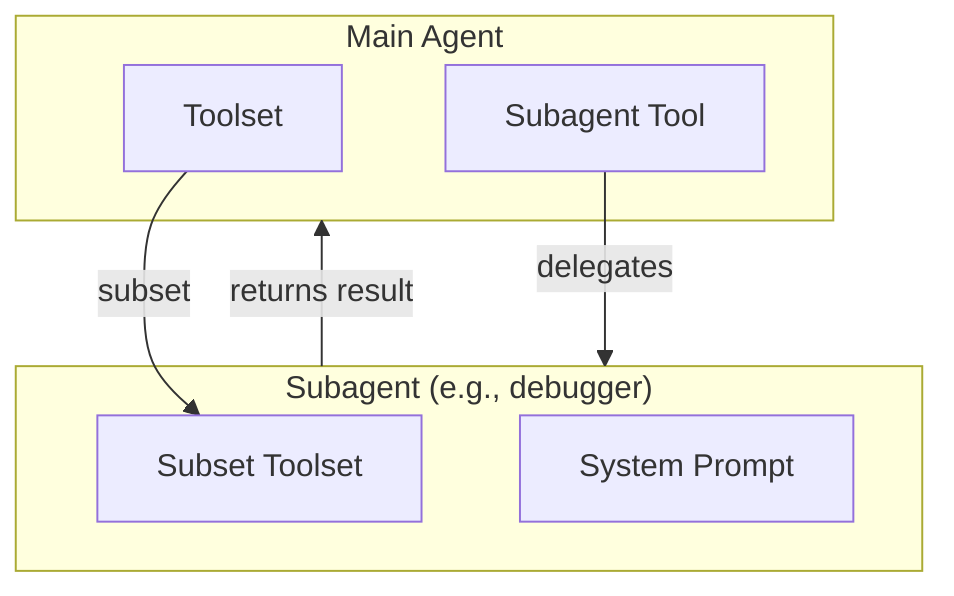

# Subagent System

Hierarchical agent architectures where a main agent delegates specialized tasks to child agents.

## Overview

- **Markdown-based Configuration**: Define subagents using markdown files with YAML frontmatter
- **Tool Inheritance**: Subagents inherit tools from parent toolset with optional filtering
- **Model Flexibility**: Subagents can use different models or inherit from parent
- **Dynamic Availability**: Subagent tools are automatically disabled when required tools are unavailable



## Quick Start

```python
from pai_agent_sdk.agents import create_agent, stream_agent
from pai_agent_sdk.subagents import SubagentConfig

config = SubagentConfig(
    name="researcher",
    description="Research specialist for web searches",
    system_prompt="You are a research specialist...",
    tools=["search", "scrape"],
)

runtime = create_agent(
    "anthropic:claude-sonnet-4",
    tools=[SearchTool, ScrapeTool, ViewTool],
    subagent_configs=[config],
    include_builtin_subagents=True,
)
```

> For more examples, see `pai_agent_sdk/subagents/__init__.py` and `examples/`.

## Configuration Format

Subagents are defined using markdown files with YAML frontmatter:

```markdown
---
name: debugger
description: Debugging specialist for errors and test failures
instruction: |
  Use the debugger subagent when encountering error messages or stack traces.
tools:
  - grep_tool
  - view
optional_tools:
  - shell
  - edit
model: inherit
model_settings: inherit
model_cfg: inherit
---

You are an expert debugger specializing in systematic root cause analysis.
```

### Configuration Fields

| Field            | Type          | Required | Description                                                      |
| ---------------- | ------------- | -------- | ---------------------------------------------------------------- |
| `name`           | `str`         | Yes      | Unique identifier, used as tool name                             |
| `description`    | `str`         | Yes      | Shown to model when selecting tools                              |
| `instruction`    | `str`         | No       | Injected into parent's system prompt                             |
| `system_prompt`  | `str`         | Yes      | Markdown body content (after frontmatter)                        |
| `tools`          | `list[str]`   | No       | Required tools from parent (ALL must be available)               |
| `optional_tools` | `list[str]`   | No       | Optional tools (included if available)                           |
| `model`          | `str`         | No       | `"inherit"` or model name (e.g., `"anthropic:claude-sonnet-4"`)  |
| `model_settings` | `str \| dict` | No       | `"inherit"`, preset name, or dict config                         |
| `model_cfg`      | `str \| dict` | No       | `"inherit"`, preset name (e.g., `"claude_200k"`), or dict config |

### Tool Availability Rules

- **Required tools** (`tools`): ALL must be available in parent toolset for subagent to be enabled
- **Optional tools** (`optional_tools`): Included if available, not required for availability
- **No tools specified**: Subagent inherits all tools from parent and is always available

## Builtin Presets

Located in `pai_agent_sdk/subagents/presets/`:

| Preset          | Purpose                                         | Required Tools                         |
| --------------- | ----------------------------------------------- | -------------------------------------- |
| `debugger`      | Systematic debugging and root cause analysis    | `glob_tool`, `grep_tool`, `view`, `ls` |
| `explorer`      | Codebase navigation and structure understanding | `glob_tool`, `grep_tool`, `view`, `ls` |
| `code-reviewer` | Code quality, security, and maintainability     | `glob_tool`, `grep_tool`, `view`, `ls` |
| `searcher`      | Web research for documentation and solutions    | `search`                               |

```python
from pai_agent_sdk.subagents import get_builtin_subagent_configs, load_builtin_subagent_tools

# Inspect configurations
configs = get_builtin_subagent_configs()

# Load as tools
subagent_tools = load_builtin_subagent_tools(parent_toolset, model="anthropic:claude-sonnet-4")
```

## API Reference

> Full docstrings and examples: `pai_agent_sdk/subagents/__init__.py`

### Core

| Function/Class            | Description                                      |
| ------------------------- | ------------------------------------------------ |
| `SubagentConfig`          | Pydantic model for subagent configuration        |
| `INHERIT`                 | Special value indicating inheritance from parent |
| `parse_subagent_markdown` | Parse markdown string to SubagentConfig          |
| `load_subagent_from_file` | Load SubagentConfig from a markdown file         |
| `load_subagents_from_dir` | Load all SubagentConfigs from a directory        |

### Factory Functions

| Function                             | Description                              |
| ------------------------------------ | ---------------------------------------- |
| `create_subagent_tool_from_config`   | Create tool from SubagentConfig          |
| `create_subagent_tool_from_markdown` | Create tool from markdown file or string |
| `load_subagent_tools_from_dir`       | Load all subagent tools from a directory |
| `get_builtin_subagent_configs`       | Get builtin preset configurations        |
| `load_builtin_subagent_tools`        | Load builtin presets as tools            |

### Low-Level (Advanced)

| Function                    | Description                                 |
| --------------------------- | ------------------------------------------- |
| `create_subagent_tool`      | Create tool from custom call function       |
| `create_subagent_call_func` | Create call function from pydantic-ai Agent |

## Best Practices

1. **Focused Responsibility**: Each subagent should have a clear, specific purpose
2. **Minimal Required Tools**: Only require essential tools; use `optional_tools` for nice-to-haves
3. **Clear Instructions**: Write `instruction` to help parent agent decide when to delegate
4. **Handle Missing Tools**: Subagents auto-disable when required tools are unavailable

## See Also

- [context.md](context.md) - AgentContext and subagent history management
- [toolset.md](toolset.md) - Toolset architecture and tool creation
- [model.md](model.md) - Model configuration and presets
