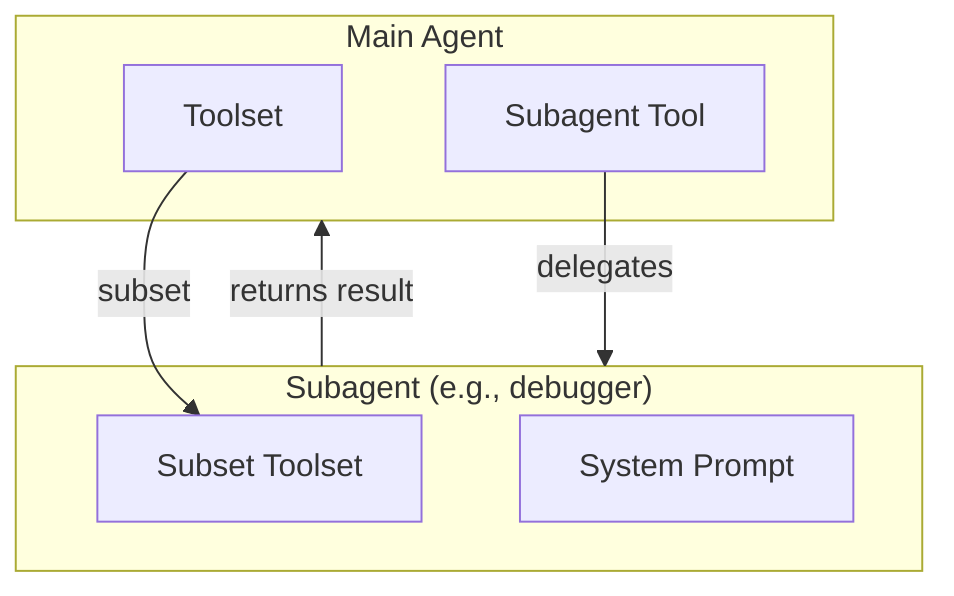

# Subagent System

This document describes the subagent architecture in pai-agent-sdk, including configuration, creation, builtin presets, and integration patterns.

## Overview

The subagent system enables **hierarchical agent architectures** where a main agent can delegate specialized tasks to child agents. Key features:

- **Markdown-based Configuration**: Define subagents using markdown files with YAML frontmatter
- **Tool Inheritance**: Subagents inherit tools from parent toolset with optional filtering
- **Model Flexibility**: Subagents can use different models or inherit from parent
- **Dynamic Availability**: Subagent tools are automatically disabled when required tools are unavailable
- **Usage Tracking**: Token usage from subagent runs is automatically recorded
- **Streaming Support**: Subagent events can be streamed to parent agent



## Architecture

### Core Components

| Component                            | Description                                                       |
| ------------------------------------ | ----------------------------------------------------------------- |
| `SubagentConfig`                     | Pydantic model holding parsed configuration from markdown         |
| `create_subagent_tool`               | Low-level factory for creating subagent tools from call functions |
| `create_subagent_tool_from_config`   | Creates subagent tool from SubagentConfig                         |
| `create_subagent_tool_from_markdown` | Creates subagent tool directly from markdown file or string       |
| `load_subagent_tools_from_dir`       | Batch-loads all subagent tools from a directory                   |
| `load_builtin_subagent_tools`        | Loads all builtin preset subagents                                |

## Configuration Format

Subagents are defined using markdown files with YAML frontmatter:

```markdown
---
name: debugger
description: Debugging specialist for errors and test failures
instruction: |
  Use the debugger subagent when:
  - Encountering error messages or stack traces
  - Tests are failing with unclear reasons
  - Code produces unexpected behavior
tools:
  - grep_tool
  - view
  - ls
optional_tools:
  - shell
  - edit
model: inherit
model_settings: inherit
---

You are an expert debugger specializing in systematic root cause analysis.

## Debugging Process

1. **Information Gathering** - Read and parse error messages
2. **Hypothesis Formation** - List possible causes
3. **Investigation** - Use tools to examine code
4. **Root Cause Identification** - Isolate the minimal case
5. **Solution Development** - Propose targeted fix
```

### Configuration Fields

| Field            | Type          | Required | Description                                                     |
| ---------------- | ------------- | -------- | --------------------------------------------------------------- |
| `name`           | `str`         | Yes      | Unique identifier, used as tool name                            |
| `description`    | `str`         | Yes      | Shown to model when selecting tools                             |
| `instruction`    | `str`         | No       | Injected into parent's system prompt                            |
| `system_prompt`  | `str`         | Yes      | Markdown body content (after frontmatter)                       |
| `tools`          | `list[str]`   | No       | Required tools from parent (ALL must be available)              |
| `optional_tools` | `list[str]`   | No       | Optional tools (included if available)                          |
| `model`          | `str`         | No       | `"inherit"` or model name (e.g., `"anthropic:claude-sonnet-4"`) |
| `model_settings` | `str \| dict` | No       | `"inherit"`, preset name, or dict config                        |
| `model_cfg`      | `dict`        | No       | ModelConfig for context management (see below)                  |

### Tool Availability Rules

- **Required tools** (`tools`): ALL must be available in parent toolset for subagent to be enabled
- **Optional tools** (`optional_tools`): Included if available, not required for availability
- **No tools specified**: Subagent inherits all tools from parent and is always available

### ModelConfig for Subagents

Subagents can have their own `model_cfg` for context management. This controls:

- `context_window`: Total context window size in tokens
- `compact_threshold`: When to trigger auto-compaction (default: 0.90)
- `max_images`: Maximum images in message history (default: 20)
- `max_videos`: Maximum videos in message history (default: 1)
- `capabilities`: Model capabilities (vision, video_understanding, document_understanding)

```yaml
---
name: fast_searcher
description: Quick search with smaller context
tools:
  - search_with_tavily
model_cfg:
  context_window: 50000
  compact_threshold: 0.80
  max_images: 5
---

You are a fast search specialist...
```

If `model_cfg` is not specified, the subagent inherits the parent's configuration.

## Usage

### Quick Start with create_agent

The simplest way to use subagents is through `create_agent`:

```python
from pai_agent_sdk.agents import create_agent
from pai_agent_sdk.subagents import SubagentConfig

# Define a custom subagent
config = SubagentConfig(
    name="researcher",
    description="Research specialist for web searches",
    system_prompt="You are a research specialist...",
    tools=["search_with_tavily", "visit_webpage"],
)

async with create_agent(
    "anthropic:claude-sonnet-4",
    tools=[SearchTool, VisitTool, ViewTool, EditTool],
    subagent_configs=[config],  # Add custom subagents
    include_builtin_subagents=True,  # Also include builtin presets
) as runtime:
    result = await runtime.agent.run(
        "Debug this error: TypeError in line 42",
        deps=runtime.ctx,
    )
```

### Loading from Markdown Files

```python
from pai_agent_sdk.subagents import (
    create_subagent_tool_from_markdown,
    load_subagent_tools_from_dir,
)
from pai_agent_sdk.toolsets.core.base import Toolset

# Create parent toolset
parent_toolset = Toolset(ctx, tools=[GrepTool, ViewTool, EditTool])

# Single file
DebuggerTool = create_subagent_tool_from_markdown(
    "subagents/debugger.md",
    parent_toolset=parent_toolset,
    model="anthropic:claude-sonnet-4",
)

# From directory (all .md files)
subagent_tools = load_subagent_tools_from_dir(
    "subagents/",
    parent_toolset=parent_toolset,
    model="anthropic:claude-sonnet-4",
    model_settings="anthropic_medium",
)
```

### Using Toolset.with_subagents

For more control, use the `with_subagents` method:

```python
from pai_agent_sdk.subagents import SubagentConfig

config = SubagentConfig(
    name="explorer",
    description="Codebase exploration specialist",
    system_prompt="You are a codebase explorer...",
    tools=["grep_tool", "glob_tool", "view", "ls"],
)

# Create extended toolset with subagent
toolset_with_subs = parent_toolset.with_subagents(
    [config],
    model="anthropic:claude-sonnet-4",
    model_settings={"temperature": 0.3},
)

# Use with agent
agent = Agent(
    model="anthropic:claude-sonnet-4",
    toolsets=[toolset_with_subs],
)
```

### Parsing Configuration Programmatically

```python
from pai_agent_sdk.subagents import parse_subagent_markdown, SubagentConfig

# From string
config = parse_subagent_markdown("""
---
name: analyzer
description: Code analysis specialist
tools:
  - grep_tool
  - view
---

You are a code analyzer...
""")

# Access fields
print(config.name)           # "analyzer"
print(config.tools)          # ["grep_tool", "view"]
print(config.system_prompt)  # "You are a code analyzer..."
```

## Builtin Presets

The SDK includes four builtin subagent presets in `pai_agent_sdk/subagents/presets/`:

### debugger

**Purpose**: Systematic debugging and root cause analysis

```python
# Required tools: glob_tool, grep_tool, view, ls
# Optional tools: shell, edit, multi_edit, replace
```

**When to use**:

- Error messages, exceptions, or stack traces
- Failing tests with unclear reasons
- Unexpected code behavior
- Build or compilation errors

### explorer

**Purpose**: Codebase navigation and structure understanding

```python
# Required tools: glob_tool, grep_tool, view, ls
# Optional tools: edit, multi_edit, replace
```

**When to use**:

- Understanding unfamiliar codebase structure
- Finding where functionality is implemented
- Locating function/class usages
- Mapping module dependencies

### code-reviewer

**Purpose**: Code quality, security, and maintainability analysis

```python
# Required tools: glob_tool, grep_tool, view, ls
# Optional tools: search, scrape, fetch
```

**When to use**:

- After implementing new features
- Before committing code
- When refactoring existing code
- Identifying security vulnerabilities

### searcher

**Purpose**: Web research for documentation and solutions

```python
# Required tools: search
# Optional tools: scrape, fetch, edit, multi_edit, replace
```

**When to use**:

- Looking for API documentation
- Finding solutions to error messages
- Researching best practices
- Getting current version information

### Loading Builtin Presets

```python
from pai_agent_sdk.subagents import (
    get_builtin_subagent_configs,
    load_builtin_subagent_tools,
)

# Get configurations only (for inspection)
configs = get_builtin_subagent_configs()
for name, config in configs.items():
    print(f"{name}: {config.description}")

# Load as tools
subagent_tools = load_builtin_subagent_tools(
    parent_toolset=main_toolset,
    model="anthropic:claude-sonnet-4",
    model_settings="anthropic_medium",
)
```

## Advanced Usage

### Custom Call Functions

For maximum control, create subagent tools from custom call functions:

```python
from pydantic_ai import Agent
from pydantic_ai.usage import RunUsage
from pai_agent_sdk.context import AgentContext
from pai_agent_sdk.toolsets.core.subagent import (
    create_subagent_tool,
    create_subagent_call_func,
)

# Option 1: Wrap an existing Agent
search_agent: Agent[AgentContext, str] = Agent(
    model="anthropic:claude-sonnet-4",
    system_prompt="You are a search specialist...",
    toolsets=[search_toolset],
)

search_func = create_subagent_call_func(search_agent)

SearchTool = create_subagent_tool(
    name="search",
    description="Search the web for information",
    call_func=search_func,
    instruction="Use this tool to search for current information.",
)

# Option 2: Custom call function
async def custom_search(
    ctx: AgentContext,
    query: str,
    max_results: int = 10,
) -> tuple[str, RunUsage]:
    # Custom logic here
    agent = get_search_agent()
    result = await agent.run(f"Search: {query}, max: {max_results}", deps=ctx)
    return str(result.output), result.usage()

CustomSearchTool = create_subagent_tool(
    name="custom_search",
    description="Custom search implementation",
    call_func=custom_search,
)
```

### Dynamic Availability

Subagent tools support dynamic availability checking:

```python
def check_api_available() -> bool:
    return os.environ.get("API_KEY") is not None

ApiTool = create_subagent_tool(
    name="api_tool",
    description="Call external API",
    call_func=api_call_func,
    availability_check=check_api_available,  # Called each time
)
```

### Subagent Context and Streaming

Subagents run in a child context with automatic usage tracking:

```python
async def search_with_stream(
    ctx: AgentContext,
    query: str,
) -> tuple[str, RunUsage]:
    # ctx is the subagent context (created by enter_subagent)
    # ctx.parent_run_id is the tool_call_id

    agent = get_search_agent()
    async for event in agent.run_stream_events(query, deps=ctx):
        # Forward events to parent's stream queue
        await ctx.subagent_stream_queues[ctx.run_id].put(event)

    result = await agent.run(query, deps=ctx)
    return str(result.output), result.usage()
```

### Model Settings Presets

Subagents support named model settings presets:

```python
from pai_agent_sdk.presets import list_presets, get_model_settings

# List available presets
for preset in list_presets():
    print(f"{preset.name}: {preset.description}")

# Use in configuration
config = SubagentConfig(
    name="fast_agent",
    description="Quick responses",
    system_prompt="...",
    model_settings="anthropic_low",  # Use preset name
)
```

## Best Practices

### 1. Design Focused Subagents

Each subagent should have a clear, focused purpose:

```yaml
# Good: Focused responsibility
name: debugger
description: Debug code issues and errors

# Avoid: Too broad
name: helper
description: Help with various tasks
```

### 2. Specify Minimal Required Tools

Only require tools that are essential:

```yaml
tools:
  - grep_tool  # Essential for searching
  - view       # Essential for reading
optional_tools:
  - edit       # Nice to have, not required
```

### 3. Write Clear Instructions

The `instruction` field helps the parent agent decide when to use the subagent:

```yaml
instruction: |
  Use the debugger when:
  - You see error messages or stack traces
  - Tests are failing
  - Code behaves unexpectedly

  Provide:
  - The error message
  - Steps to reproduce
  - Relevant file paths
```

### 4. Handle Missing Tools Gracefully

Subagents automatically become unavailable when required tools are missing:

```python
# Subagent will be available only if all required tools exist
tool_instance = DebuggerTool(ctx)
if tool_instance.is_available():
    # Safe to use
    pass
```

### 5. Monitor Usage

Track subagent token usage through `extra_usage`:

```python
# After agent run
for agent_name, usage in ctx.extra_usage.items():
    print(f"{agent_name}: {usage.total_tokens} tokens")
```

## API Reference

### SubagentConfig

```python
class SubagentConfig(BaseModel):
    name: str
    description: str
    instruction: str | None = None
    system_prompt: str
    tools: list[str] | None = None
    optional_tools: list[str] | None = None
    model: str | None = None
    model_settings: str | dict[str, Any] | None = None
    model_cfg: dict[str, Any] | None = None
```

### Factory Functions

```python
# Parse markdown string
def parse_subagent_markdown(content: str) -> SubagentConfig: ...

# Load from file
def load_subagent_from_file(path: Path | str) -> SubagentConfig: ...

# Load directory
def load_subagents_from_dir(dir_path: Path | str) -> dict[str, SubagentConfig]: ...

# Create tool from config
def create_subagent_tool_from_config(
    config: SubagentConfig,
    parent_toolset: Toolset[Any],
    *,
    model: str | Model | None = None,
    model_settings: dict[str, Any] | str | None = None,
    history_processors: Sequence[HistoryProcessor[AgentContext]] | None = None,
    model_cfg: ModelConfig | None = None,
) -> type[BaseTool]: ...

# Create tool from markdown
def create_subagent_tool_from_markdown(
    content: str | Path,
    parent_toolset: Toolset[Any],
    *,
    model: str | Model | None = None,
    model_settings: dict[str, Any] | str | None = None,
    history_processors: Sequence[HistoryProcessor[AgentContext]] | None = None,
    model_cfg: ModelConfig | None = None,
) -> type[BaseTool]: ...

# Load tools from directory
def load_subagent_tools_from_dir(
    dir_path: Path | str,
    parent_toolset: Toolset[Any],
    *,
    model: str | Model | None = None,
    model_settings: dict[str, Any] | str | None = None,
    history_processors: Sequence[HistoryProcessor[AgentContext]] | None = None,
    model_cfg: ModelConfig | None = None,
) -> list[type[BaseTool]]: ...

# Get builtin configs
def get_builtin_subagent_configs() -> dict[str, SubagentConfig]: ...

# Load builtin tools
def load_builtin_subagent_tools(
    parent_toolset: Toolset[Any],
    *,
    model: str | Model | None = None,
    model_settings: dict[str, Any] | str | None = None,
    history_processors: Sequence[HistoryProcessor[AgentContext]] | None = None,
    model_cfg: ModelConfig | None = None,
) -> list[type[BaseTool]]: ...
```

### Low-Level Tool Creation

```python
from pai_agent_sdk.toolsets.core.subagent import (
    create_subagent_tool,
    create_subagent_call_func,
    SubagentCallFunc,
    AvailabilityCheckFunc,
)

# Create tool from call function
def create_subagent_tool(
    name: str,
    description: str,
    call_func: SubagentCallFunc,
    *,
    instruction: str | InstructionFunc | None = None,
    availability_check: AvailabilityCheckFunc | None = None,
    model_cfg: ModelConfig | None = None,
) -> type[BaseTool]: ...

# Create call function from Agent
def create_subagent_call_func(
    agent: Agent[AgentContext, Any],
) -> SubagentCallFunc: ...
```

## See Also

- [context.md](context.md) - AgentContext and subagent history management
- [toolset.md](toolset.md) - Toolset architecture and tool creation
- [model.md](model.md) - Model configuration and presets
