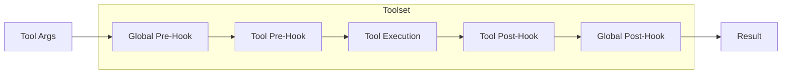

# Toolset Architecture

The toolset system for managing tools with hooks and HITL support.

## Overview

- **BaseTool**: Abstract base class for individual tools
- **Toolset**: Container that manages tools with hooks
- **Hook System**: Pre/post hooks for intercepting tool execution
- **Error Handling**: Post-hooks can intercept and handle exceptions



## Creating Tools

Inherit from `BaseTool` and implement the `call` method:

```python
from pai_agent_sdk.toolsets.core.base import BaseTool
from pydantic_ai import RunContext
from pai_agent_sdk.context import AgentContext

class MyCustomTool(BaseTool):
    name = "my_tool"
    description = "A custom tool example"

    async def call(self, ctx: RunContext[AgentContext], path: str) -> str:
        return await ctx.deps.file_operator.read_file(path)

    # Optional overrides:
    # def is_available(self, ctx) -> bool: ...
    # def get_instruction(self, ctx) -> str | Instruction | None: ...
    # def get_approval_metadata(self) -> dict | None: ...
```

> Full interface: `pai_agent_sdk/toolsets/base.py`

## Tool Instructions

Tools can provide instructions to inject into the system prompt via `get_instruction()`.

### Basic Usage

Return a plain string (uses tool name as group):

```python
class MyTool(BaseTool):
    name = "my_tool"
    description = "..."

    def get_instruction(self, ctx):
        return "Guidelines for using my_tool..."
```

### Grouped Instructions (Deduplication)

When multiple related tools share the same instruction, use `Instruction` with a `group`:

```python
from pai_agent_sdk.toolsets import Instruction

class TaskCreateTool(BaseTool):
    name = "task_create"

    def get_instruction(self, ctx):
        return Instruction(
            group="task-manager",  # Same group = deduplicated
            content="Task manager guidelines..."
        )

class TaskListTool(BaseTool):
    name = "task_list"

    def get_instruction(self, ctx):
        return Instruction(
            group="task-manager",  # Same group, only first one kept
            content="Task manager guidelines..."
        )
```

**Deduplication behavior**: When `Toolset.get_instructions()` collects instructions, tools with the same `group` only contribute once (first wins). This reduces prompt bloat for related tool families.

| Return Type   | Group ID  | Deduplicated |
| ------------- | --------- | ------------ |
| `str`         | tool name | No           |
| `Instruction` | `.group`  | Yes          |

## Using Toolset

Typically via `create_agent`:

```python
from pai_agent_sdk.agents import create_agent, stream_agent

runtime = create_agent(
    "openai:gpt-4",
    tools=[ViewTool, EditTool, GrepTool],
    pre_hooks={"view": my_pre_hook},
    post_hooks={"edit": my_post_hook},
    global_hooks=GlobalHooks(pre=global_pre, post=global_post),
)
```

> For manual toolset creation, see `pai_agent_sdk/toolsets/core/base.py`

## Hook System

### Execution Order

```
global_pre -> tool_pre -> execute -> tool_post -> global_post
```

### Hook Signatures

All hooks receive a shared `metadata` dict that persists throughout a single `call_tool` invocation.

| Hook Type            | Signature                                      |
| -------------------- | ---------------------------------------------- |
| `PreHookFunc`        | `(ctx, args, metadata) -> args`                |
| `PostHookFunc`       | `(ctx, result, metadata) -> result`            |
| `GlobalPreHookFunc`  | `(ctx, tool_name, args, metadata) -> args`     |
| `GlobalPostHookFunc` | `(ctx, tool_name, result, metadata) -> result` |

### Error Handling in Post-Hooks

Post-hooks receive the result, which **may be an Exception instance** if tool execution failed:

- Check `isinstance(result, Exception)` to handle errors
- Return a fallback value for recovery, or pass through to re-raise

> Examples: `pai_agent_sdk/toolsets/core/base.py` docstrings

## Extending Toolset

Override `_call_tool_func` for custom execution behavior (timeout, retry, error wrapping):

```python
class TimeoutToolset(Toolset):
    async def _call_tool_func(self, args, ctx, tool) -> Any:
        return await asyncio.wait_for(tool.call_func(args, ctx), timeout=30.0)
```

> Full examples: `pai_agent_sdk/toolsets/core/base.py`

## Human-in-the-Loop (HITL) Approval

Configure tools requiring user approval:

```python
ctx.need_user_approve_tools = ["shell", "edit", "replace"]
```

When called, these tools raise `ApprovalRequired`. Implement `get_approval_metadata()` in your tool to provide context.

> HITL flow details: `pai_agent_sdk/toolsets/core/base.py`

## Architecture

| Component             | Purpose                                 |
| --------------------- | --------------------------------------- |
| `BaseTool`            | Abstract base for individual tools      |
| `Toolset`             | Manages tools with hooks                |
| `HookableToolsetTool` | Internal wrapper with hook support      |
| `GlobalHooks`         | Container for global pre/post hooks     |
| `_call_tool_func`     | Overridable method for custom execution |

## See Also

- [context.md](context.md) - AgentContext configuration
- [subagent.md](subagent.md) - Subagent system
- [environment.md](environment.md) - Environment and resource management
