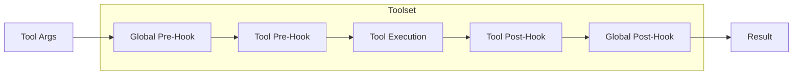
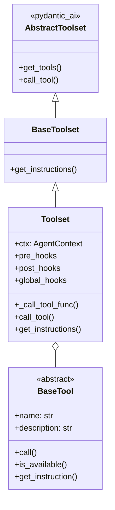

# Toolset Architecture

This document describes how to use and extend the Toolset system in pai-agent-sdk.

## Overview

The toolset system provides:

- **BaseTool**: Abstract base class for individual tools
- **Toolset**: Container that manages tools with hooks and HITL support
- **Hook System**: Pre/post hooks for intercepting tool execution
- **Error Handling**: Post-hooks can intercept and handle exceptions



## Creating Tools

Inherit from `BaseTool` and implement the `call` method:

```python
from pai_agent_sdk.toolsets.core.base import BaseTool
from pydantic_ai import RunContext
from pai_agent_sdk.context import AgentContext

class ReadFileTool(BaseTool):
    name = "read_file"
    description = "Read contents of a file"

    async def call(self, ctx: RunContext[AgentContext], path: str) -> str:
        return Path(path).read_text()
```

### Optional Methods

```python
class MyTool(BaseTool):
    name = "my_tool"
    description = "..."

    def is_available(self) -> bool:
        """Return False to exclude this tool when skip_unavailable=True."""
        return some_dependency_available()

    def get_instruction(self, ctx: RunContext[AgentContext]) -> str | None:
        """Return dynamic instructions injected into system prompt."""
        return "Use this tool when..."

    def get_approval_metadata(self) -> dict[str, Any] | None:
        """Return metadata for ApprovalRequired when HITL is triggered."""
        return {"reason": "This tool modifies files"}
```

## Using Toolset

```python
from pai_agent_sdk.toolsets.core.base import Toolset, GlobalHooks
from pai_agent_sdk.context import AgentContext

ctx = AgentContext()
toolset = Toolset(
    ctx,
    tools=[ReadFileTool, WriteFileTool],
    pre_hooks={"read_file": my_pre_hook},
    post_hooks={"write_file": my_post_hook},
    global_hooks=GlobalHooks(pre=global_pre, post=global_post),
)

agent = Agent(model="openai:gpt-4", toolsets=[toolset])
```

## Hook System

### Hook Execution Order

```
global_pre -> tool_pre -> execute -> tool_post -> global_post
```

### Hook Signatures

```python
# Pre-hook: modify arguments before execution
PreHookFunc = Callable[[RunContext[AgentDepsT], dict[str, Any]], Awaitable[dict[str, Any]]]

# Post-hook: modify result after execution
PostHookFunc = Callable[[RunContext[AgentDepsT], Any], Awaitable[Any]]

# Global pre-hook: includes tool name
GlobalPreHookFunc = Callable[[RunContext[AgentDepsT], str, dict[str, Any]], Awaitable[dict[str, Any]]]

# Global post-hook: includes tool name
GlobalPostHookFunc = Callable[[RunContext[AgentDepsT], str, Any], Awaitable[Any]]
```

### Example: Logging Hook

```python
async def logging_post_hook(ctx: RunContext, tool_name: str, result: Any) -> Any:
    logger.info(f"Tool {tool_name} returned: {result}")
    return result

toolset = Toolset(
    ctx,
    tools=[...],
    global_hooks=GlobalHooks(post=logging_post_hook),
)
```

## Error Handling in Post-Hooks

Post-hooks receive the result, which **may be an Exception instance** if tool execution failed. This enables:

- **Error Logging**: Check `isinstance(result, Exception)` to log errors
- **Error Transformation**: Convert exceptions to user-friendly messages
- **Error Recovery**: Return a fallback value for recoverable errors

If the final result after all hooks is still an Exception, it will be raised.

### Example: Error Recovery

```python
async def error_recovery_hook(ctx: RunContext, result: Any) -> Any:
    if isinstance(result, FileNotFoundError):
        return "File not found. Please check the path."
    if isinstance(result, Exception):
        # Log and re-raise other errors
        logger.error(f"Tool failed: {result}")
        return result  # Will be raised
    return result

toolset = Toolset(
    ctx,
    tools=[ReadFileTool],
    post_hooks={"read_file": error_recovery_hook},
)
```

### Example: Error Monitoring

```python
async def monitoring_hook(ctx: RunContext, tool_name: str, result: Any) -> Any:
    if isinstance(result, Exception):
        metrics.increment(f"tool.{tool_name}.error")
        logger.error(f"Tool {tool_name} failed", exc_info=result)
    else:
        metrics.increment(f"tool.{tool_name}.success")
    return result  # Pass through unchanged

toolset = Toolset(
    ctx,
    tools=[...],
    global_hooks=GlobalHooks(post=monitoring_hook),
)
```

## Extending Toolset

### Custom Tool Execution

Override `_call_tool_func` to customize execution behavior:

```python
import asyncio
from pai_agent_sdk.toolsets.core.base import Toolset, HookableToolsetTool

class TimeoutToolset(Toolset):
    """Toolset with per-tool timeout support."""

    async def _call_tool_func(
        self,
        args: dict[str, Any],
        ctx: RunContext[AgentDepsT],
        tool: HookableToolsetTool[AgentDepsT],
    ) -> Any:
        timeout = tool.timeout or 30.0
        try:
            return await asyncio.wait_for(
                tool.call_func(args, ctx),
                timeout=timeout,
            )
        except asyncio.TimeoutError as e:
            return e  # Will be passed to post-hooks
        except Exception as e:
            return e
```

### Retry Logic

```python
class RetryToolset(Toolset):
    """Toolset with automatic retry on transient errors."""

    async def _call_tool_func(
        self,
        args: dict[str, Any],
        ctx: RunContext[AgentDepsT],
        tool: HookableToolsetTool[AgentDepsT],
    ) -> Any:
        max_retries = 3
        last_error: Exception | None = None

        for attempt in range(max_retries):
            try:
                return await tool.call_func(args, ctx)
            except (ConnectionError, TimeoutError) as e:
                last_error = e
                await asyncio.sleep(2 ** attempt)  # Exponential backoff
            except Exception as e:
                return e  # Non-retryable error

        return last_error  # All retries failed
```

### Custom Error Wrapping

```python
class WrappingToolset(Toolset):
    """Toolset that wraps errors with additional context."""

    async def _call_tool_func(
        self,
        args: dict[str, Any],
        ctx: RunContext[AgentDepsT],
        tool: HookableToolsetTool[AgentDepsT],
    ) -> Any:
        try:
            return await tool.call_func(args, ctx)
        except Exception as e:
            # Wrap with tool context
            tool_name = tool.tool_def.name if tool.tool_def else "unknown"
            return ToolExecutionError(
                f"Tool '{tool_name}' failed: {e}",
                original_error=e,
                tool_args=args,
            )
```

## Architecture

### Class Hierarchy



### Key Components

| Component             | Purpose                                 |
| --------------------- | --------------------------------------- |
| `BaseTool`            | Abstract base for individual tools      |
| `Toolset`             | Manages tools with hooks                |
| `HookableToolsetTool` | Internal wrapper with hook support      |
| `GlobalHooks`         | Container for global pre/post hooks     |
| `_call_tool_func`     | Overridable method for custom execution |

## Human-in-the-Loop (HITL) Approval

Toolset supports requiring user approval before executing specific tools via pydantic-ai's `ApprovalRequired` mechanism.

### Configuring Approval-Required Tools

Set `need_user_approve_tools` in `AgentContext` to specify which tools require approval:

```python
from pai_agent_sdk.context import AgentContext

async with AgentContext(...) as ctx:
    # Tools that require user approval before execution
    ctx.need_user_approve_tools = ["shell", "edit", "replace"]
```

### How It Works

1. When a tool in `need_user_approve_tools` is called, `Toolset.call_tool()` raises `ApprovalRequired`
2. The exception includes metadata from `BaseTool.get_approval_metadata()` if implemented
3. pydantic-ai handles the approval flow, deferring execution until user confirms
4. If approved (via `ctx.tool_call_approved`), the tool executes normally

### Custom Approval Metadata

Implement `get_approval_metadata()` in your tool to provide context for approval requests:

```python
class ShellTool(BaseTool):
    name = "shell"
    description = "Execute shell commands"

    def get_approval_metadata(self) -> dict[str, Any] | None:
        return {
            "warning": "This will execute a shell command",
            "risk_level": "high",
        }

    async def call(self, ctx: RunContext[AgentContext], command: str) -> str:
        ...
```

### Session Persistence

The `need_user_approve_tools` list is included in `ResumableState`, so approval settings persist across session restores:

```python
# Export state (includes need_user_approve_tools)
state = ctx.export_state()

# Restore later - approval settings are preserved
new_ctx = AgentContext(...).with_state(state)
assert new_ctx.need_user_approve_tools == ["shell", "edit", "replace"]
```
