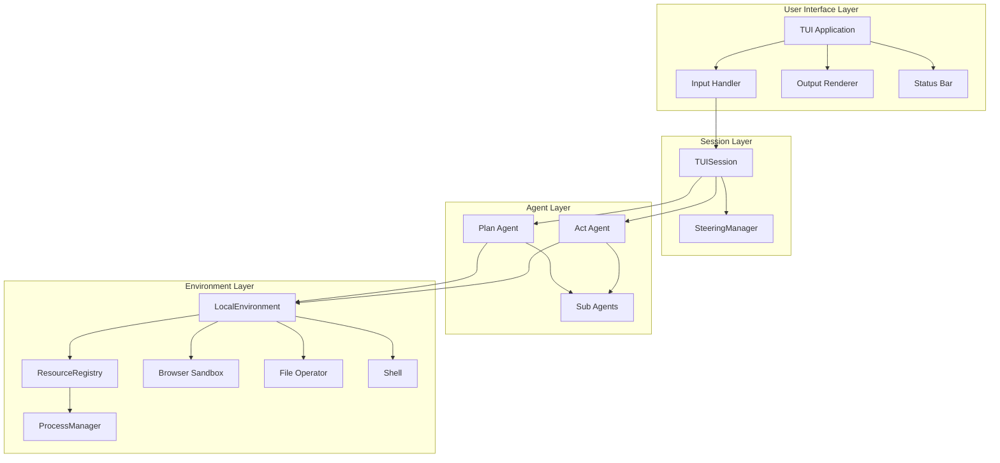

# Paintress CLI TUI Architecture Overview

## Document Index

| Document                                                 | Description                                       |
| -------------------------------------------------------- | ------------------------------------------------- |
| [01-event-system.md](./01-event-system.md)               | Event system and multi-agent display architecture |
| [02-configuration.md](./02-configuration.md)             | Configuration via environment variables           |
| [03-tui-environment.md](./03-tui-environment.md)         | TUI Environment with ProcessManager as Resource   |
| [04-steering.md](./04-steering.md)                       | Steering mechanism and TUISession design          |
| [05-browser-integration.md](./05-browser-integration.md) | Browser Use integration with CDP                  |
| [06-ui-layout.md](./06-ui-layout.md)                     | TUI layout and user experience design             |
| [07-design-review.md](./07-design-review.md)             | Final design decisions                            |

## High-Level Architecture



## Design Principles

### 1. Event-Driven via output_queue

所有 agent 活动通过 `stream_agent` 的 `output_queue` 传递:

- 通过 `pre_node_hook` 注入 `AgentPhaseEvent` (Generating/Executing 状态)
- 无额外 EventBus,直接使用 SDK 机制

### 2. Simplified Configuration

配置主要通过环境变量,用户配置目录用于:

- 自定义 subagents
- MCP 服务器配置

### 3. Dual-Mode Agents

只有 PLAN 和 ACT 两个模式:

- **PLAN**: 只读工具,分析和规划
- **ACT**: 完整工具集,执行和实现

通过 `@agent.instructions` 注入模式指导。

### 4. Composition over Inheritance

TUISession 组合 AgentContext,而非继承:

- 保持 AgentContext 不变
- Steering filter 通过闭包访问 manager
- 子 agent 正常工作

### 5. ProcessManager as Resource

ProcessManager 作为 Resource 注册到 ResourceRegistry:

- 管理长时间运行的后台进程
- TUI 退出时自动清理

## Component Responsibilities

### TUI Application

- 管理 prompt_toolkit Application 生命周期
- 处理键盘绑定和输入路由
- 协调布局组件 (output pane, status bar, input area)

### TUISession

- 持有 `AgentContext` (组合模式)
- 管理 `SteeringManager` 实例
- 跟踪 UI 状态 (IDLE/RUNNING) 和模式 (PLAN/ACT)

### LocalEnvironment

- SDK 标准环境,不修改
- 通过 ResourceRegistry 管理 ProcessManager

### Plan/Act Agent

- 两个独立的 AgentRuntime
- 不同的工具集和 instructions
- 模式切换时选择对应 runtime

## Key Data Flows

### 1. User Input Flow

```
User Input -> TUI -> TUISession -> [Steering Buffer | Agent Prompt]
```

### 2. Agent Event Flow

```
Agent Execution -> pre_node_hook -> output_queue -> TUI Renderer
```

### 3. Steering Injection Flow

```
Steering Buffer -> SteeringManager.draw_messages() -> steering_filter (closure) -> Message History
```

### 4. Mode Switch Flow

```
User: Ctrl+P/Ctrl+A -> TUISession.mode = PLAN/ACT -> Use plan_runtime/act_runtime
```
