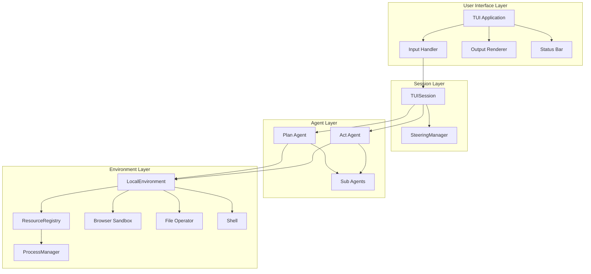

# Paintress CLI TUI Architecture Overview

## Document Index

| Document                                                 | Description                                       |
| -------------------------------------------------------- | ------------------------------------------------- |
| [01-event-system.md](./01-event-system.md)               | Event system and multi-agent display architecture |
| [02-configuration.md](./02-configuration.md)             | Configuration via environment variables           |
| [03-tui-environment.md](./03-tui-environment.md)         | TUI Environment with ProcessManager as Resource   |
| [04-steering.md](./04-steering.md)                       | Steering mechanism and TUISession design          |
| [05-browser-integration.md](./05-browser-integration.md) | Browser Use integration with CDP                  |
| [06-ui-layout.md](./06-ui-layout.md)                     | TUI layout and user experience design             |
| [07-logging.md](./07-logging.md)                         | Logging configuration                             |
| [08-hitl.md](./08-hitl.md)                               | Human-in-the-loop approval workflow               |

## High-Level Architecture



## Design Principles

### 1. Event-Driven via SDK Lifecycle Events

All agent activity flows through `stream_agent`'s event stream:

- SDK automatically emits `ModelRequestStartEvent` / `ToolCallsStartEvent` lifecycle events
- `post_node_hook` emits `ContextUpdateEvent` for token usage tracking
- No additional EventBus needed; uses SDK mechanisms directly

### 2. Simplified Configuration

Configuration primarily via environment variables. User config directory used for:

- Custom subagents
- MCP server configuration

### 3. Dual-Mode Agents

Only PLAN and ACT modes:

- **PLAN**: Read-only tools, analysis and planning
- **ACT**: Full toolset, execution and implementation

Mode guidance injected via `@agent.instructions`.

### 4. Composition over Inheritance

TUISession composes AgentContext rather than inheriting:

- Keeps AgentContext unchanged
- Steering filter accesses manager via closure
- Subagents work normally

### 5. ProcessManager as Resource

ProcessManager registered as Resource in ResourceRegistry:

- Manages long-running background processes
- Automatic cleanup on TUI exit

## Component Responsibilities

### TUI Application

- Manages prompt_toolkit Application lifecycle
- Handles keyboard bindings and input routing
- Coordinates layout components (output pane, status bar, input area)

### TUISession

- Holds `AgentContext` (composition pattern)
- Manages `SteeringManager` instance
- Tracks UI state (IDLE/RUNNING) and mode (PLAN/ACT)

### LocalEnvironment

- Standard SDK environment, unmodified
- ProcessManager managed via ResourceRegistry

### Plan/Act Agent

- Two independent AgentRuntime instances
- Different toolsets and instructions
- Mode switch selects corresponding runtime

## Key Data Flows

### 1. User Input Flow

```
User Input -> TUI -> TUISession -> [Steering Buffer | Agent Prompt]
```

### 2. Agent Event Flow

```
Agent Execution -> SDK lifecycle events -> stream_agent -> TUI Renderer
                   (ModelRequestStartEvent, ToolCallsStartEvent, etc.)
```

### 3. Steering Injection Flow

```
Steering Buffer -> SteeringManager.draw_messages() -> steering_filter (closure) -> Message History
```

### 4. Mode Switch Flow

```
User: Ctrl+P/Ctrl+A -> TUISession.mode = PLAN/ACT -> Use plan_runtime/act_runtime
```
