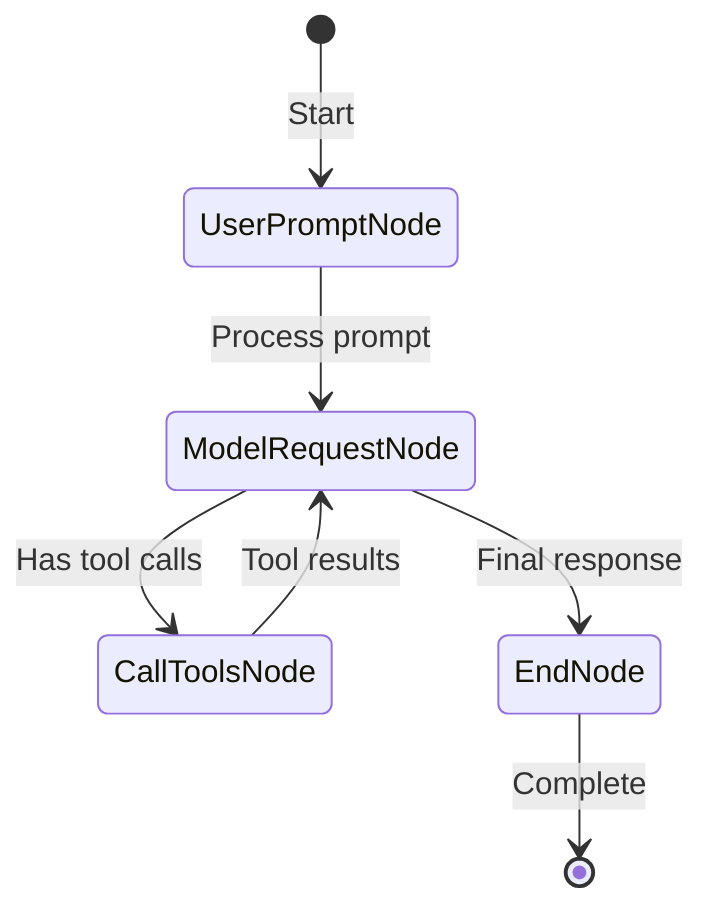
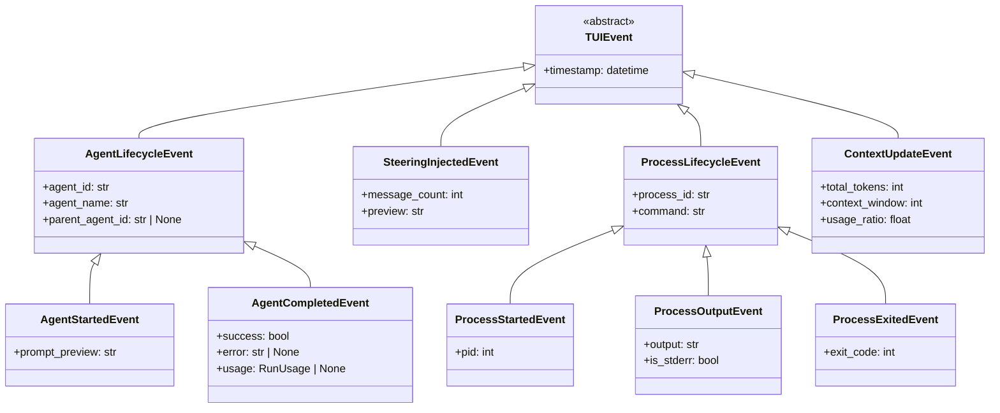
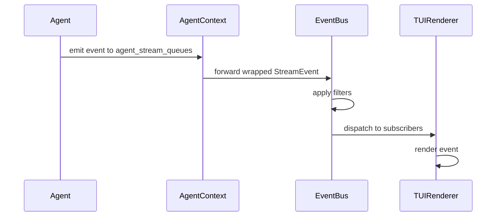

# Event System and Multi-Agent Display Architecture

## Overview

The TUI event system is built on top of `pai_agent_sdk`'s existing event infrastructure (`AgentContext.agent_stream_queues`) and extends it with TUI-specific events for comprehensive agent activity visualization.

A key integration point is `stream_agent`'s hook system, particularly `pre_node_hook`, which allows us to emit fine-grained lifecycle events based on the agent's internal state machine transitions.

## SDK Event Foundation

### Existing Event Types (from pai_agent_sdk)

```python
# From pai_agent_sdk/events.py
@dataclass
class AgentEvent:
    event_id: str
    timestamp: datetime

# Compact Events
@dataclass
class CompactStartEvent(AgentEvent):
    message_count: int

@dataclass
class CompactCompleteEvent(AgentEvent):
    summary_markdown: str
    original_message_count: int
    compacted_message_count: int

@dataclass
class CompactFailedEvent(AgentEvent):
    error: str
    message_count: int

# Handoff Events
@dataclass
class HandoffStartEvent(AgentEvent):
    message_count: int

@dataclass
class HandoffCompleteEvent(AgentEvent):
    handoff_content: str
    original_message_count: int

@dataclass
class HandoffFailedEvent(AgentEvent):
    error: str
    message_count: int
```

### Stream Event Wrapper (from context.py)

```python
@dataclass
class StreamEvent:
    """Stream event with agent identification."""
    agent_id: str
    agent_name: str
    event: AgentStreamEvent  # ModelResponseStreamEvent | HandleResponseEvent | AgentEvent
```

## Node-Level Events via pre_node_hook

The `stream_agent` function provides hooks that fire at key points in the agent's execution graph. By leveraging `pre_node_hook`, we can emit fine-grained status events that enable rich TUI status display.

### Agent Graph Nodes



| Node Type          | Description              | TUI Status           |
| ------------------ | ------------------------ | -------------------- |
| `ModelRequestNode` | Agent is calling LLM     | "Generating..."      |
| `CallToolsNode`    | Agent is executing tools | "Executing tools..." |
| `UserPromptNode`   | Processing user input    | (internal)           |
| `EndNode`          | Agent completed          | "Done"               |

### Node State Events

```python
from dataclasses import dataclass, field
from datetime import datetime
from enum import Enum

class AgentPhase(str, Enum):
    """Agent execution phase for status display."""
    IDLE = "idle"
    GENERATING = "generating"      # ModelRequestNode
    EXECUTING = "executing"        # CallToolsNode
    COMPLETED = "completed"        # EndNode

@dataclass
class AgentPhaseEvent(TUIEvent):
    """Emitted when agent transitions between execution phases.

    This event is emitted via pre_node_hook when the agent graph
    transitions to a new node type.
    """
    agent_id: str
    agent_name: str
    phase: AgentPhase
    node_type: str  # "ModelRequestNode" | "CallToolsNode" | etc.
    details: str = ""  # Optional details like "Calling claude-4-sonnet"
```

### pre_node_hook Implementation

```python
from pydantic_ai._agent_graph import ModelRequestNode, CallToolsNode

async def create_tui_pre_node_hook(
    event_bus: EventBus,
) -> NodeHook:
    """Create a pre_node_hook that emits phase events to TUI."""

    async def hook(ctx: NodeHookContext) -> None:
        node = ctx.node
        agent_info = ctx.agent_info
        output_queue = ctx.output_queue

        # Determine phase based on node type
        if isinstance(node, ModelRequestNode):
            phase = AgentPhase.GENERATING
            details = "Generating response..."
        elif isinstance(node, CallToolsNode):
            phase = AgentPhase.EXECUTING
            # Could extract tool names from node if available
            details = "Executing tools..."
        else:
            return  # Skip other node types

        # Emit phase event to output queue
        event = AgentPhaseEvent(
            agent_id=agent_info.agent_id,
            agent_name=agent_info.agent_name,
            phase=phase,
            node_type=type(node).__name__,
            details=details,
        )

        # Put wrapped event into output queue
        await output_queue.put(StreamEvent(
            agent_id=agent_info.agent_id,
            agent_name=agent_info.agent_name,
            event=event,
        ))

    return hook
```

### Status Bar Integration

The phase events enable a dynamic status bar:

```
┌─────────────────────────────────────────────────────────────────────┐
│ paintress │ claude-4 │ ACT │ Generating... │ 12.5k/200k │ 2m 34s   │
└─────────────────────────────────────────────────────────────────────┘
                              ^^^^^^^^^^^^^^^
                              Dynamic status from AgentPhaseEvent
```

Status transitions:

- **IDLE**: "Ready" (waiting for input)
- **GENERATING**: "Generating..." with spinner animation
- **EXECUTING**: "Executing tools..." or "Running: tool_name"
- **COMPLETED**: "Done" (briefly shown before returning to IDLE)

### Full Hook Integration Example

```python
async def run_with_tui_hooks(
    runtime: AgentRuntime,
    user_prompt: str,
    event_bus: EventBus,
) -> None:
    """Run agent with TUI-integrated hooks."""

    # Create hooks
    pre_node_hook = await create_tui_pre_node_hook(event_bus)

    async def post_node_hook(ctx: NodeHookContext) -> None:
        """Emit completion status after node finishes."""
        # Could track timing, emit metrics, etc.
        pass

    async with stream_agent(
        runtime,
        user_prompt,
        pre_node_hook=pre_node_hook,
        post_node_hook=post_node_hook,
    ) as streamer:
        async for event in streamer:
            # Events are automatically routed to event_bus via output_queue
            await event_bus.emit(event)
```

## TUI Event Extensions

### TUI-Specific Event Types



### Event Definitions

```python
# TUI-specific events (paintress_cli/tui/events.py)
from dataclasses import dataclass, field
from datetime import datetime
from typing import Any

@dataclass
class TUIEvent:
    """Base class for TUI-specific events."""
    timestamp: datetime = field(default_factory=datetime.now)

@dataclass
class AgentLifecycleEvent(TUIEvent):
    """Base for agent lifecycle events."""
    agent_id: str
    agent_name: str
    parent_agent_id: str | None = None

@dataclass
class AgentStartedEvent(AgentLifecycleEvent):
    """Emitted when an agent (main or sub) starts execution."""
    prompt_preview: str = ""  # First N chars of prompt

@dataclass
class AgentCompletedEvent(AgentLifecycleEvent):
    """Emitted when an agent completes execution."""
    success: bool = True
    error: str | None = None
    usage: Any = None  # RunUsage

@dataclass
class SteeringInjectedEvent(TUIEvent):
    """Emitted when steering messages are injected."""
    message_count: int = 0
    preview: str = ""

@dataclass
class ProcessStartedEvent(TUIEvent):
    """Emitted when a subprocess starts."""
    process_id: str = ""
    command: str = ""
    pid: int = 0

@dataclass
class ProcessOutputEvent(TUIEvent):
    """Emitted when subprocess produces output."""
    process_id: str = ""
    output: str = ""
    is_stderr: bool = False

@dataclass
class ProcessExitedEvent(TUIEvent):
    """Emitted when subprocess exits."""
    process_id: str = ""
    exit_code: int = 0

@dataclass
class ContextUpdateEvent(TUIEvent):
    """Real-time context usage update."""
    total_tokens: int = 0
    context_window: int = 0

    @property
    def usage_ratio(self) -> float:
        if self.context_window <= 0:
            return 0.0
        return self.total_tokens / self.context_window
```

## Event Bus Architecture

### Design Goals

1. **Unified Event Stream**: Single subscription point for all events
2. **Agent Identification**: Every event carries agent metadata
3. **Event Filtering**: Support for filtering by agent, event type
4. **Non-blocking**: Event emission never blocks agent execution

### Event Bus Implementation



### EventBus Interface

```python
class EventBus:
    """Central event hub for TUI."""

    def __init__(self) -> None:
        self._subscribers: list[Callable[[StreamEvent | TUIEvent], Awaitable[None]]] = []
        self._filters: list[Callable[[StreamEvent | TUIEvent], bool]] = []

    def subscribe(
        self,
        callback: Callable[[StreamEvent | TUIEvent], Awaitable[None]],
        filter_fn: Callable[[StreamEvent | TUIEvent], bool] | None = None,
    ) -> Callable[[], None]:
        """Subscribe to events with optional filter. Returns unsubscribe function."""
        ...

    async def emit(self, event: StreamEvent | TUIEvent) -> None:
        """Emit event to all matching subscribers."""
        ...

    def create_agent_filter(self, agent_id: str) -> Callable[[StreamEvent | TUIEvent], bool]:
        """Create filter for specific agent's events."""
        ...

    def create_type_filter(self, *event_types: type) -> Callable[[StreamEvent | TUIEvent], bool]:
        """Create filter for specific event types."""
        ...
```

## Multi-Agent Display

### Agent Tree Visualization

When subagents are active, the TUI displays a hierarchical view:

```
Main Agent [claude-4-sonnet] ━━━━━━━━━━━━━━━━━━━━━━━━━━━━━
├─ search_agent [gemini-flash] ◉ Running
│  └─ Searching for: "python async patterns"
├─ reasoning_agent [claude-4-sonnet] ✓ Completed (2.3s)
│  └─ Analysis complete: 3 recommendations
└─ design_agent [flux] ◉ Running
   └─ Generating: hero image
```

### Agent Status Indicators

| Symbol | Status     | Description                    |
| ------ | ---------- | ------------------------------ |
| `◉`    | Running    | Agent is actively executing    |
| `✓`    | Completed  | Agent finished successfully    |
| `✗`    | Failed     | Agent encountered an error     |
| `⏸`    | Paused     | Waiting for approval or input  |
| `↻`    | Compacting | Context compaction in progress |
| `→`    | Handoff    | Performing context handoff     |

### Event-to-Display Mapping

```python
class AgentDisplayManager:
    """Manages agent tree display based on events."""

    def __init__(self, event_bus: EventBus) -> None:
        self._agents: dict[str, AgentDisplayState] = {}
        self._tree_order: list[str] = []  # Maintains display order
        event_bus.subscribe(self._handle_event)

    async def _handle_event(self, event: StreamEvent | TUIEvent) -> None:
        match event:
            case AgentStartedEvent():
                self._add_agent(event)
            case AgentCompletedEvent():
                self._update_agent_status(event.agent_id, "completed", event.success)
            case StreamEvent() if isinstance(event.event, CompactStartEvent):
                self._update_agent_status(event.agent_id, "compacting")
            case StreamEvent() if isinstance(event.event, HandoffStartEvent):
                self._update_agent_status(event.agent_id, "handoff")
            # ... more cases

    def render_tree(self) -> str:
        """Render current agent tree as string."""
        ...
```

## Compact and Handoff Event Display

### Compact Events

```
┌─ Context Compaction ─────────────────────────────────────┐
│ ↻ Compacting 42 messages...                              │
│   Original: 42 messages (150k tokens)                    │
│   Result: 8 messages (45k tokens)                        │
│   Compression: 70%                                       │
└──────────────────────────────────────────────────────────┘
```

### Handoff Events

```
┌─ Context Handoff ────────────────────────────────────────┐
│ → Preparing handoff from 35 messages...                  │
│                                                          │
│ Summary:                                                 │
│   - Implemented authentication module                    │
│   - Created 5 new files                                  │
│   - Pending: integration tests                           │
│                                                          │
│ ✓ Handoff complete. Context reset.                       │
└──────────────────────────────────────────────────────────┘
```

## Event Queue Integration

### Bridging SDK and TUI Events

```python
async def bridge_agent_events(
    ctx: AgentContext,
    event_bus: EventBus,
    agent_id: str = "main",
) -> None:
    """Bridge agent_stream_queues to TUI EventBus."""
    queue = ctx.agent_stream_queues[ctx.run_id]

    while True:
        try:
            raw_event = await asyncio.wait_for(queue.get(), timeout=0.1)
            # Wrap in StreamEvent with agent identification
            stream_event = StreamEvent(
                agent_id=agent_id,
                agent_name=ctx.agent_registry.get(agent_id, AgentInfo(agent_id, "unknown")).agent_name,
                event=raw_event,
            )
            await event_bus.emit(stream_event)
        except asyncio.TimeoutError:
            continue
        except asyncio.CancelledError:
            break
```

### Subagent Event Forwarding

Subagent events are automatically captured through the shared `agent_stream_queues` mechanism:

```python
# In subagent execution (handled by SDK)
async with ctx.create_subagent_context("search", agent_id=tool_call_id) as sub_ctx:
    # Events from subagent are written to sub_ctx.agent_stream_queues[sub_ctx.run_id]
    # TUI event bridge monitors all queues in ctx.agent_stream_queues
    ...
```

## Performance Considerations

### Event Batching

For high-frequency events (like token streaming), implement batching:

```python
class EventBatcher:
    """Batches rapid events for efficient rendering."""

    def __init__(self, flush_interval: float = 0.05) -> None:
        self._buffer: list[StreamEvent] = []
        self._flush_interval = flush_interval
        self._last_flush = time.monotonic()

    async def add(self, event: StreamEvent) -> list[StreamEvent] | None:
        """Add event to buffer, return batch if flush needed."""
        self._buffer.append(event)

        now = time.monotonic()
        if now - self._last_flush >= self._flush_interval:
            batch = self._buffer
            self._buffer = []
            self._last_flush = now
            return batch
        return None
```

### Memory Management

- Events are not persisted indefinitely
- Old events are pruned after display
- Only essential metadata is retained for agent tree display
