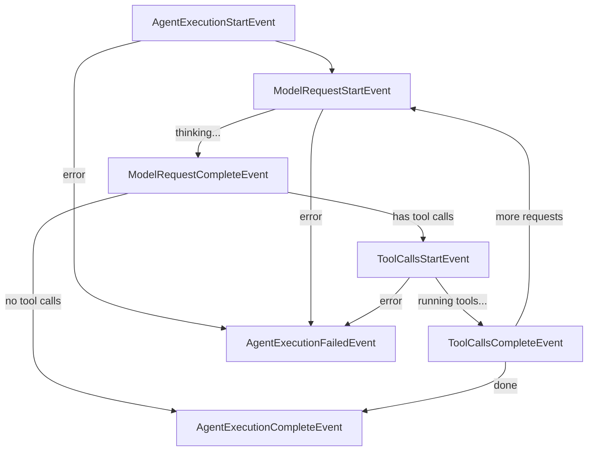
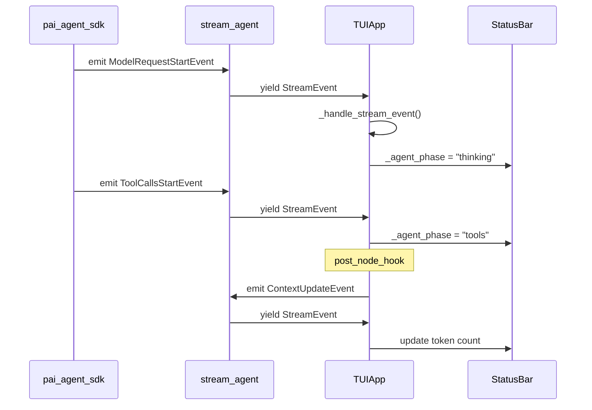

# Event System Architecture

## Overview

The TUI event system leverages `pai_agent_sdk`'s built-in event infrastructure:

1. **SDK Lifecycle Events**: Automatic status tracking via `ModelRequestStartEvent`, `ToolCallsStartEvent`, etc.
2. **SDK Sideband Events**: Compact, handoff, subagent events from `pai_agent_sdk.events`
3. **TUI-Specific Events**: `ContextUpdateEvent` for real-time token tracking

## SDK Lifecycle Events

The SDK's `stream_agent` automatically emits lifecycle events when `emit_lifecycle_events=True` (default).



### Event Types (from pai_agent_sdk.events)

| Event | When Emitted | Key Fields |
|-------|-------------|------------|
| `AgentExecutionStartEvent` | Agent execution begins | `user_prompt`, `message_history_count` |
| `ModelRequestStartEvent` | Model request starts (thinking) | `loop_index`, `message_count` |
| `ModelRequestCompleteEvent` | Model response received | `loop_index`, `duration_seconds` |
| `ToolCallsStartEvent` | Tool execution starts | `loop_index` |
| `ToolCallsCompleteEvent` | Tool execution completes | `loop_index`, `duration_seconds` |
| `AgentExecutionCompleteEvent` | Agent execution completes | `total_loops`, `total_duration_seconds` |
| `AgentExecutionFailedEvent` | Agent execution fails | `error`, `error_type`, `total_loops` |

### Status Bar Integration

The TUI uses lifecycle events to drive the status bar:

```python
# In app.py event handling
if isinstance(event, ModelRequestStartEvent):
    self._agent_phase = "thinking"
elif isinstance(event, ToolCallsStartEvent):
    self._agent_phase = "tools"

# In status bar rendering
phase_display = {
    "thinking": "Thinking...",
    "tools": "Running tools..."
}.get(self._agent_phase, "Running...")
```

**Status Bar Display:**
```
ACT | Thinking... | Context: 45% | Ctrl+C: Interrupt
ACT | Running tools... | Context: 45% | Ctrl+C: Interrupt
```

## SDK Sideband Events

These events are emitted by tools/agents for UI feedback:

### Compact Events

```python
@dataclass
class CompactStartEvent(AgentEvent):
    message_count: int

@dataclass
class CompactCompleteEvent(AgentEvent):
    summary_markdown: str
    original_message_count: int
    compacted_message_count: int

@dataclass
class CompactFailedEvent(AgentEvent):
    error: str
    message_count: int
```

### Handoff Events

```python
@dataclass
class HandoffStartEvent(AgentEvent):
    message_count: int

@dataclass
class HandoffCompleteEvent(AgentEvent):
    handoff_content: str
    original_message_count: int

@dataclass
class HandoffFailedEvent(AgentEvent):
    error: str
    message_count: int
```

### Subagent Events

```python
@dataclass
class SubagentStartEvent(AgentEvent):
    agent_id: str
    agent_name: str
    prompt_preview: str

@dataclass
class SubagentCompleteEvent(AgentEvent):
    agent_id: str
    agent_name: str
    success: bool
    request_count: int
    result_preview: str
    error: str
    duration_seconds: float
```

### Message Bus Events

```python
@dataclass
class MessageReceivedEvent(AgentEvent):
    """Emitted when steering messages are injected."""
    messages: list[BusMessageInfo]
```

## TUI-Specific Events

### ContextUpdateEvent

Real-time context usage tracking, emitted via `post_node_hook`:

```python
# paintress_cli/events.py
@dataclass
class ContextUpdateEvent(AgentEvent):
    total_tokens: int = 0
    context_window_size: int = 0
```

This event is emitted by `emit_context_update` hook in `hooks.py`:

```python
async def emit_context_update(hook_ctx: NodeHookContext) -> None:
    usage = get_latest_request_usage(hook_ctx.run.all_messages())
    event = ContextUpdateEvent(
        event_id=f"context-{uuid.uuid4().hex[:8]}",
        total_tokens=usage.total_tokens,
        context_window_size=window_size,
    )
    await hook_ctx.output_queue.put(StreamEvent(..., event=event))
```

## Event Flow Architecture



## Multi-Agent Display

When subagents are active, events carry `agent_id` and `agent_name`:

```python
@dataclass
class StreamEvent:
    agent_id: str      # e.g., "explorer-a7b9"
    agent_name: str    # e.g., "explorer"
    event: AgentStreamEvent
```

The TUI can use these to display hierarchical agent activity:

```
Main Agent [claude-4-sonnet] ━━━━━━━━━━━━━━━━━━━━━━━━━━━━━
├─ explorer [gemini-flash] ◉ Running
│  └─ Searching codebase...
└─ debugger [claude-4-sonnet] ✓ Completed (2.3s)
```

## Implementation Summary

| Component | File | Purpose |
|-----------|------|---------|
| SDK Lifecycle Events | `pai_agent_sdk/events.py` | Automatic phase tracking |
| Context Update Hook | `paintress_cli/hooks.py` | Token usage tracking |
| TUI Events | `paintress_cli/events.py` | `ContextUpdateEvent` |
| Event Handling | `paintress_cli/app.py` | `_handle_stream_event()` |

## Usage in stream_agent

```python
async with stream_agent(
    runtime,
    user_prompt,
    post_node_hook=emit_context_update,  # For token tracking
    # emit_lifecycle_events=True,  # Default, emits ModelRequestStartEvent etc.
) as stream:
    async for event in stream:
        self._handle_stream_event(event)
```
