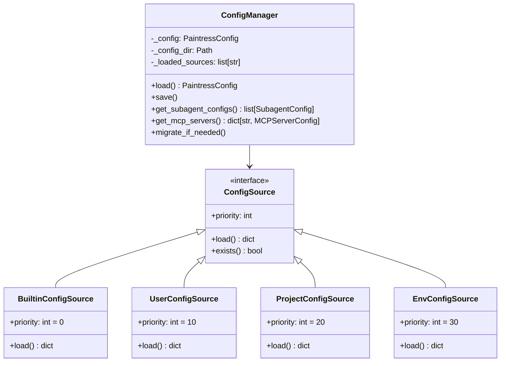
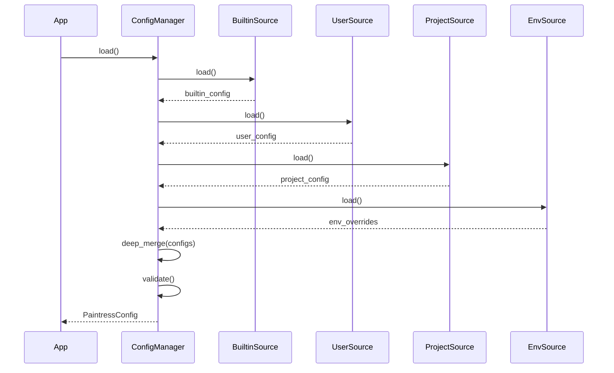

# Portable Configuration System Design

## Overview

The configuration system provides a layered approach to managing TUI settings, allowing users to customize behavior while maintaining sensible defaults. Configuration is stored at `~/.config/youware-labs/paintress-cli/` following XDG Base Directory specification.

## Directory Structure

```
~/.config/youware-labs/paintress-cli/
├── config.toml              # Main configuration file
├── subagents/               # User-defined subagent configurations
│   ├── my-researcher.md     # Custom subagent definition
│   └── code-reviewer.md     # Another custom subagent
└── mcp-servers.toml         # MCP server configurations
```

## Configuration Schema

### config.toml

```toml
# Paintress CLI Configuration
# Version: 1.0.0

[general]
# Default model for main agent
model = "anthropic:claude-sonnet-4"
# Model settings preset
model_settings = "anthropic_high"
# Auto-continue mode (agent continues without confirmation)
auto_mode = true
# Maximum requests per session
max_requests = 200

[display]
# Code highlighting theme ("dark" or "light")
code_theme = "dark"
# Maximum lines to show for tool results
max_tool_result_lines = 5
# Maximum length for tool argument display
max_arg_length = 100
# Show token usage in status bar
show_token_usage = true
# Show elapsed time
show_elapsed_time = true

[browser]
# CDP URL for browser automation
# Options:
#   - null: Disable browser features
#   - "auto": Auto-start Docker browser sandbox
#   - "ws://localhost:9222": Use existing browser
cdp_url = null
# Docker image for auto-start browser
browser_image = "zenika/alpine-chrome:latest"
# Browser startup timeout in seconds
browser_timeout = 30

[tools]
# Tools requiring user approval before execution
need_approval = [
    "shell_sandbox",
    "file_write",
]
# Enable specific tool categories
enable_bash = true
enable_web_search = true
enable_file_operations = true

[steering]
# Enable steering mode (inject messages during execution)
enabled = true
# Steering message prefix (empty = any message is steering)
prefix = ">"
# Buffer size for pending steering messages
buffer_size = 10

[subagents]
# Additional subagent directories to load
additional_dirs = []
# Disabled builtin subagents
disabled_builtins = []
# Override builtin subagent settings
[subagents.overrides.search_agent]
model = "google:gemini-2.0-flash"

[session]
# Session persistence directory
session_dir = ".paintress"
# Auto-save message history
auto_save_history = true
# Auto-restore previous session
auto_restore = true

[mcp]
# Enable MCP server integration
enabled = true
# Allow all MCP tools (dangerous)
allow_all_tools = false
# Allowed MCP tool patterns
allowed_tools = ["github_*", "filesystem_*"]
```

### mcp-servers.toml

```toml
# MCP Server Configuration

[servers.github]
transport = "stdio"
command = "npx"
args = ["-y", "@modelcontextprotocol/server-github"]
env = { GITHUB_TOKEN = "${GITHUB_TOKEN}" }

[servers.filesystem]
transport = "stdio"
command = "npx"
args = ["-y", "@modelcontextprotocol/server-filesystem", "/path/to/allowed"]

[servers.custom-api]
transport = "streamable_http"
url = "http://localhost:8080/mcp"
headers = { Authorization = "Bearer ${API_TOKEN}" }
```

## Configuration Models

```python
from pathlib import Path
from typing import Literal
from pydantic import BaseModel, Field

class GeneralConfig(BaseModel):
    model: str = "anthropic:claude-sonnet-4"
    model_settings: str | dict = "anthropic_high"
    auto_mode: bool = True
    max_requests: int = 200

class DisplayConfig(BaseModel):
    code_theme: Literal["dark", "light"] = "dark"
    max_tool_result_lines: int = 5
    max_arg_length: int = 100
    show_token_usage: bool = True
    show_elapsed_time: bool = True

class BrowserConfig(BaseModel):
    cdp_url: str | None = None  # None, "auto", or explicit URL
    browser_image: str = "zenika/alpine-chrome:latest"
    browser_timeout: int = 30

class ToolsConfig(BaseModel):
    need_approval: list[str] = Field(default_factory=lambda: ["shell_sandbox"])
    enable_bash: bool = True
    enable_web_search: bool = True
    enable_file_operations: bool = True

class SteeringConfig(BaseModel):
    enabled: bool = True
    prefix: str = ">"
    buffer_size: int = 10

class SubagentOverride(BaseModel):
    model: str | None = None
    model_settings: str | dict | None = None
    disabled: bool = False

class SubagentsConfig(BaseModel):
    additional_dirs: list[str] = Field(default_factory=list)
    disabled_builtins: list[str] = Field(default_factory=list)
    overrides: dict[str, SubagentOverride] = Field(default_factory=dict)

class SessionConfig(BaseModel):
    session_dir: str = ".paintress"
    auto_save_history: bool = True
    auto_restore: bool = True

class MCPConfig(BaseModel):
    enabled: bool = True
    allow_all_tools: bool = False
    allowed_tools: list[str] = Field(default_factory=list)

class PaintressConfig(BaseModel):
    """Complete configuration model."""
    general: GeneralConfig = Field(default_factory=GeneralConfig)
    display: DisplayConfig = Field(default_factory=DisplayConfig)
    browser: BrowserConfig = Field(default_factory=BrowserConfig)
    tools: ToolsConfig = Field(default_factory=ToolsConfig)
    steering: SteeringConfig = Field(default_factory=SteeringConfig)
    subagents: SubagentsConfig = Field(default_factory=SubagentsConfig)
    session: SessionConfig = Field(default_factory=SessionConfig)
    mcp: MCPConfig = Field(default_factory=MCPConfig)
```

## Configuration Manager

### Architecture



### Configuration Loading Flow



### Implementation

```python
import os
import tomllib
from pathlib import Path
from typing import Any

class ConfigManager:
    """Manages layered configuration loading and merging."""

    DEFAULT_CONFIG_DIR = Path.home() / ".config" / "youware-labs" / "paintress-cli"
    PROJECT_CONFIG_DIR = ".paintress"

    def __init__(
        self,
        config_dir: Path | None = None,
        project_dir: Path | None = None,
    ) -> None:
        self._config_dir = config_dir or self.DEFAULT_CONFIG_DIR
        self._project_dir = project_dir or Path.cwd()
        self._config: PaintressConfig | None = None
        self._loaded_sources: list[str] = []

    @property
    def config(self) -> PaintressConfig:
        if self._config is None:
            self._config = self.load()
        return self._config

    def load(self) -> PaintressConfig:
        """Load and merge configuration from all sources."""
        merged: dict[str, Any] = {}

        # Layer 1: Builtin defaults (from PaintressConfig defaults)
        # Nothing to load - Pydantic handles defaults

        # Layer 2: User config
        user_config_file = self._config_dir / "config.toml"
        if user_config_file.exists():
            with open(user_config_file, "rb") as f:
                user_config = tomllib.load(f)
            merged = self._deep_merge(merged, user_config)
            self._loaded_sources.append(str(user_config_file))

        # Layer 3: Project config
        project_config_file = self._project_dir / self.PROJECT_CONFIG_DIR / "config.toml"
        if project_config_file.exists():
            with open(project_config_file, "rb") as f:
                project_config = tomllib.load(f)
            merged = self._deep_merge(merged, project_config)
            self._loaded_sources.append(str(project_config_file))

        # Layer 4: Environment overrides
        env_overrides = self._load_env_overrides()
        merged = self._deep_merge(merged, env_overrides)

        # Validate and return
        self._config = PaintressConfig.model_validate(merged)
        return self._config

    def _deep_merge(self, base: dict, override: dict) -> dict:
        """Deep merge two dictionaries, override takes precedence."""
        result = base.copy()
        for key, value in override.items():
            if key in result and isinstance(result[key], dict) and isinstance(value, dict):
                result[key] = self._deep_merge(result[key], value)
            else:
                result[key] = value
        return result

    def _load_env_overrides(self) -> dict[str, Any]:
        """Load configuration from environment variables."""
        overrides: dict[str, Any] = {}

        # Map environment variables to config paths
        env_mappings = {
            "PAINTRESS_MODEL": ("general", "model"),
            "PAINTRESS_AUTO_MODE": ("general", "auto_mode"),
            "PAINTRESS_CDP_URL": ("browser", "cdp_url"),
            "PAINTRESS_SESSION_DIR": ("session", "session_dir"),
        }

        for env_var, path in env_mappings.items():
            value = os.environ.get(env_var)
            if value is not None:
                # Navigate to nested location
                current = overrides
                for key in path[:-1]:
                    current = current.setdefault(key, {})
                # Convert types as needed
                if path[-1] in ("auto_mode",):
                    value = value.lower() in ("true", "1", "yes")
                current[path[-1]] = value

        return overrides

    def ensure_config_dir(self) -> None:
        """Create config directory structure if it doesn't exist."""
        self._config_dir.mkdir(parents=True, exist_ok=True)
        (self._config_dir / "subagents").mkdir(exist_ok=True)

    def save_default_config(self, force: bool = False) -> Path | None:
        """Save default configuration to user config directory."""
        config_file = self._config_dir / "config.toml"
        if config_file.exists() and not force:
            return None

        self.ensure_config_dir()
        default_config = self._generate_default_config_toml()
        config_file.write_text(default_config)
        return config_file

    def _generate_default_config_toml(self) -> str:
        """Generate default config.toml content with comments."""
        return '''# Paintress CLI Configuration
# Generated by paintress init

[general]
model = "anthropic:claude-sonnet-4"
auto_mode = true
max_requests = 200

[display]
code_theme = "dark"
show_token_usage = true

[browser]
# Set to "auto" to auto-start Docker browser
# cdp_url = "auto"

[steering]
enabled = true
prefix = ">"

[session]
auto_save_history = true
auto_restore = true
'''
```

## Subagent Configuration Loading

### Loading User Subagents

```python
def get_subagent_configs(self) -> list[SubagentConfig]:
    """Load all subagent configurations."""
    configs: list[SubagentConfig] = []

    # 1. Load builtin subagents (from pai_agent_sdk)
    from pai_agent_sdk.subagents import get_builtin_subagent_configs
    builtin_configs = get_builtin_subagent_configs()

    for config in builtin_configs:
        # Check if disabled
        if config.name in self.config.subagents.disabled_builtins:
            continue

        # Apply overrides
        if config.name in self.config.subagents.overrides:
            override = self.config.subagents.overrides[config.name]
            if override.disabled:
                continue
            if override.model:
                config.model = override.model
            if override.model_settings:
                config.model_settings = override.model_settings

        configs.append(config)

    # 2. Load user subagents from config dir
    user_subagents_dir = self._config_dir / "subagents"
    if user_subagents_dir.exists():
        from pai_agent_sdk.subagents import load_subagents_from_dir
        user_configs = load_subagents_from_dir(user_subagents_dir)
        configs.extend(user_configs)

    # 3. Load from additional directories
    for dir_path in self.config.subagents.additional_dirs:
        path = Path(dir_path).expanduser()
        if path.exists():
            from pai_agent_sdk.subagents import load_subagents_from_dir
            additional_configs = load_subagents_from_dir(path)
            configs.extend(additional_configs)

    return configs
```

## Configuration Migration

### Version Migration

```python
class ConfigMigrator:
    """Handles configuration schema migrations."""

    CURRENT_VERSION = "1.0.0"

    def __init__(self, config_dir: Path) -> None:
        self._config_dir = config_dir
        self._version_file = config_dir / ".version"

    def get_current_version(self) -> str | None:
        """Get the version of existing configuration."""
        if not self._version_file.exists():
            return None
        return self._version_file.read_text().strip()

    def needs_migration(self) -> bool:
        """Check if configuration needs migration."""
        current = self.get_current_version()
        return current is not None and current != self.CURRENT_VERSION

    def migrate(self) -> None:
        """Run necessary migrations."""
        current = self.get_current_version()

        if current is None:
            # Fresh install, no migration needed
            self._write_version()
            return

        # Define migration path
        migrations = [
            ("0.9.0", "1.0.0", self._migrate_0_9_to_1_0),
        ]

        for from_ver, to_ver, migrator in migrations:
            if self._version_compare(current, from_ver) <= 0:
                migrator()
                current = to_ver

        self._write_version()

    def _migrate_0_9_to_1_0(self) -> None:
        """Example migration from 0.9.0 to 1.0.0."""
        config_file = self._config_dir / "config.toml"
        if not config_file.exists():
            return

        content = config_file.read_text()
        # Example: rename old key to new key
        content = content.replace("[old_section]", "[new_section]")
        config_file.write_text(content)

    def _write_version(self) -> None:
        self._version_file.write_text(self.CURRENT_VERSION)

    def _version_compare(self, v1: str, v2: str) -> int:
        """Compare version strings. Returns -1, 0, or 1."""
        parts1 = [int(x) for x in v1.split(".")]
        parts2 = [int(x) for x in v2.split(".")]
        for p1, p2 in zip(parts1, parts2):
            if p1 < p2:
                return -1
            if p1 > p2:
                return 1
        return 0
```

## CLI Commands for Configuration

```bash
# Initialize configuration with defaults
paintress init

# Show current configuration
paintress config show

# Set a configuration value
paintress config set general.model "openai:gpt-4o"

# Get a configuration value
paintress config get general.model

# Reset to defaults
paintress config reset

# Validate configuration
paintress config validate

# Copy builtin subagent to user config for customization
paintress subagent copy search_agent

# List available subagents
paintress subagent list
```
