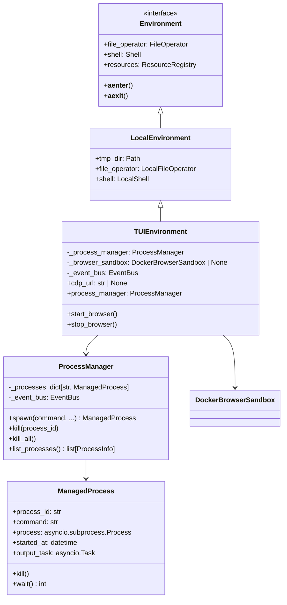
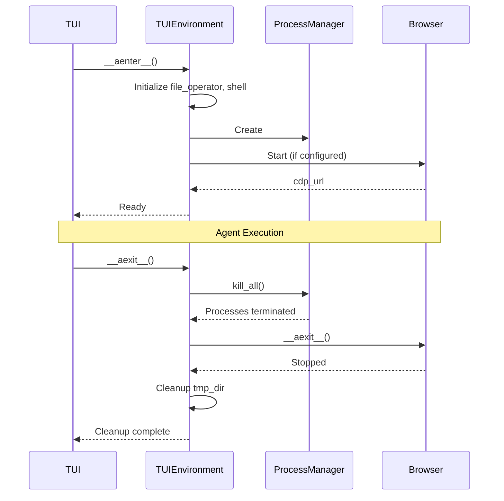

# TUI Environment with Subprocess Management

## Overview

TUIEnvironment extends `pai_agent_sdk`'s LocalEnvironment with capabilities specifically designed for TUI operation:

1. **Subprocess Management**: Track and control long-running processes
2. **Browser Integration**: Optional headless browser sandbox (future)
3. **Resource Cleanup**: Ensure all resources are properly cleaned up

> **Note**: Event emission from ProcessManager (ProcessStartedEvent, ProcessOutputEvent, etc.)
> is a planned feature not yet implemented. Currently, ProcessManager operates without
> emitting events to the TUI event stream.

## Architecture



## Process Manager

### Design Goals

1. **Tracking**: Maintain registry of all spawned processes
2. **Output Streaming**: Forward stdout/stderr to event bus
3. **Lifecycle Management**: Proper cleanup on exit or cancellation
4. **TUI Integration**: Emit events for process status display

### Process Manager Implementation

```python
import asyncio
import uuid
from dataclasses import dataclass, field
from datetime import datetime
from typing import Callable, Awaitable

@dataclass
class ProcessInfo:
    """Public information about a managed process."""
    process_id: str
    command: str
    args: list[str]
    pid: int
    started_at: datetime
    is_running: bool
    exit_code: int | None = None

@dataclass
class ManagedProcess:
    """Internal process wrapper with management capabilities."""
    process_id: str
    command: str
    args: list[str]
    process: asyncio.subprocess.Process
    started_at: datetime = field(default_factory=datetime.now)
    _output_tasks: list[asyncio.Task] = field(default_factory=list)
    _exit_code: int | None = None

    @property
    def pid(self) -> int:
        return self.process.pid

    @property
    def is_running(self) -> bool:
        return self.process.returncode is None

    @property
    def exit_code(self) -> int | None:
        return self.process.returncode

    def to_info(self) -> ProcessInfo:
        return ProcessInfo(
            process_id=self.process_id,
            command=self.command,
            args=self.args,
            pid=self.pid,
            started_at=self.started_at,
            is_running=self.is_running,
            exit_code=self.exit_code,
        )

    async def kill(self, timeout: float = 5.0) -> int:
        """Kill the process and wait for cleanup."""
        if not self.is_running:
            return self.exit_code or 0

        # Try graceful termination first
        self.process.terminate()
        try:
            await asyncio.wait_for(self.process.wait(), timeout=timeout)
        except asyncio.TimeoutError:
            # Force kill
            self.process.kill()
            await self.process.wait()

        # Cancel output tasks
        for task in self._output_tasks:
            task.cancel()
            try:
                await task
            except asyncio.CancelledError:
                pass

        return self.exit_code or -1

    async def wait(self) -> int:
        """Wait for process to complete."""
        await self.process.wait()
        return self.exit_code or 0


class ProcessManager:
    """Manages subprocess lifecycle for TUI environment."""

    def __init__(self, event_bus: EventBus | None = None) -> None:
        self._processes: dict[str, ManagedProcess] = {}
        self._event_bus = event_bus
        self._lock = asyncio.Lock()

    async def spawn(
        self,
        command: str,
        args: list[str] | None = None,
        cwd: str | None = None,
        env: dict[str, str] | None = None,
        process_id: str | None = None,
        capture_output: bool = True,
    ) -> ManagedProcess:
        """Spawn a new managed subprocess.

        Args:
            command: Command to execute
            args: Command arguments
            cwd: Working directory
            env: Environment variables (merged with current)
            process_id: Custom process ID (auto-generated if None)
            capture_output: Whether to capture and stream output

        Returns:
            ManagedProcess instance
        """
        proc_id = process_id or f"proc-{uuid.uuid4().hex[:8]}"
        args = args or []

        # Prepare environment
        import os
        full_env = os.environ.copy()
        if env:
            full_env.update(env)

        # Spawn process
        process = await asyncio.create_subprocess_exec(
            command,
            *args,
            cwd=cwd,
            env=full_env,
            stdout=asyncio.subprocess.PIPE if capture_output else None,
            stderr=asyncio.subprocess.PIPE if capture_output else None,
        )

        managed = ManagedProcess(
            process_id=proc_id,
            command=command,
            args=args,
            process=process,
        )

        async with self._lock:
            self._processes[proc_id] = managed

        # Emit start event
        if self._event_bus:
            await self._event_bus.emit(ProcessStartedEvent(
                process_id=proc_id,
                command=f"{command} {' '.join(args)}",
                pid=process.pid,
            ))

        # Start output streaming tasks
        if capture_output:
            if process.stdout:
                stdout_task = asyncio.create_task(
                    self._stream_output(managed, process.stdout, is_stderr=False)
                )
                managed._output_tasks.append(stdout_task)
            if process.stderr:
                stderr_task = asyncio.create_task(
                    self._stream_output(managed, process.stderr, is_stderr=True)
                )
                managed._output_tasks.append(stderr_task)

        # Start exit monitor
        asyncio.create_task(self._monitor_exit(managed))

        return managed

    async def _stream_output(
        self,
        managed: ManagedProcess,
        stream: asyncio.StreamReader,
        is_stderr: bool,
    ) -> None:
        """Stream process output to event bus."""
        try:
            async for line in stream:
                decoded = line.decode("utf-8", errors="replace").rstrip()
                if self._event_bus and decoded:
                    await self._event_bus.emit(ProcessOutputEvent(
                        process_id=managed.process_id,
                        output=decoded,
                        is_stderr=is_stderr,
                    ))
        except asyncio.CancelledError:
            pass

    async def _monitor_exit(self, managed: ManagedProcess) -> None:
        """Monitor process exit and emit event."""
        exit_code = await managed.process.wait()

        # Wait for output tasks to complete
        for task in managed._output_tasks:
            try:
                await asyncio.wait_for(task, timeout=1.0)
            except (asyncio.TimeoutError, asyncio.CancelledError):
                pass

        if self._event_bus:
            await self._event_bus.emit(ProcessExitedEvent(
                process_id=managed.process_id,
                exit_code=exit_code,
            ))

    async def kill(self, process_id: str, timeout: float = 5.0) -> bool:
        """Kill a specific process by ID."""
        async with self._lock:
            managed = self._processes.get(process_id)
            if not managed:
                return False

        await managed.kill(timeout)
        return True

    async def kill_all(self, timeout: float = 10.0) -> None:
        """Kill all managed processes."""
        async with self._lock:
            processes = list(self._processes.values())

        # Kill all in parallel
        await asyncio.gather(
            *[p.kill(timeout) for p in processes],
            return_exceptions=True,
        )

    def list_processes(self) -> list[ProcessInfo]:
        """List all managed processes."""
        return [p.to_info() for p in self._processes.values()]

    def get_process(self, process_id: str) -> ManagedProcess | None:
        """Get a specific process by ID."""
        return self._processes.get(process_id)
```

## TUI Environment

### Implementation

```python
from pathlib import Path
from contextlib import asynccontextmanager
from typing import AsyncIterator

from pai_agent_sdk.environment.local import LocalEnvironment
from pai_agent_sdk.sandbox.browser.docker_ import DockerBrowserSandbox

class TUIEnvironment(LocalEnvironment):
    """Extended environment for TUI with subprocess and browser support."""

    def __init__(
        self,
        working_dir: Path | None = None,
        tmp_dir: Path | None = None,
        event_bus: EventBus | None = None,
        browser_config: BrowserConfig | None = None,
    ) -> None:
        super().__init__(
            working_dir=working_dir,
            tmp_dir=tmp_dir,
        )
        self._event_bus = event_bus
        self._browser_config = browser_config
        self._process_manager: ProcessManager | None = None
        self._browser_sandbox: DockerBrowserSandbox | None = None
        self._cdp_url: str | None = None

    @property
    def process_manager(self) -> ProcessManager:
        """Get the process manager, creating if needed."""
        if self._process_manager is None:
            self._process_manager = ProcessManager(event_bus=self._event_bus)
        return self._process_manager

    @property
    def cdp_url(self) -> str | None:
        """Get the CDP URL for browser automation."""
        return self._cdp_url

    async def __aenter__(self) -> "TUIEnvironment":
        """Enter async context, initializing all resources."""
        await super().__aenter__()

        # Initialize process manager
        self._process_manager = ProcessManager(event_bus=self._event_bus)

        # Start browser if configured
        if self._browser_config and self._browser_config.cdp_url:
            await self._initialize_browser()

        return self

    async def __aexit__(self, exc_type, exc_val, exc_tb) -> None:
        """Exit async context, cleaning up all resources."""
        # Stop browser
        if self._browser_sandbox:
            await self._stop_browser()

        # Kill all processes
        if self._process_manager:
            await self._process_manager.kill_all()

        await super().__aexit__(exc_type, exc_val, exc_tb)

    async def _initialize_browser(self) -> None:
        """Initialize browser sandbox based on configuration."""
        config = self._browser_config
        if not config or not config.cdp_url:
            return

        if config.cdp_url == "auto":
            # Start Docker browser sandbox
            self._browser_sandbox = DockerBrowserSandbox(
                image=config.browser_image,
                timeout=config.browser_timeout,
            )
            self._cdp_url = await self._browser_sandbox.__aenter__()
        else:
            # Use provided CDP URL directly
            self._cdp_url = config.cdp_url

    async def _stop_browser(self) -> None:
        """Stop browser sandbox if running."""
        if self._browser_sandbox:
            await self._browser_sandbox.__aexit__(None, None, None)
            self._browser_sandbox = None
        self._cdp_url = None

    @asynccontextmanager
    async def browser_session(self) -> AsyncIterator[str]:
        """Context manager for temporary browser session.

        Use this when you need a browser only for specific operations.
        """
        if self._cdp_url:
            # Browser already running
            yield self._cdp_url
        else:
            # Start temporary browser
            sandbox = DockerBrowserSandbox()
            try:
                cdp_url = await sandbox.__aenter__()
                yield cdp_url
            finally:
                await sandbox.__aexit__(None, None, None)
```

## TUI Shell Extension

### Enhanced Shell with Event Emission

```python
from pai_agent_sdk.environment.local import LocalShell

class TUIShell(LocalShell):
    """Shell with TUI event integration."""

    def __init__(
        self,
        default_cwd: Path,
        event_bus: EventBus | None = None,
        **kwargs,
    ) -> None:
        super().__init__(default_cwd=default_cwd, **kwargs)
        self._event_bus = event_bus

    async def execute(
        self,
        command: str | list[str],
        cwd: str | None = None,
        timeout: float | None = None,
        env: dict[str, str] | None = None,
    ) -> ShellResult:
        """Execute command with event emission."""
        # Generate unique ID for this execution
        exec_id = f"shell-{uuid.uuid4().hex[:8]}"

        # Emit start event
        cmd_str = command if isinstance(command, str) else " ".join(command)
        if self._event_bus:
            await self._event_bus.emit(ProcessStartedEvent(
                process_id=exec_id,
                command=cmd_str,
                pid=0,  # Will be updated
            ))

        try:
            result = await super().execute(command, cwd=cwd, timeout=timeout, env=env)

            # Emit output events
            if self._event_bus:
                if result.stdout:
                    await self._event_bus.emit(ProcessOutputEvent(
                        process_id=exec_id,
                        output=result.stdout[:1000],  # Truncate for display
                        is_stderr=False,
                    ))
                if result.stderr:
                    await self._event_bus.emit(ProcessOutputEvent(
                        process_id=exec_id,
                        output=result.stderr[:1000],
                        is_stderr=True,
                    ))

            # Emit exit event
            if self._event_bus:
                await self._event_bus.emit(ProcessExitedEvent(
                    process_id=exec_id,
                    exit_code=result.return_code,
                ))

            return result

        except Exception as e:
            if self._event_bus:
                await self._event_bus.emit(ProcessExitedEvent(
                    process_id=exec_id,
                    exit_code=-1,
                ))
            raise
```

## Process Display in TUI

### Process Panel

```
┌─ Active Processes ───────────────────────────────────────┐
│                                                          │
│ [proc-a1b2] npm run dev                    PID: 12345    │
│   Running for 2m 34s                       ◉ Active      │
│   Last output: Server listening on :3000                 │
│                                                          │
│ [proc-c3d4] python -m pytest               PID: 12346    │
│   Running for 0m 12s                       ◉ Active      │
│   Last output: test_auth.py::test_login PASSED           │
│                                                          │
│ [browser] Chrome Headless                  CDP Ready     │
│   ws://localhost:9222/devtools/browser/...               │
│                                                          │
└──────────────────────────────────────────────────────────┘
```

### Process Control Commands

```
# In TUI input, prefix with ! for process commands
!ps                    # List all processes
!kill proc-a1b2        # Kill specific process
!kill-all              # Kill all processes
!logs proc-a1b2        # Show full output of process
```

## Resource Lifecycle



## Browser Integration Modes

### Mode 1: Auto-Start Docker Browser

```toml
# config.toml
[browser]
cdp_url = "auto"
browser_image = "zenika/alpine-chrome:latest"
```

The TUIEnvironment will:

1. Pull/use the specified Docker image
2. Start a container with Chrome
3. Wait for CDP to be available
4. Provide cdp_url to BrowserUseToolset

### Mode 2: External Browser

```toml
# config.toml
[browser]
cdp_url = "ws://localhost:9222"
```

User is responsible for:

1. Starting Chrome with `--remote-debugging-port=9222`
2. Ensuring CDP is accessible

### Mode 3: Disabled

```toml
# config.toml
[browser]
cdp_url = null
```

Browser tools will not be available to the agent.
