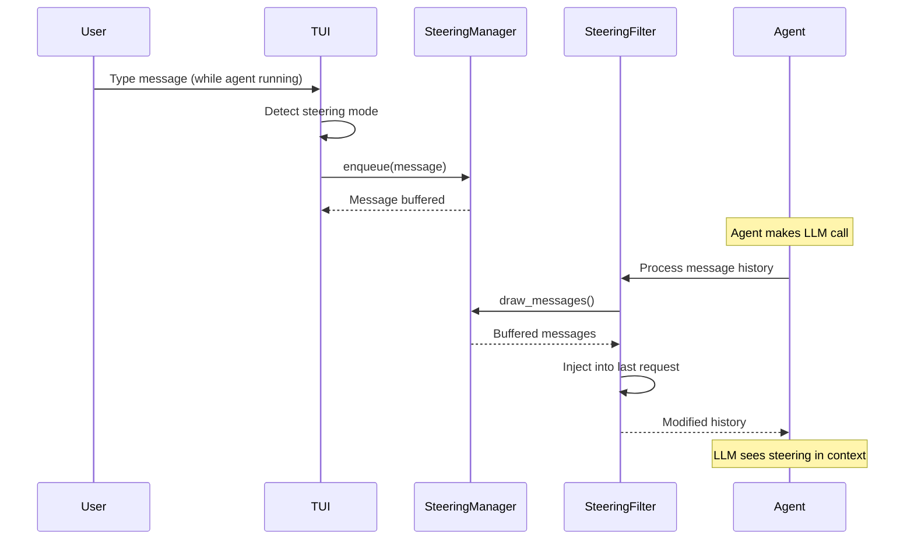
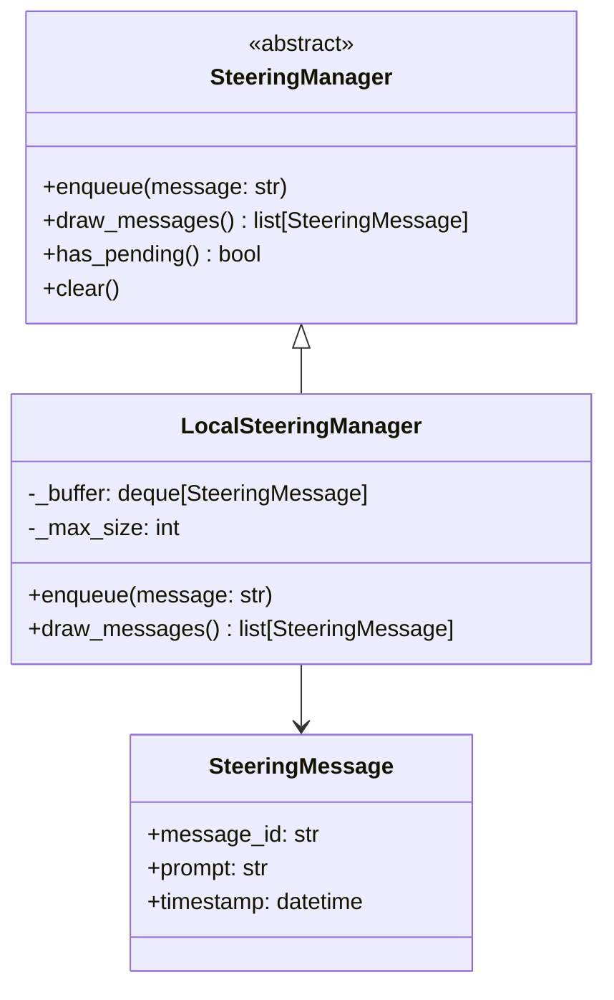
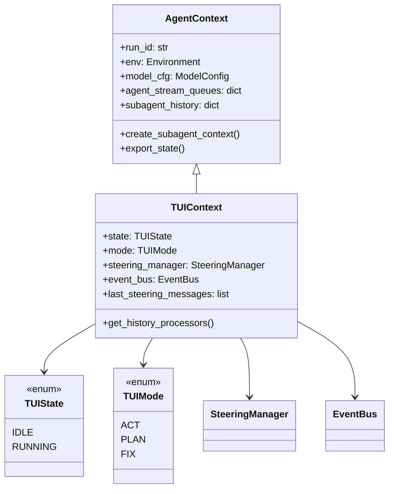
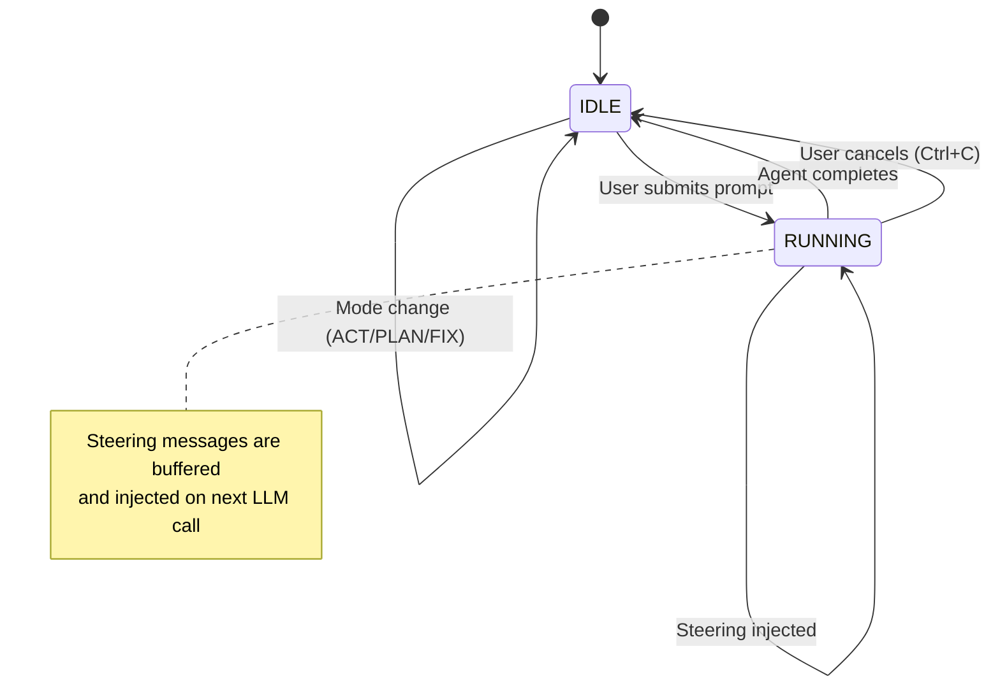

# Steering Mechanism and TUIContext Design

## Overview

Steering is a mechanism that allows users to inject guidance into an agent's execution flow without interrupting it. This is particularly useful for long-running tasks where the user wants to:

- Provide clarification or additional context
- Redirect the agent's approach
- Add constraints or preferences mid-execution

Only the **main agent** receives steering messages; subagents execute autonomously.

## Core Concepts

### Steering vs Direct Input

| Aspect    | Direct Input          | Steering                    |
| --------- | --------------------- | --------------------------- |
| Timing    | Between agent turns   | During agent execution      |
| Flow      | Starts new agent run  | Injected into current run   |
| Target    | Any agent state       | Only while agent is running |
| Mechanism | User prompt parameter | Message filter injection    |

### Steering Flow



## Steering Manager

### Architecture



### Implementation

```python
import asyncio
import uuid
from collections import deque
from dataclasses import dataclass, field
from datetime import datetime
from typing import Protocol

@dataclass
class SteeringMessage:
    """A steering message to be injected into agent context."""
    message_id: str
    prompt: str
    timestamp: datetime = field(default_factory=datetime.now)


class SteeringManager(Protocol):
    """Protocol for steering message management."""

    async def enqueue(self, message: str) -> SteeringMessage:
        """Add a steering message to the buffer."""
        ...

    async def draw_messages(self) -> list[SteeringMessage]:
        """Draw and clear all pending steering messages."""
        ...

    def has_pending(self) -> bool:
        """Check if there are pending steering messages."""
        ...

    def clear(self) -> None:
        """Clear all pending steering messages."""
        ...


class LocalSteeringManager:
    """Local in-memory steering manager for TUI."""

    def __init__(self, max_size: int = 10) -> None:
        self._buffer: deque[SteeringMessage] = deque(maxlen=max_size)
        self._lock = asyncio.Lock()

    async def enqueue(self, message: str) -> SteeringMessage:
        """Add a steering message to the buffer."""
        steering = SteeringMessage(
            message_id=f"steer-{uuid.uuid4().hex[:8]}",
            prompt=message,
        )
        async with self._lock:
            self._buffer.append(steering)
        return steering

    async def draw_messages(self) -> list[SteeringMessage]:
        """Draw and clear all pending steering messages.

        Returns all buffered messages and clears the buffer.
        This is called by the steering filter during message processing.
        """
        async with self._lock:
            messages = list(self._buffer)
            self._buffer.clear()
        return messages

    def has_pending(self) -> bool:
        """Check if there are pending steering messages."""
        return len(self._buffer) > 0

    def clear(self) -> None:
        """Clear all pending steering messages."""
        self._buffer.clear()
```

## Steering Filter

### Message Injection

The steering filter is a pydantic-ai history processor that injects steering messages into the conversation:

```python
from pydantic_ai import ModelMessage, ModelRequest, UserPromptPart, RunContext

def render_steering_messages(messages: list[SteeringMessage]) -> list[UserPromptPart]:
    """Render steering messages as user prompt parts."""
    prompts = "\n".join([m.prompt for m in messages])
    content = f"""<steering>
{prompts}
</steering>

<system-reminder>
The user has provided additional guidance during task execution.
Review the <steering> content carefully, consider how it affects your current approach,
and adjust your work accordingly while continuing toward the goal.
</system-reminder>
"""
    return [UserPromptPart(content=content)]


async def inject_steering_message(
    ctx: RunContext[TUIContext],
    message_history: list[ModelMessage],
) -> list[ModelMessage]:
    """Inject steering messages into message history.

    This is a pydantic-ai history_processor that:
    1. Checks if steering manager has pending messages
    2. Draws messages from the buffer
    3. Injects them into the last request in history
    """
    # Get steering manager from context
    tui_ctx: TUIContext = ctx.deps
    steering_manager = tui_ctx.steering_manager

    if not steering_manager:
        return message_history

    # Only inject into requests (not responses)
    if not message_history or not isinstance(message_history[-1], ModelRequest):
        return message_history

    # Draw pending messages
    try:
        steering_messages = await steering_manager.draw_messages()
    except Exception as e:
        # Log but don't fail the request
        return message_history

    if not steering_messages:
        return message_history

    # Store in context for reference
    tui_ctx.last_steering_messages = steering_messages.copy()

    # Inject into the last request
    rendered = render_steering_messages(steering_messages)
    message_history[-1].parts = [*message_history[-1].parts, *rendered]

    # Emit event for TUI display
    if tui_ctx.event_bus:
        await tui_ctx.event_bus.emit(SteeringInjectedEvent(
            message_count=len(steering_messages),
            preview=steering_messages[0].prompt[:100] if steering_messages else "",
        ))

    return message_history
```

## TUIContext Design

### Extended Context for TUI

TUIContext extends `AgentContext` with TUI-specific capabilities:



### Implementation

```python
from enum import Enum
from typing import Callable, Any

from pai_agent_sdk.context import AgentContext, ModelConfig, ToolConfig
from agent_environment import Environment

class TUIState(str, Enum):
    """TUI application state."""
    IDLE = "idle"        # Waiting for user input
    RUNNING = "running"  # Agent is executing

class TUIMode(str, Enum):
    """Agent execution mode."""
    ACT = "act"    # Execute and implement
    PLAN = "plan"  # Plan and analyze
    FIX = "fix"    # Debug and fix


class TUIContext(AgentContext):
    """Extended context for TUI with steering and state management."""

    state: TUIState = TUIState.IDLE
    """Current TUI state."""

    mode: TUIMode = TUIMode.ACT
    """Current agent mode."""

    steering_manager: SteeringManager | None = None
    """Steering manager for injecting guidance during execution."""

    event_bus: EventBus | None = None
    """Event bus for TUI event distribution."""

    last_steering_messages: list[SteeringMessage] = []
    """Last steering messages that were injected."""

    _steering_config: SteeringConfig | None = None

    def __init__(
        self,
        env: Environment | None = None,
        model_cfg: ModelConfig | None = None,
        tool_config: ToolConfig | None = None,
        event_bus: EventBus | None = None,
        steering_config: SteeringConfig | None = None,
        **kwargs: Any,
    ) -> None:
        super().__init__(
            env=env,
            model_cfg=model_cfg or ModelConfig(),
            tool_config=tool_config or ToolConfig(),
            **kwargs,
        )
        self.event_bus = event_bus
        self._steering_config = steering_config

        # Initialize steering if enabled
        if steering_config and steering_config.enabled:
            self.steering_manager = LocalSteeringManager(
                max_size=steering_config.buffer_size,
            )

    def get_history_processors(self) -> list[Callable]:
        """Get history processors including steering injection.

        Returns processors in order:
        1. tool_id_wrapper.wrap_messages (from parent)
        2. inject_steering_message (TUI-specific)
        """
        processors = super().get_history_processors()

        # Add steering injection if enabled
        if self.steering_manager:
            processors.append(inject_steering_message)

        return processors

    def transition_to(self, new_state: TUIState) -> None:
        """Transition to a new state with validation."""
        old_state = self.state
        self.state = new_state

        # Emit state change event
        if self.event_bus:
            asyncio.create_task(self.event_bus.emit(
                StateChangeEvent(
                    old_state=old_state,
                    new_state=new_state,
                )
            ))

    def set_mode(self, mode: TUIMode) -> None:
        """Set the agent execution mode."""
        self.mode = mode

    async def enqueue_steering(self, message: str) -> SteeringMessage | None:
        """Enqueue a steering message if in RUNNING state.

        Returns the queued message, or None if not in running state
        or steering is disabled.
        """
        if self.state != TUIState.RUNNING:
            return None
        if not self.steering_manager:
            return None

        # Check prefix if configured
        if self._steering_config and self._steering_config.prefix:
            if not message.startswith(self._steering_config.prefix):
                return None
            # Remove prefix
            message = message[len(self._steering_config.prefix):].strip()

        return await self.steering_manager.enqueue(message)

    def create_subagent_context(
        self,
        agent_name: str,
        agent_id: str | None = None,
        **override: Any,
    ) -> "TUIContext":
        """Create subagent context without steering.

        Subagents do not receive steering - they execute autonomously.
        """
        # Create base subagent context
        sub_ctx = super().create_subagent_context(
            agent_name=agent_name,
            agent_id=agent_id,
            **override,
        )

        # Convert to TUIContext but disable steering
        return TUIContext(
            run_id=sub_ctx.run_id,
            parent_run_id=sub_ctx.parent_run_id,
            env=sub_ctx.env,
            model_cfg=sub_ctx.model_cfg,
            tool_config=sub_ctx.tool_config,
            event_bus=self.event_bus,  # Share event bus
            steering_manager=None,      # No steering for subagents
            agent_stream_queues=self.agent_stream_queues,  # Share stream queues
            agent_registry=self.agent_registry,  # Share registry
        )
```

## TUI Input Routing

### Input Classification

```python
class InputRouter:
    """Routes TUI input to appropriate handlers."""

    def __init__(
        self,
        ctx: TUIContext,
        steering_prefix: str = ">",
        process_prefix: str = "!",
    ) -> None:
        self._ctx = ctx
        self._steering_prefix = steering_prefix
        self._process_prefix = process_prefix

    async def route(self, input_text: str) -> InputAction:
        """Classify and route user input."""
        input_text = input_text.strip()

        if not input_text:
            return InputAction.EMPTY

        # Process commands (always available)
        if input_text.startswith(self._process_prefix):
            return InputAction.PROCESS_COMMAND

        # State-dependent routing
        if self._ctx.state == TUIState.RUNNING:
            # In running state, input is steering
            if self._steering_prefix:
                if input_text.startswith(self._steering_prefix):
                    return InputAction.STEERING
                else:
                    # Show hint that steering requires prefix
                    return InputAction.INVALID_STEERING
            else:
                return InputAction.STEERING

        else:  # IDLE state
            # In idle state, input is new prompt
            return InputAction.NEW_PROMPT


class InputAction(Enum):
    EMPTY = "empty"
    NEW_PROMPT = "new_prompt"
    STEERING = "steering"
    INVALID_STEERING = "invalid_steering"
    PROCESS_COMMAND = "process_command"
```

## Steering Display

### Visual Feedback

When steering is active, the TUI shows:

```
┌─ Steering Queue ─────────────────────────────────────────┐
│ 2 messages pending                                       │
│                                                          │
│ > Focus on error handling first                          │
│ > Use async/await pattern instead                        │
│                                                          │
│ Messages will be injected on next LLM call               │
└──────────────────────────────────────────────────────────┘
```

### Injection Confirmation

When steering is injected:

```
┌─ Steering Injected ──────────────────────────────────────┐
│ 2 messages added to context                              │
│ Preview: "Focus on error handling first..."              │
└──────────────────────────────────────────────────────────┘
```

## State Transitions



## Configuration

### Steering Configuration Options

```toml
[steering]
# Enable steering capability
enabled = true

# Prefix required for steering messages (empty = no prefix required)
# When set, only messages starting with this prefix are treated as steering
prefix = ">"

# Maximum number of buffered steering messages
buffer_size = 10
```

### Prefix Behavior

| `prefix`     | IDLE Input | RUNNING Input                              |
| ------------ | ---------- | ------------------------------------------ |
| `""` (empty) | New prompt | All input is steering                      |
| `">"`        | New prompt | `>message` = steering, `message` = ignored |
| `"@"`        | New prompt | `@message` = steering, `message` = ignored |

## Subagent Isolation

### Why Subagents Don't Receive Steering

1. **Autonomy**: Subagents are designed to complete specific tasks independently
2. **Complexity**: Steering multiple concurrent subagents would be confusing
3. **Scope**: Steering is for high-level guidance, not micro-management
4. **Implementation**: Subagents may use different models/providers

### Alternative for Subagent Control

If users need to influence subagent behavior:

1. Cancel the main agent
2. Adjust the prompt with more specific instructions
3. Re-run with the modified prompt

Or configure subagent behavior through:

- Subagent system prompts (via configuration)
- Tool availability (via toolset configuration)
- Model selection (via model overrides)
