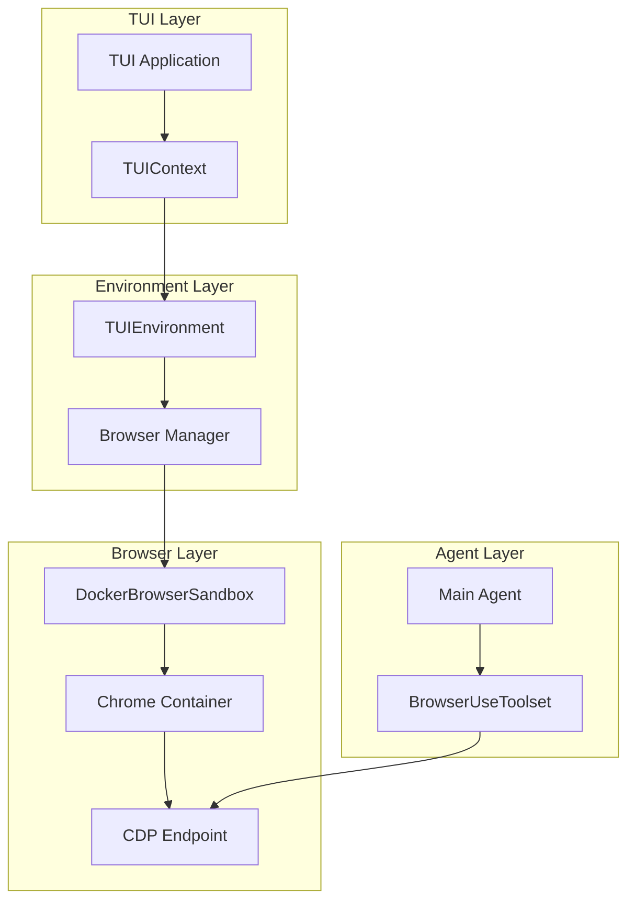
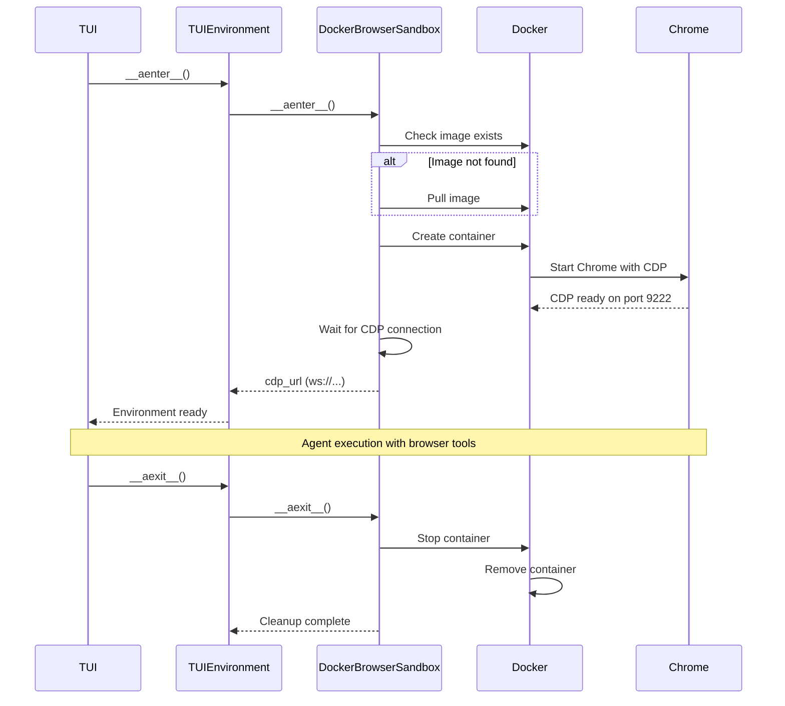

# Browser Use Integration with CDP

## Overview

Paintress CLI integrates browser automation capabilities through the Chrome DevTools Protocol (CDP). This enables agents to interact with web pages, capture screenshots, fill forms, and perform complex web automation tasks.

## Integration Modes

### Mode 1: Auto-Start Docker Browser (Recommended)

```toml
[browser]
cdp_url = "auto"
browser_image = "browserless/chromium:latest"
browser_timeout = 30
```

When `cdp_url = "auto"`:

1. TUIEnvironment checks for Docker availability
2. Pulls/uses the specified browser image
3. Starts a container with Chrome and CDP enabled
4. Waits for CDP to be ready
5. Provides `cdp_url` to BrowserUseToolset

### Mode 2: External Browser

```toml
[browser]
cdp_url = "ws://localhost:9222"
```

User must:

1. Start Chrome with `--remote-debugging-port=9222`
2. Ensure the CDP endpoint is accessible
3. TUIEnvironment connects directly

### Mode 3: Disabled (Default)

```toml
[browser]
cdp_url = null  # or omit the setting
```

Browser tools are not available to the agent.

## Architecture



## Docker Browser Sandbox

### Lifecycle



### Configuration

```python
@dataclass
class DockerBrowserConfig:
    """Configuration for Docker browser sandbox."""

    image: str = "browserless/chromium:latest"
    """Docker image to use for the browser."""

    container_name_prefix: str = "paintress-browser"
    """Prefix for container names."""

    port: int = 9222
    """Port for CDP endpoint."""

    startup_timeout: float = 30.0
    """Timeout waiting for browser to start."""

    extra_args: list[str] = field(default_factory=list)
    """Additional Chrome arguments."""

    # Chrome flags for headless operation
    default_chrome_args: list[str] = field(default_factory=lambda: [
        "--headless=new",
        "--disable-gpu",
        "--no-sandbox",
        "--disable-dev-shm-usage",
        "--disable-setuid-sandbox",
        "--disable-web-security",
        "--allow-running-insecure-content",
    ])
```

## BrowserUseToolset Integration

### Tool Registration

```python
from pai_agent_sdk.toolsets.browser_use import BrowserUseToolset

async def create_browser_toolset(
    cdp_url: str,
    event_bus: EventBus | None = None,
) -> BrowserUseToolset:
    """Create browser toolset with TUI integration."""

    toolset = BrowserUseToolset(
        cdp_url=cdp_url,
        always_use_new_page=True,
        auto_cleanup_page=True,
    )

    # Wrap tools with event emission
    if event_bus:
        original_navigate = toolset.navigate

        async def navigate_with_event(url: str, **kwargs):
            await event_bus.emit(BrowserNavigateEvent(url=url))
            result = await original_navigate(url, **kwargs)
            await event_bus.emit(BrowserNavigateCompleteEvent(url=url))
            return result

        toolset.navigate = navigate_with_event

    return toolset
```

### Available Browser Tools

| Tool                 | Description                |
| -------------------- | -------------------------- |
| `browser_navigate`   | Navigate to a URL          |
| `browser_screenshot` | Capture page screenshot    |
| `browser_click`      | Click on element           |
| `browser_type`       | Type text into input       |
| `browser_scroll`     | Scroll the page            |
| `browser_get_text`   | Get text content           |
| `browser_execute_js` | Execute JavaScript         |
| `browser_wait_for`   | Wait for element/condition |

## Auto-Start Flow

### Initialization Sequence

```python
async def initialize_browser(config: BrowserConfig) -> str | None:
    """Initialize browser based on configuration.

    Returns:
        CDP URL if browser is available, None otherwise
    """
    if not config.cdp_url:
        return None

    if config.cdp_url == "auto":
        return await _auto_start_browser(config)
    else:
        return await _verify_external_browser(config.cdp_url)


async def _auto_start_browser(config: BrowserConfig) -> str:
    """Start Docker browser automatically."""
    # Check Docker availability
    if not await _is_docker_available():
        raise BrowserStartError(
            "Docker is required for auto browser mode but not available. "
            "Either install Docker or provide an explicit cdp_url."
        )

    # Check if image exists
    image_exists = await _check_docker_image(config.browser_image)
    if not image_exists:
        # Pull image (with progress indication)
        await _pull_docker_image(config.browser_image)

    # Start sandbox
    sandbox = DockerBrowserSandbox(
        image=config.browser_image,
        timeout=config.browser_timeout,
    )

    cdp_url = await sandbox.__aenter__()
    return cdp_url


async def _verify_external_browser(cdp_url: str) -> str:
    """Verify external browser is accessible."""
    import websockets

    try:
        async with websockets.connect(cdp_url, close_timeout=5) as ws:
            # Connection successful
            pass
        return cdp_url
    except Exception as e:
        raise BrowserConnectionError(
            f"Cannot connect to browser at {cdp_url}: {e}"
        )


async def _is_docker_available() -> bool:
    """Check if Docker is available and running."""
    try:
        proc = await asyncio.create_subprocess_exec(
            "docker", "info",
            stdout=asyncio.subprocess.DEVNULL,
            stderr=asyncio.subprocess.DEVNULL,
        )
        return await proc.wait() == 0
    except FileNotFoundError:
        return False
```

## Error Handling

### Browser-Related Exceptions

```python
class BrowserError(Exception):
    """Base exception for browser operations."""
    pass

class BrowserStartError(BrowserError):
    """Failed to start browser."""
    pass

class BrowserConnectionError(BrowserError):
    """Failed to connect to browser."""
    pass

class BrowserTimeoutError(BrowserError):
    """Browser operation timed out."""
    pass

class DockerNotAvailableError(BrowserStartError):
    """Docker is not available for auto-start mode."""
    pass
```

### Graceful Degradation

```python
async def setup_toolsets(
    ctx: TUIContext,
    config: PaintressConfig,
) -> list[Toolset]:
    """Setup toolsets with graceful browser degradation."""
    toolsets = []

    # Always add core toolsets
    toolsets.append(CoreToolset(ctx))

    # Try to add browser toolset
    if config.browser.cdp_url:
        try:
            browser_toolset = await create_browser_toolset(
                cdp_url=ctx.env.cdp_url,
                event_bus=ctx.event_bus,
            )
            toolsets.append(browser_toolset)
        except BrowserError as e:
            # Log warning but continue without browser
            logger.warning(f"Browser toolset unavailable: {e}")
            if ctx.event_bus:
                await ctx.event_bus.emit(BrowserUnavailableEvent(
                    reason=str(e),
                ))

    return toolsets
```

## TUI Display

### Browser Status Indicator

```
┌─ Status Bar ─────────────────────────────────────────────┐
│ Mode: ACT │ Model: claude-4 │ Tokens: 12k/200k │ [B]     │
└──────────────────────────────────────────────────────────┘
                                                    ^
                                                    Browser indicator:
                                                    [B] = Browser active
                                                    [-] = Not configured
                                                    [!] = Error/unavailable
```

### Browser Activity Panel

When browser tools are active:

```
┌─ Browser Activity ───────────────────────────────────────┐
│                                                          │
│ Page: https://example.com/dashboard                      │
│ Status: Loaded (2.3s)                                    │
│                                                          │
│ Recent Actions:                                          │
│   1. Navigate to https://example.com                     │
│   2. Click #login-button                                 │
│   3. Type "username" into #email                         │
│   4. Screenshot captured (dashboard.png)                 │
│                                                          │
└──────────────────────────────────────────────────────────┘
```

## Security Considerations

### Network Isolation

```python
# Docker run with network restrictions
docker_args = [
    "--network=bridge",  # Default bridge network
    "--cap-drop=ALL",    # Drop all capabilities
    "--cap-add=SYS_ADMIN",  # Required for Chrome sandbox
    "--security-opt=no-new-privileges",
]
```

### Resource Limits

```python
# Prevent resource exhaustion
docker_args.extend([
    "--memory=2g",
    "--cpus=2",
    "--pids-limit=100",
])
```

### Data Persistence

Browser data (cookies, localStorage) is ephemeral by default:

```python
# No volume mounts = data lost on container stop
# For persistent data (optional):
docker_args.extend([
    "-v", f"{data_dir}:/data",
    "--user-data-dir=/data",
])
```

## CLI Commands

```bash
# Check browser status
paintress browser status

# Manually start browser
paintress browser start

# Stop browser
paintress browser stop

# Connect to specific browser
paintress browser connect ws://localhost:9222

# Test browser connection
paintress browser test
```

## Troubleshooting

### Common Issues

| Issue                  | Cause                    | Solution                                 |
| ---------------------- | ------------------------ | ---------------------------------------- |
| Docker not found       | Docker not installed     | Install Docker                           |
| Cannot pull image      | Network/auth issue       | Check Docker login                       |
| Port in use            | Another browser running  | Stop other browser or use different port |
| CDP connection refused | Firewall/container issue | Check container logs                     |
| Browser crashes        | Memory limits            | Increase Docker memory                   |

### Debug Mode

```toml
[browser]
debug = true  # Enable verbose browser logging
```

Enables:

- Chrome DevTools Protocol logging
- Container stdout/stderr streaming
- Network request logging
