# TUI Layout and User Experience Design

## Overview

The TUI provides a split-screen interface optimized for agent interaction with real-time feedback. The layout adapts to different interaction modes and provides clear visual feedback for all agent activities.

## Layout Structure

### Main Layout

```
┌─────────────────────────────────────────────────────────────────────┐
│ [Paintress CLI] claude-4-sonnet │ ACT │ 12.5k/200k tokens │ 2m 34s │  <- Status Bar
├─────────────────────────────────────────────────────────────────────┤
│                                                                     │
│ Agent output and responses appear here...                           │
│                                                                     │  <- Output Pane
│ [ToolCall] edit_file({"path": "src/main.py", ...})                  │     (Scrollable)
│                                                                     │
│ I've updated the main.py file to include proper error handling...   │
│                                                                     │
├─────────────────────────────────────────────────────────────────────┤
│ ◉ search_agent [running] │ ✓ reasoning [done 2.1s]                  │  <- Agent Panel
├─────────────────────────────────────────────────────────────────────┤
│ > |                                                                 │  <- Input Area
└─────────────────────────────────────────────────────────────────────┘
```

### Component Breakdown

```mermaid
graph TB
    subgraph "TUI Application"
        StatusBar[Status Bar]
        OutputPane[Output Pane]
        AgentPanel[Agent Activity Panel]
        InputArea[Input Area]
    end

    StatusBar --> ModelInfo[Model Name]
    StatusBar --> ModeIndicator[Mode: ACT/PLAN/FIX]
    StatusBar --> TokenUsage[Token Counter]
    StatusBar --> Timer[Elapsed Time]
    StatusBar --> BrowserStatus[Browser Icon]

    OutputPane --> TextStream[Streaming Text]
    OutputPane --> ToolCalls[Tool Call Display]
    OutputPane --> CodeBlocks[Code Blocks]
    OutputPane --> Events[Event Notifications]

    AgentPanel --> AgentTree[Agent Tree View]
    AgentPanel --> CompactStatus[Compact/Handoff Status]

    InputArea --> PromptInput[User Input]
    InputArea --> SteeringIndicator[Steering Mode Indicator]
```



## Status Bar

### Design

```
┌─────────────────────────────────────────────────────────────────────┐
│ paintress │ claude-4 │ ACT │ 12.5k/200k (6.3%) │ 2m 34s │ [B] [S2] │
└─────────────────────────────────────────────────────────────────────┘
     │           │        │           │              │        │    │
     │           │        │           │              │        │    └── Steering queue
     │           │        │           │              │        └── Browser status
     │           │        │           │              └── Elapsed time
     │           │        │           └── Token usage (current/max)
     │           │        └── Current mode
     │           └── Model name (abbreviated)
     └── App name
```

### Status Bar Components

```python
class StatusBarRenderer:
    """Renders the status bar with current state."""

    def render(self, ctx: TUIContext) -> str:
        parts = []

        # App name
        parts.append(self._style("paintress", "app_name"))

        # Model name (abbreviated)
        model = self._abbreviate_model(ctx.model_name)
        parts.append(self._style(model, "model"))

        # Mode
        mode_style = {
            TUIMode.ACT: "mode_act",
            TUIMode.PLAN: "mode_plan",
            TUIMode.FIX: "mode_fix",
        }[ctx.mode]
        parts.append(self._style(ctx.mode.value.upper(), mode_style))

        # Token usage
        if ctx.token_usage:
            usage = ctx.token_usage
            window = ctx.model_cfg.context_window or 0
            ratio = (usage / window * 100) if window > 0 else 0
            usage_str = f"{self._format_tokens(usage)}/{self._format_tokens(window)} ({ratio:.1f}%)"
            parts.append(self._style(usage_str, self._usage_style(ratio)))

        # Elapsed time
        if ctx.elapsed_time:
            parts.append(self._format_duration(ctx.elapsed_time))

        # Browser status
        if ctx.env and ctx.env.cdp_url:
            parts.append(self._style("[B]", "browser_active"))
        elif ctx.config.browser.cdp_url:
            parts.append(self._style("[!]", "browser_error"))

        # Steering queue
        if ctx.steering_manager and ctx.steering_manager.has_pending():
            count = len(ctx.steering_manager._buffer)
            parts.append(self._style(f"[S{count}]", "steering_pending"))

        return " | ".join(parts)

    def _format_tokens(self, tokens: int) -> str:
        if tokens >= 1000:
            return f"{tokens/1000:.1f}k"
        return str(tokens)
```

## Output Pane

### Streaming Text Display

```python
class OutputRenderer:
    """Renders agent output with formatting."""

    def __init__(self, console: Console, width: int) -> None:
        self._console = console
        self._width = width
        self._buffer: list[str] = []

    async def handle_event(self, event: StreamEvent | TUIEvent) -> None:
        """Process event and update display."""
        match event:
            case StreamEvent() if isinstance(event.event, PartDeltaEvent):
                # Streaming text - append to current line
                delta = event.event.delta
                if isinstance(delta, TextPartDelta):
                    self._append_text(delta.content_delta)

            case StreamEvent() if isinstance(event.event, FunctionToolCallEvent):
                # Tool call - format as block
                self._render_tool_call(event.event)

            case StreamEvent() if isinstance(event.event, FunctionToolResultEvent):
                # Tool result - format as block
                self._render_tool_result(event.event)

            case StreamEvent() if isinstance(event.event, CompactStartEvent):
                self._render_compact_start(event.event)

            case StreamEvent() if isinstance(event.event, CompactCompleteEvent):
                self._render_compact_complete(event.event)

            case StreamEvent() if isinstance(event.event, HandoffStartEvent):
                self._render_handoff_start(event.event)

            case AgentStartedEvent():
                self._render_agent_started(event)

            case AgentCompletedEvent():
                self._render_agent_completed(event)
```

### Tool Call Display

```
┌─ Tool Call ──────────────────────────────────────────────┐
│ edit_file                                                │
│ ──────────────────────────────────────────────────────── │
│ path: src/main.py                                        │
│ content: def main():                                     │
│     print("Hello, World!")                               │
│     ...                                                  │
└──────────────────────────────────────────────────────────┘
```

### Tool Result Display

```
┌─ Tool Result ────────────────────────────────────────────┐
│ edit_file                                     (1.2s)     │
│ ──────────────────────────────────────────────────────── │
│ Successfully wrote 42 lines to src/main.py               │
└──────────────────────────────────────────────────────────┘
```

### Code Block Rendering

```python
def render_code_block(self, code: str, language: str = "") -> str:
    """Render code with syntax highlighting."""
    from rich.syntax import Syntax

    syntax = Syntax(
        code,
        language or "text",
        theme=self._code_theme,
        line_numbers=True,
        word_wrap=True,
    )

    return self._to_ansi(syntax)
```

## Agent Activity Panel

### Multi-Agent Display

```
┌─ Active Agents ──────────────────────────────────────────┐
│ main [claude-4]                              ◉ Running   │
│ ├─ search_agent [gemini-flash]               ◉ Running   │
│ │   └─ Searching: "python best practices"                │
│ ├─ reasoning [claude-4]                      ✓ Done 2.1s │
│ └─ design_agent [flux]                       ◉ Running   │
│     └─ Generating: logo concept                          │
└──────────────────────────────────────────────────────────┘
```

### Compact/Handoff Status

```
┌─ Context Management ─────────────────────────────────────┐
│ ↻ Compacting context...                                  │
│   42 messages -> 8 messages (81% reduction)              │
└──────────────────────────────────────────────────────────┘
```

```
┌─ Context Handoff ────────────────────────────────────────┐
│ → Preparing handoff summary...                           │
│   Preserving: 5 key decisions, 12 file modifications     │
│ ✓ Handoff complete. Context reset.                       │
└──────────────────────────────────────────────────────────┘
```

## Input Area

### State-Dependent Prompt

| State    | Prompt        | Description                          |
| -------- | ------------- | ------------------------------------ |
| IDLE     | `You: `       | Ready for new input                  |
| RUNNING  | `> `          | Steering mode (if prefix configured) |
| RUNNING  | `[Steering] ` | Steering mode (if no prefix)         |
| APPROVAL | `[Approve?] ` | Waiting for tool approval            |

### Input Modes

```python
class InputHandler:
    """Handles user input with state-aware behavior."""

    def __init__(self, ctx: TUIContext) -> None:
        self._ctx = ctx

    def get_prompt(self) -> str:
        """Get appropriate prompt for current state."""
        if self._ctx.state == TUIState.IDLE:
            return "You: "
        elif self._ctx.state == TUIState.RUNNING:
            if self._ctx.steering_manager:
                prefix = self._ctx._steering_config.prefix or ""
                if prefix:
                    return f"{prefix} "
                return "[Steering] "
            return ""  # Input disabled during run without steering
        return "> "

    def get_placeholder(self) -> str:
        """Get placeholder text for input area."""
        if self._ctx.state == TUIState.IDLE:
            return "Enter your message..."
        elif self._ctx.state == TUIState.RUNNING:
            if self._ctx.steering_manager:
                return "Type to steer the agent..."
            return "Agent is working..."
        return ""
```

## Keyboard Shortcuts

### Global Shortcuts

| Shortcut | Action                   | Available In |
| -------- | ------------------------ | ------------ |
| `Ctrl+C` | Cancel current operation | Always       |
| `Ctrl+D` | Exit application         | IDLE         |
| `Ctrl+L` | Clear output             | Always       |
| `Ctrl+S` | Save session             | Always       |
| `F1`     | Toggle help              | Always       |
| `F2`     | Toggle agent panel       | Always       |

### Mode Shortcuts

| Shortcut | Action              |
| -------- | ------------------- |
| `Ctrl+A` | Switch to ACT mode  |
| `Ctrl+P` | Switch to PLAN mode |
| `Ctrl+F` | Switch to FIX mode  |

### Navigation

| Shortcut     | Action                 |
| ------------ | ---------------------- |
| `Page Up`    | Scroll output up       |
| `Page Down`  | Scroll output down     |
| `Home`       | Scroll to top          |
| `End`        | Scroll to bottom       |
| `Up Arrow`   | Previous input history |
| `Down Arrow` | Next input history     |

## Visual Styles

### Color Scheme

```python
TUI_STYLES = {
    # Status bar
    "app_name": "bold cyan",
    "model": "blue",
    "mode_act": "bold green",
    "mode_plan": "bold yellow",
    "mode_fix": "bold red",
    "usage_low": "green",      # < 50%
    "usage_medium": "yellow",  # 50-80%
    "usage_high": "red",       # > 80%
    "timer": "dim",
    "browser_active": "green",
    "browser_error": "red",
    "steering_pending": "magenta",

    # Output
    "text": "white",
    "tool_call_header": "bold cyan",
    "tool_call_name": "bold",
    "tool_result_header": "bold green",
    "tool_error": "bold red",
    "code": "white on #1e1e1e",

    # Agents
    "agent_main": "bold white",
    "agent_sub": "dim white",
    "agent_running": "bold yellow",
    "agent_done": "green",
    "agent_failed": "red",

    # Events
    "compact_event": "cyan",
    "handoff_event": "magenta",
    "steering_event": "yellow",

    # Input
    "prompt": "bold",
    "placeholder": "dim",
}
```

### Dark/Light Theme Support

```python
class ThemeManager:
    """Manages TUI color themes."""

    THEMES = {
        "dark": {
            "background": "#1e1e1e",
            "foreground": "#d4d4d4",
            "accent": "#569cd6",
            # ...
        },
        "light": {
            "background": "#ffffff",
            "foreground": "#1e1e1e",
            "accent": "#0066cc",
            # ...
        },
    }

    def __init__(self, theme_name: str = "dark") -> None:
        self._theme = self.THEMES.get(theme_name, self.THEMES["dark"])

    def get_style(self, name: str) -> str:
        """Get style string for named element."""
        # ...
```

## Responsive Layout

### Width Adaptation

```python
class LayoutManager:
    """Manages layout based on terminal size."""

    MIN_WIDTH = 80
    COMPACT_WIDTH = 100
    FULL_WIDTH = 120

    def __init__(self) -> None:
        self._width = 0
        self._height = 0
        self._update_size()

    def _update_size(self) -> None:
        import shutil
        size = shutil.get_terminal_size()
        self._width = max(size.columns, self.MIN_WIDTH)
        self._height = size.lines

    def get_layout_mode(self) -> str:
        """Determine layout mode based on width."""
        if self._width < self.COMPACT_WIDTH:
            return "compact"
        elif self._width < self.FULL_WIDTH:
            return "normal"
        else:
            return "full"

    def should_show_agent_panel(self) -> bool:
        """Whether to show agent panel (hidden in compact mode)."""
        return self.get_layout_mode() != "compact"
```

### Compact Mode

When terminal width is limited:

```
┌─────────────────────────────────────────┐
│ claude-4 │ ACT │ 12.5k/200k │ 2:34     │
├─────────────────────────────────────────┤
│                                         │
│ Agent output here...                    │
│                                         │
├─────────────────────────────────────────┤
│ You: |                                  │
└─────────────────────────────────────────┘
```

## Help Screen

```
┌─ Paintress CLI Help ─────────────────────────────────────┐
│                                                          │
│ KEYBOARD SHORTCUTS                                       │
│                                                          │
│ General:                                                 │
│   Ctrl+C      Cancel current operation                   │
│   Ctrl+D      Exit (when idle)                           │
│   Ctrl+L      Clear output                               │
│   F1          Toggle this help                           │
│                                                          │
│ Modes:                                                   │
│   Ctrl+A      ACT mode (implement)                       │
│   Ctrl+P      PLAN mode (analyze)                        │
│   Ctrl+F      FIX mode (debug)                           │
│                                                          │
│ Navigation:                                              │
│   Page Up/Down    Scroll output                          │
│   Up/Down         Input history                          │
│                                                          │
│ COMMANDS                                                 │
│                                                          │
│   !ps             List processes                         │
│   !kill <id>      Kill process                           │
│   !clear          Clear session                          │
│   !save           Save session                           │
│                                                          │
│                                    Press F1 to close     │
└──────────────────────────────────────────────────────────┘
```

## Accessibility

### Screen Reader Support

```python
class AccessibilityManager:
    """Manages accessibility features."""

    def __init__(self, enabled: bool = True) -> None:
        self._enabled = enabled

    def announce(self, text: str, priority: str = "normal") -> None:
        """Announce text for screen readers."""
        if not self._enabled:
            return

        # Use terminal bell for high priority
        if priority == "high":
            print("\a", end="", flush=True)

        # Could integrate with accessibility APIs
```

### High Contrast Mode

```toml
[display]
high_contrast = true
```

Enables high-contrast color scheme for better visibility.
