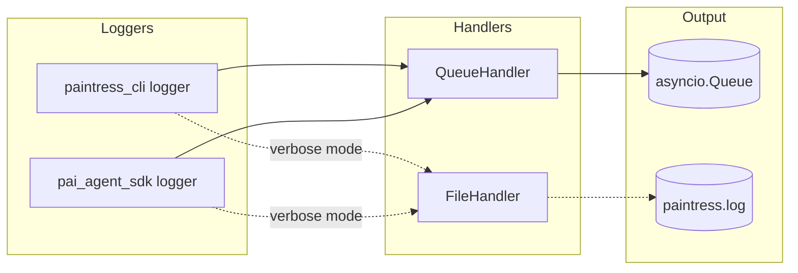

# TUI Logging System

## Overview

TUI logging has two modes:

1. **Silent mode** (default): No log output, prevents interference with TUI display
2. **Verbose mode** (`-v` flag): Logs written to `paintress.log` in current directory

Additionally, log messages are emitted as `LogEvent` instances to an asyncio Queue for potential TUI panel display.

## Logging Modes

| Mode | Startup Behavior | TUI Runtime Behavior |
|------|------------------|---------------------|
| Normal | NullHandler (silent) | Queue only |
| Verbose (`-v`) | FileHandler (`paintress.log`) | Queue + FileHandler |

## Architecture



## Components

### LogEvent

Extends `pai_agent_sdk.events.AgentEvent` to carry log information:

```python
@dataclass
class LogEvent(AgentEvent):
    level: str = "INFO"        # DEBUG, INFO, WARNING, ERROR, CRITICAL
    logger_name: str = ""       # e.g., "paintress_cli.session"
    message: str = ""           # Formatted log message
    func_name: str = ""         # Function where log was called
    line_no: int = 0            # Line number
```

### QueueHandler

Custom `logging.Handler` that emits `LogEvent` to a queue:

```python
class QueueHandler(logging.Handler):
    def __init__(self, queue: Queue, level: int = logging.DEBUG):
        super().__init__(level)
        self._queue = queue

    def emit(self, record: logging.LogRecord) -> None:
        event = LogEvent(
            event_id=f"log-{record.created:.0f}-{record.lineno}",
            level=record.levelname,
            logger_name=record.name,
            message=self.format(record),
            func_name=record.funcName,
            line_no=record.lineno,
        )
        self._queue.put_nowait(event)
```

## Usage

### CLI Startup Logging

Called in `cli.py` before TUI starts:

```python
from paintress_cli.logging import configure_logging

# Silent mode (default)
configure_logging(verbose=False)

# Verbose mode - logs to paintress.log
configure_logging(verbose=True)
```

### TUI Runtime Logging

Called in `app.py` when TUI initializes:

```python
import asyncio
from paintress_cli.logging import configure_tui_logging

# Create queue for log events
log_queue = asyncio.Queue()

# Configure with verbose mode for file logging
configure_tui_logging(log_queue, verbose=True)
```

### Getting a Logger

```python
from paintress_cli.logging import get_logger

logger = get_logger(__name__)
logger.info("Processing user input")
logger.warning("Token usage high")
logger.error("Connection failed")
```

## Design Decisions

### Why File-Based for Verbose Mode?

1. **TUI-safe**: No stdout/stderr output that corrupts display
2. **Persistent**: Logs preserved for debugging after session ends
3. **Simple**: `tail -f paintress.log` for real-time monitoring

### Why Silent by Default?

- TUI provides visual feedback for important events
- Log noise distracts from user interaction
- File I/O overhead unnecessary for normal operation

### Log Levels

| Level    | Usage                                  |
| -------- | -------------------------------------- |
| DEBUG    | Detailed tracing (verbose mode)        |
| INFO     | Normal operations                      |
| WARNING  | Potential issues                       |
| ERROR    | Failures                               |
| CRITICAL | Fatal errors                           |

## API Reference

### `configure_logging(verbose=False)`

Configure logging for CLI startup phase.

- `verbose=False`: NullHandler (silent)
- `verbose=True`: FileHandler (`paintress.log`)

### `configure_tui_logging(queue, level=logging.INFO, verbose=False)`

Configure logging for TUI runtime.

- Always adds QueueHandler for log events
- `verbose=True`: Also adds FileHandler

### `reset_logging()`

Clear all handlers. Useful for tests.

### `get_logger(name)`

Get a logger under the `paintress_cli` namespace.

## File Location

Log file is always created in the current working directory:

```
./paintress.log
```

Format:
```
2026-01-15 14:30:00,123 DEBUG [paintress_cli.session] Starting agent run
2026-01-15 14:30:01,456 INFO [pai_agent_sdk.agents.main] Streaming response
```
