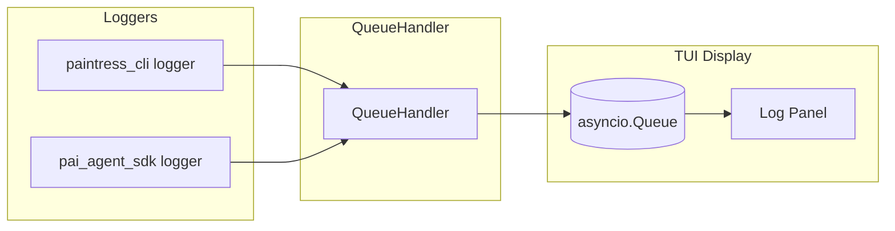

# TUI Logging System

## Overview

TUI logging redirects all log output from both `paintress_cli` and `pai_agent_sdk` to an asyncio Queue. This prevents log messages from interfering with the TUI display (no stdout/stderr output).

Log messages are emitted as `LogEvent` instances that TUI components can consume and display in a dedicated log panel.

## Architecture



## Components

### LogEvent

Extends `pai_agent_sdk.events.AgentEvent` to carry log information:

```python
@dataclass
class LogEvent(AgentEvent):
    level: str = "INFO"        # DEBUG, INFO, WARNING, ERROR, CRITICAL
    logger_name: str = ""       # e.g., "paintress_cli.session"
    message: str = ""           # Formatted log message
    func_name: str = ""         # Function where log was called
    line_no: int = 0            # Line number
```

### QueueHandler

Custom `logging.Handler` that emits `LogEvent` to a queue:

```python
class QueueHandler(logging.Handler):
    def __init__(self, queue: Queue, level: int = logging.DEBUG):
        super().__init__(level)
        self._queue = queue

    def emit(self, record: logging.LogRecord) -> None:
        event = LogEvent(
            event_id=f"log-{record.created:.0f}-{record.lineno}",
            level=record.levelname,
            logger_name=record.name,
            message=self.format(record),
            func_name=record.funcName,
            line_no=record.lineno,
        )
        self._queue.put_nowait(event)
```

## Usage

### Initialization

Call `configure_tui_logging()` once at TUI startup:

```python
import asyncio
from paintress_cli.logging import configure_tui_logging

# Create queue for log events
log_queue = asyncio.Queue()

# Configure both paintress_cli and pai_agent_sdk loggers
configure_tui_logging(log_queue, level=logging.INFO)
```

### Getting a Logger

```python
from paintress_cli.logging import get_logger

logger = get_logger(__name__)
logger.info("Processing user input")
logger.warning("Token usage high")
logger.error("Connection failed")
```

### Consuming Log Events

TUI components consume `LogEvent` from the queue:

```python
async def log_panel_task(log_queue: asyncio.Queue):
    while True:
        event = await log_queue.get()
        if isinstance(event, LogEvent):
            display_log_line(
                level=event.level,
                message=event.message,
                timestamp=event.timestamp,
            )
```

## Design Decisions

### Why Queue-Based?

1. **Non-blocking**: Logging never blocks agent execution
2. **TUI-safe**: No stdout/stderr output that corrupts display
3. **Unified**: Same event system as agent events
4. **Filterable**: TUI can filter/format logs as needed

### Why Extend AgentEvent?

- Consistent with SDK event system
- Can flow through same `agent_stream_queues` if needed
- Carries `event_id` and `timestamp` automatically

### Log Levels

| Level    | Usage                                  |
| -------- | -------------------------------------- |
| DEBUG    | Detailed tracing (disabled by default) |
| INFO     | Normal operations                      |
| WARNING  | Potential issues                       |
| ERROR    | Failures                               |
| CRITICAL | Fatal errors                           |

Default level is `INFO` to avoid noise from DEBUG messages.

## API Reference

### `configure_tui_logging(queue, level=logging.INFO)`

Configure both `paintress_cli` and `pai_agent_sdk` loggers to emit to the queue.

### `reset_logging()`

Clear all handlers. Useful for tests.

### `get_logger(name)`

Get a logger under the `paintress_cli` namespace.

## Integration with TUI

The log panel renderer consumes from the log queue and displays formatted entries:

```
┌─ Logs ────────────────────────────────────────────────┐
│ 16:32:01 INFO  session: Injected 1 steering message   │
│ 16:32:02 WARN  context: Token usage at 75%            │
│ 16:32:05 ERROR browser: Connection timeout            │
└───────────────────────────────────────────────────────┘
```

Color coding by level:

- DEBUG: dim/gray
- INFO: default
- WARNING: yellow
- ERROR: red
- CRITICAL: red/bold
