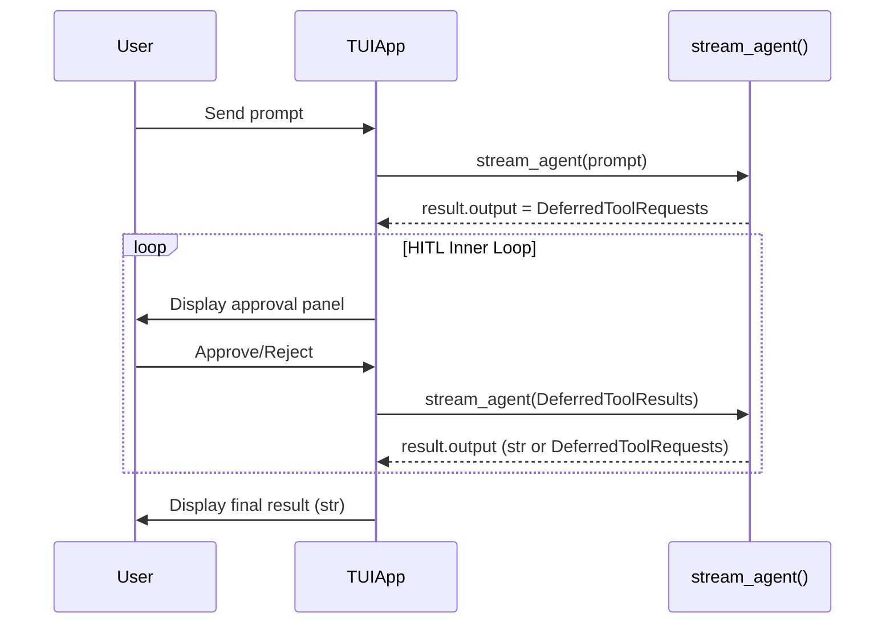

# Human-in-the-Loop (HITL) Design for paintress-cli

## Overview

This document describes how paintress-cli handles Human-in-the-Loop (HITL) for tool approval workflows. The key insight is that **HITL should be treated as an inner loop within agent execution, not as a separate TUI state**.

## Architecture



## Core Design: HITL as Inner Loop

Inspired by `dev/tui/cliapp.py`, HITL is handled as a **while loop**, not a state machine:

```python
# Main execution loop (simplified)
async def _run_agent_loop(self, user_input: str) -> None:
    result = await self._stream_agent(user_input)

    # HITL inner loop: keep processing until we get final str output
    while isinstance(result.output, DeferredToolRequests):
        user_response = await self._request_user_action(result.output)
        result = await self._stream_agent(user_response)

    # Done - result.output is str
```

This approach:
- **No additional TUI state needed** - HITL is just a `while` loop
- **Unified interface** - `_stream_agent()` accepts `str | DeferredToolResults`
- **Natural recursion** - Agent may return multiple `DeferredToolRequests` in sequence
- **Simple mental model** - Approval blocks the loop, then resumes

## Existing Configuration

### tools.toml

```toml
[tools]
# Tools requiring user approval before execution
need_approval = ["shell", "replace"]
```

Location priority:
1. Project: `.paintress/tools.toml` (overrides global)
2. Global: `~/.config/youware-labs/paintress-cli/tools.toml`

### Runtime Configuration

```python
# paintress_cli/runtime.py
output_type: OutputSpec[str|DeferredToolRequests] = [
    TextOutput(steering_output_guard),
    DeferredToolRequests,
]

runtime = create_agent(
    ...
    output_type=output_type,
    need_user_approve_tools=config.tools.need_approval or None,
)
```

With this configuration:
- Normal completion: `result.output` is `str`
- Needs approval: `result.output` is `DeferredToolRequests`

## Implementation

### 1. Unified Stream Method

```python
async def _stream_agent(
    self,
    prompt: str | DeferredToolResults,
) -> AgentRunResult[str | DeferredToolRequests]:
    """Execute agent with prompt or deferred results."""
    async with stream_agent(
        self.runtime,
        user_prompt=prompt if isinstance(prompt, str) else "",
        message_history=self._message_history,
        deferred_tool_results=prompt if isinstance(prompt, DeferredToolResults) else None,
    ) as stream:
        async for event in stream:
            self._handle_stream_event(event)

        stream.raise_if_exception()
        if stream.run:
            self._message_history = list(stream.run.all_messages())
        return stream.run.result
```

### 2. HITL Execution Loop

```python
async def _execute_with_hitl(self, user_input: str) -> None:
    """Execute agent with HITL inner loop."""
    self._state = TUIState.RUNNING
    self._append_user_input(user_input)

    try:
        result = await self._stream_agent(user_input)

        # HITL inner loop
        while result and isinstance(result.output, DeferredToolRequests):
            user_response = await self._request_user_action(result.output)
            result = await self._stream_agent(user_response)

        # Agent completed with str output
        self._state = TUIState.IDLE

    except asyncio.CancelledError:
        self._append_output("[Cancelled]")
        self._state = TUIState.IDLE
    except Exception as e:
        self._append_error_output(e)
        self._state = TUIState.IDLE
```

### 3. Request User Action

```python
async def _request_user_action(
    self,
    deferred: DeferredToolRequests,
) -> DeferredToolResults:
    """Collect approval decisions from user."""
    results = DeferredToolResults()

    if not deferred.approvals:
        return results

    self._append_system_output(
        f"[Tool approval required: {len(deferred.approvals)} tool(s)]"
    )

    for idx, tool_call in enumerate(deferred.approvals, 1):
        # Display approval panel
        self._display_approval_panel(tool_call, idx, len(deferred.approvals))

        # Wait for user decision (blocking)
        decision = await self._wait_for_approval_input()

        if decision.approved:
            results.approvals[tool_call.tool_call_id] = True
            self._append_system_output(f"Approved: {tool_call.tool_name}")
        else:
            results.approvals[tool_call.tool_call_id] = ToolDenied(
                decision.reason or "User rejected"
            )
            self._append_system_output(
                f"Rejected: {tool_call.tool_name} - {decision.reason}"
            )

    return results
```

### 4. Approval Input (TUI-specific)

For prompt_toolkit TUI, use `asyncio.Event` to block during approval:

```python
@dataclass
class ApprovalDecision:
    approved: bool
    reason: str | None = None

async def _wait_for_approval_input(self) -> ApprovalDecision:
    """Block until user provides approval decision."""
    self._approval_event = asyncio.Event()
    self._approval_result: ApprovalDecision | None = None

    # Wait for key handler to set the event
    await self._approval_event.wait()

    return self._approval_result or ApprovalDecision(approved=False, reason="No input")

# In key bindings:
@kb.add("enter")
def handle_enter(event: KeyPressEvent) -> None:
    text = input_area.buffer.text.strip()
    input_area.buffer.reset()

    # Check if waiting for approval
    if self._approval_event and not self._approval_event.is_set():
        if text.lower() in ("", "y", "yes"):
            self._approval_result = ApprovalDecision(approved=True)
        else:
            self._approval_result = ApprovalDecision(approved=False, reason=text)
        self._approval_event.set()
        return

    # Normal input handling...
```

### 5. Approval Panel Display

```python
def _display_approval_panel(
    self,
    tool_call: ToolCallPart,
    index: int,
    total: int,
) -> None:
    """Display approval panel for a tool call."""
    content_parts = [
        Text(f"Tool {index} of {total}", style="bold cyan"),
        Text(""),
        Text(f"Tool: {tool_call.tool_name}", style="bold yellow"),
        Text(f"ID: {tool_call.tool_call_id}", style="dim"),
    ]

    if tool_call.args:
        content_parts.append(Text(""))
        content_parts.append(Text("Arguments:", style="bold cyan"))
        args_json = json.dumps(tool_call.args, indent=2, ensure_ascii=False)
        if len(args_json.split("\n")) > 20:
            lines = args_json.split("\n")[:20]
            args_json = "\n".join(lines) + "\n... (truncated)"
        content_parts.append(Syntax(args_json, "json", theme=self._code_theme))

    panel = Panel(
        Group(*content_parts),
        title="[yellow]Tool Approval Required[/yellow]",
        subtitle="[dim]Enter/Y: Approve | Text: Reject | Ctrl+C: Cancel[/dim]",
        border_style="yellow",
    )

    self._append_rich(panel)
```

## User Interaction

| Input | Action |
|-------|--------|
| `Enter` or `y`/`yes` | Approve current tool call |
| Any other text | Reject with text as reason |
| `Ctrl+C` | Cancel all pending and return to IDLE |

## Status Bar

During HITL, show approval progress:

```python
def _get_status_bar(self) -> FormattedText:
    # Check if waiting for approval input
    if hasattr(self, "_approval_event") and self._approval_event and not self._approval_event.is_set():
        return [
            ("class:status-bar.mode", f" {self._mode.value.upper()} "),
            ("class:status-bar", " | "),
            ("class:status-bar.warning", "Awaiting Approval"),
            ("class:status-bar", " | "),
            ("class:status-bar", "Enter: Approve | Text: Reject"),
        ]
    # ... normal status bar ...
```

## Session Persistence

On session restore, check for pending tool calls:

```python
def _check_pending_on_restore(self) -> DeferredToolRequests | None:
    """Check if restored session has pending approvals."""
    if not self._message_history:
        return None

    last_msg = self._message_history[-1]
    if not isinstance(last_msg, ModelResponse):
        return None

    tool_calls = [p for p in last_msg.parts if isinstance(p, ToolCallPart)]
    if not tool_calls:
        return None

    # Filter to tools needing approval
    need_approval = set(self.ctx.need_user_approve_tools)
    approvals = [tc for tc in tool_calls if tc.tool_name in need_approval]

    if approvals:
        return DeferredToolRequests(calls=tool_calls, approvals=approvals)
    return None
```

## Comparison: CLI vs TUI

| Aspect | CLI (cliapp.py) | TUI (prompt_toolkit) |
|--------|-----------------|---------------------|
| Input model | Blocking `prompt_async()` | Event-driven key bindings |
| HITL loop | Simple `while` + `await prompt` | `while` + `asyncio.Event` |
| Approval collection | Sequential blocking | Event-based blocking |

The TUI requires `asyncio.Event` because prompt_toolkit uses event-driven input, but the conceptual model is the same: HITL is an inner loop that blocks until all approvals are collected.
